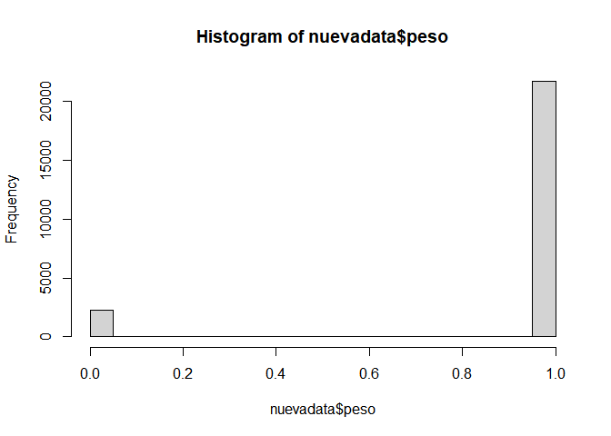
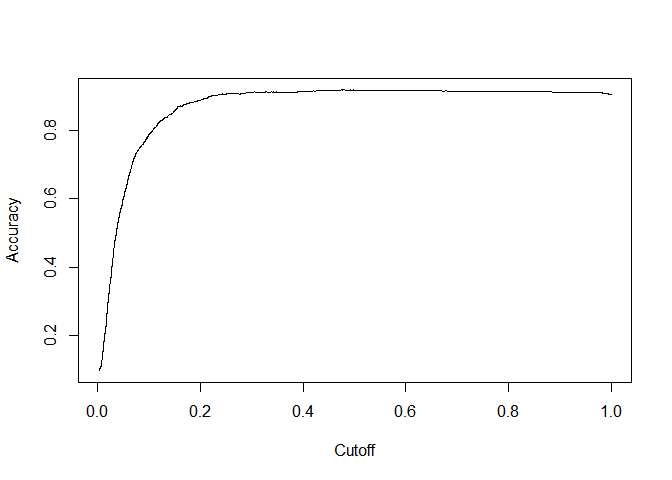

MODULO VI: Machine Learning ll: Modelos Para La Predicción Y
Clasificación
================
Ronald Llerena
2024-08-19

``` r
datos1<- read.spss("D:\\Betametrica\\Modulo VI\\ENV_2017.sav",
                  use.value.labels = F,
                  to.data.frame = T)
```

    ## re-encoding from CP1252

``` r
table(datos1$prov_nac)
```

    ## 
    ##    01    02    03    04    05    06    07    08    09    10    11    12    13 
    ## 14454  2910  4523  2504  7543  7797 13179 14100 79788  8589  8106 18447 25161 
    ##    14    15    16    17    18    19    20    21    22    23    24 
    ##  5648  2891  2942 48865  9518  1916   353  4902  4678 12638  6800

``` r
str(datos1$prov_nac)
```

    ##  chr [1:308252] "24" "24" "24" "24" "24" "24" "09" "24" "24" "24" "09" "24" ...
    ##  - attr(*, "value.labels")= Named chr [1:26] "90      " "88      " "24      " "23      " ...
    ##   ..- attr(*, "names")= chr [1:26] "Zonas no delimitadas" "Exterior" "Santa Elena" "Santo Domingo de los Tsáchilas" ...

``` r
names(datos1)
```

    ##  [1] "prov_insc"  "cant_insc"  "parr_insc"  "anio_insc"  "mes_insc"  
    ##  [6] "dia_insc"   "fecha_insc" "sexo"       "anio_nac"   "mes_nac"   
    ## [11] "dia_nac"    "fecha_nac"  "talla"      "peso"       "sem_gest"  
    ## [16] "tipo_part"  "apgar1"     "apgar5"     "p_emb"      "lugar_ocur"
    ## [21] "prov_nac"   "cant_nac"   "parr_nac"   "area_nac"   "asis_por"  
    ## [26] "nac_mad"    "cod_pais"   "anio_mad"   "mes_mad"    "dia_mad"   
    ## [31] "fecha_mad"  "edad_mad"   "con_pren"   "num_emb"    "num_par"   
    ## [36] "hij_viv"    "hij_vivm"   "hij_nacm"   "etnia"      "est_civil" 
    ## [41] "niv_inst"   "sabe_leer"  "prov_res"   "cant_res"   "parr_res"  
    ## [46] "area_res"   "residente"

``` r
datos1$prov_nac<- as.numeric(as.character((datos1$prov_nac)))
str(datos1$prov_nac)
```

    ##  num [1:308252] 24 24 24 24 24 24 9 24 24 24 ...

``` r
nuevadata<-datos1 %>% 
  filter(prov_nac==13)  %>%
  select(peso,
         talla,
         sem_gest,
         sexo,
         edad_mad,
         sabe_leer,
         con_pren) %>%
 
    filter(
  peso!=99,
  talla!=99,
  sem_gest!=99,
  con_pren!=99,
  sabe_leer!=9)%>% 
mutate(peso=if_else(peso>2500,1,0),
       sexo=if_else(sexo==1,0,1),
       sabe_leer=if_else(sabe_leer==1,1,0),
       con_pre=if_else(con_pren>=7,1,0),
       edad2= edad_mad ^ 2)    
```

Hemos manipulado la infomración o depurado vamos a realizar un
histograma de la variable peso donde se presentara solo 1 y 0

``` r
hist(nuevadata$peso)
```

<!-- -->

``` r
str(nuevadata$peso)
```

    ##  num [1:23975] 1 1 1 1 1 1 1 1 1 0 ...

Como demostramos que la variable peso es un número vamos a categorizarla
como factor, como peso tiene valores binarios si tiene valor de 1 vamos
a decir que es el peso adecuado y si es 0 es lo contrario peso no es
adecuado.

``` r
nuevadata$peso <-factor(nuevadata$peso)
nuevadata<- nuevadata %>%
    mutate(peso=recode_factor(
      peso,
      '0'="no adecuado",
      '1'= "adecuado"))

# fijar una semilla
set.seed(1234)

#crear una muestra de entrenamiento

entrenamiento <- createDataPartition(nuevadata$peso,
                                     p=0.10, list= F)

#Realizamos el modelo SVM con la muestra de entrenamiento

modelo <- svm(peso  ~talla+sem_gest+sexo+
                edad_mad+edad2+sabe_leer,
              data=nuevadata[entrenamiento,],
              kernel="linear",
                     cost= 10,scale=T,probability=TRUE )

# recuperar los vectores de soporte

modelo$index
```

    ##   [1]    3    7   30   33   37   48   52   61   69   81   89   95   99  107  114
    ##  [16]  117  134  135  147  166  175  210  220  234  243  248  250  256  258  262
    ##  [31]  282  288  306  335  348  356  359  366  371  373  378  381  385  394  399
    ##  [46]  405  424  432  471  476  495  503  516  517  527  536  558  580  592  602
    ##  [61]  620  622  635  637  657  662  664  669  673  684  694  695  697  699  706
    ##  [76]  715  740  749  751  755  758  785  793  806  857  863  872  880  904  934
    ##  [91]  935  947  954  971  976  980  985  994 1011 1016 1017 1021 1031 1048 1050
    ## [106] 1051 1052 1063 1068 1075 1082 1085 1088 1092 1094 1112 1120 1125 1154 1187
    ## [121] 1209 1218 1221 1226 1236 1253 1264 1298 1321 1339 1351 1360 1361 1376 1378
    ## [136] 1386 1391 1392 1442 1447 1448 1455 1478 1494 1504 1519 1526 1530 1565 1574
    ## [151] 1575 1599 1605 1607 1609 1626 1629 1630 1643 1649 1653 1670 1673 1675 1695
    ## [166] 1718 1721 1729 1731 1738 1742 1746 1763 1784 1794 1795 1820 1826 1833 1836
    ## [181] 1853 1856 1868 1873 1876 1878 1880 1887 1888 1894 1898 1905 1919 1924 1931
    ## [196] 1941 1942 1948 1970 1974 1977 1996 2003 2004 2016 2025 2026 2029 2035 2041
    ## [211] 2045 2055 2071 2109 2185 2194 2212 2238 2251 2265 2285 2299 2313 2323 2326
    ## [226] 2327 2329 2334 2335 2346 2372   41   42   66   79  100  112  124  141  145
    ## [241]  146  148  153  158  168  173  178  179  188  217  218  223  224  225  241
    ## [256]  264  268  273  280  287  301  320  323  331  338  340  353  357  358  372
    ## [271]  376  383  395  406  420  425  430  437  442  449  454  455  482  499  500
    ## [286]  501  504  507  510  534  538  543  546  548  551  569  577  579  583  585
    ## [301]  596  598  607  610  614  618  626  639  641  647  688  724  728  742  745
    ## [316]  752  786  839  841  842  874  876  881  902  903  917  928  932  942  956
    ## [331]  959  961  963  964  965  966  972  973  975  977  984  989  996  998 1001
    ## [346] 1009 1019 1026 1033 1054 1055 1059 1060 1064 1065 1067 1078 1084 1086 1096
    ## [361] 1100 1105 1106 1115 1145 1146 1147 1158 1177 1190 1211 1254 1256 1312 1328
    ## [376] 1333 1336 1337 1375 1397 1408 1410 1418 1421 1435 1452 1469 1492 1495 1527
    ## [391] 1529 1536 1541 1560 1590 1604 1615 1617 1623 1676 1677 1701 1712 1716 1727
    ## [406] 1768 1782 1796 1821 1829 1837 1842 1845 1847 1881 1882 1883 1918 1920 1922
    ## [421] 1927 1928 1946 1954 1955 1957 1966 2011 2033 2044 2110 2121 2138 2139 2140
    ## [436] 2145 2160 2167 2176 2199 2208 2234 2242 2260 2267 2268 2275 2278 2307 2308
    ## [451] 2314 2319 2336 2340 2341 2356 2367

``` r
#Recuoerar el termino independiente
modelo$rho
```

    ## [1] -1.283981

Recuperar los coficientes que usan para multiplicar cada observación y
obtener el vector perpendicular al plano

``` r
modelo$coefs
```

    ##                 [,1]
    ##   [1,]  1.000000e+01
    ##   [2,]  1.000000e+01
    ##   [3,]  1.000000e+01
    ##   [4,]  1.000000e+01
    ##   [5,]  1.000000e+01
    ##   [6,]  1.000000e+01
    ##   [7,]  1.000000e+01
    ##   [8,]  1.000000e+01
    ##   [9,]  1.000000e+01
    ##  [10,]  1.000000e+01
    ##  [11,]  1.000000e+01
    ##  [12,]  1.000000e+01
    ##  [13,]  1.000000e+01
    ##  [14,]  1.000000e+01
    ##  [15,]  1.000000e+01
    ##  [16,]  1.000000e+01
    ##  [17,]  1.000000e+01
    ##  [18,]  1.000000e+01
    ##  [19,]  1.000000e+01
    ##  [20,]  1.000000e+01
    ##  [21,]  1.000000e+01
    ##  [22,]  1.000000e+01
    ##  [23,]  1.000000e+01
    ##  [24,]  1.000000e+01
    ##  [25,]  1.000000e+01
    ##  [26,]  1.000000e+01
    ##  [27,]  1.000000e+01
    ##  [28,]  1.000000e+01
    ##  [29,]  1.000000e+01
    ##  [30,]  1.000000e+01
    ##  [31,]  1.000000e+01
    ##  [32,]  1.000000e+01
    ##  [33,]  1.000000e+01
    ##  [34,]  1.000000e+01
    ##  [35,]  1.000000e+01
    ##  [36,]  6.103412e+00
    ##  [37,]  1.000000e+01
    ##  [38,]  1.000000e+01
    ##  [39,]  1.000000e+01
    ##  [40,]  1.000000e+01
    ##  [41,]  1.000000e+01
    ##  [42,]  1.000000e+01
    ##  [43,]  1.000000e+01
    ##  [44,]  1.000000e+01
    ##  [45,]  1.000000e+01
    ##  [46,]  1.000000e+01
    ##  [47,]  1.000000e+01
    ##  [48,]  1.000000e+01
    ##  [49,]  1.000000e+01
    ##  [50,]  1.000000e+01
    ##  [51,]  1.000000e+01
    ##  [52,]  1.000000e+01
    ##  [53,]  1.000000e+01
    ##  [54,]  1.000000e+01
    ##  [55,]  1.000000e+01
    ##  [56,]  1.000000e+01
    ##  [57,]  1.000000e+01
    ##  [58,]  1.000000e+01
    ##  [59,]  1.000000e+01
    ##  [60,]  1.000000e+01
    ##  [61,]  1.000000e+01
    ##  [62,]  1.000000e+01
    ##  [63,]  1.000000e+01
    ##  [64,]  1.000000e+01
    ##  [65,]  1.000000e+01
    ##  [66,]  1.000000e+01
    ##  [67,]  1.000000e+01
    ##  [68,]  1.000000e+01
    ##  [69,]  1.000000e+01
    ##  [70,]  1.000000e+01
    ##  [71,]  1.000000e+01
    ##  [72,]  1.000000e+01
    ##  [73,]  1.000000e+01
    ##  [74,]  1.000000e+01
    ##  [75,]  1.000000e+01
    ##  [76,]  9.054423e+00
    ##  [77,]  1.000000e+01
    ##  [78,]  1.000000e+01
    ##  [79,]  1.000000e+01
    ##  [80,]  1.000000e+01
    ##  [81,]  1.000000e+01
    ##  [82,]  1.000000e+01
    ##  [83,]  1.000000e+01
    ##  [84,]  1.000000e+01
    ##  [85,]  1.000000e+01
    ##  [86,]  1.000000e+01
    ##  [87,]  1.000000e+01
    ##  [88,]  1.000000e+01
    ##  [89,]  1.000000e+01
    ##  [90,]  1.000000e+01
    ##  [91,]  1.000000e+01
    ##  [92,]  1.000000e+01
    ##  [93,]  1.000000e+01
    ##  [94,]  1.000000e+01
    ##  [95,]  1.000000e+01
    ##  [96,]  1.000000e+01
    ##  [97,]  1.000000e+01
    ##  [98,]  1.000000e+01
    ##  [99,]  1.000000e+01
    ## [100,]  1.000000e+01
    ## [101,]  1.000000e+01
    ## [102,]  1.000000e+01
    ## [103,]  1.000000e+01
    ## [104,]  1.000000e+01
    ## [105,]  1.000000e+01
    ## [106,]  1.000000e+01
    ## [107,]  1.000000e+01
    ## [108,]  1.000000e+01
    ## [109,]  1.000000e+01
    ## [110,]  1.000000e+01
    ## [111,]  1.000000e+01
    ## [112,]  1.000000e+01
    ## [113,]  1.000000e+01
    ## [114,]  1.000000e+01
    ## [115,]  1.000000e+01
    ## [116,]  1.000000e+01
    ## [117,]  1.000000e+01
    ## [118,]  1.000000e+01
    ## [119,]  1.000000e+01
    ## [120,]  1.000000e+01
    ## [121,]  1.000000e+01
    ## [122,]  1.000000e+01
    ## [123,]  1.000000e+01
    ## [124,]  1.000000e+01
    ## [125,]  1.000000e+01
    ## [126,]  1.000000e+01
    ## [127,]  1.000000e+01
    ## [128,]  1.000000e+01
    ## [129,]  1.000000e+01
    ## [130,]  1.000000e+01
    ## [131,]  1.000000e+01
    ## [132,]  1.000000e+01
    ## [133,]  1.000000e+01
    ## [134,]  1.000000e+01
    ## [135,]  1.000000e+01
    ## [136,]  1.729612e+00
    ## [137,]  1.000000e+01
    ## [138,]  1.000000e+01
    ## [139,]  1.000000e+01
    ## [140,]  1.000000e+01
    ## [141,]  1.000000e+01
    ## [142,]  1.000000e+01
    ## [143,]  1.000000e+01
    ## [144,]  1.000000e+01
    ## [145,]  1.000000e+01
    ## [146,]  1.000000e+01
    ## [147,]  1.000000e+01
    ## [148,]  1.000000e+01
    ## [149,]  1.000000e+01
    ## [150,]  1.000000e+01
    ## [151,]  1.000000e+01
    ## [152,]  8.752989e+00
    ## [153,]  1.000000e+01
    ## [154,]  1.000000e+01
    ## [155,]  1.000000e+01
    ## [156,]  1.000000e+01
    ## [157,]  1.000000e+01
    ## [158,]  1.000000e+01
    ## [159,]  1.000000e+01
    ## [160,]  1.000000e+01
    ## [161,]  1.000000e+01
    ## [162,]  6.784716e+00
    ## [163,]  1.000000e+01
    ## [164,]  1.000000e+01
    ## [165,]  1.000000e+01
    ## [166,]  1.000000e+01
    ## [167,]  1.000000e+01
    ## [168,]  1.000000e+01
    ## [169,]  1.000000e+01
    ## [170,]  1.000000e+01
    ## [171,]  1.000000e+01
    ## [172,]  1.606406e+00
    ## [173,]  1.000000e+01
    ## [174,]  1.000000e+01
    ## [175,]  1.000000e+01
    ## [176,]  1.000000e+01
    ## [177,]  1.000000e+01
    ## [178,]  1.000000e+01
    ## [179,]  1.432710e+00
    ## [180,]  1.000000e+01
    ## [181,]  1.000000e+01
    ## [182,]  1.000000e+01
    ## [183,]  1.000000e+01
    ## [184,]  1.000000e+01
    ## [185,]  1.000000e+01
    ## [186,]  1.000000e+01
    ## [187,]  1.000000e+01
    ## [188,]  1.000000e+01
    ## [189,]  1.000000e+01
    ## [190,]  1.000000e+01
    ## [191,]  1.000000e+01
    ## [192,]  1.000000e+01
    ## [193,]  1.000000e+01
    ## [194,]  1.000000e+01
    ## [195,]  1.000000e+01
    ## [196,]  1.000000e+01
    ## [197,]  1.000000e+01
    ## [198,]  1.000000e+01
    ## [199,]  1.000000e+01
    ## [200,]  1.000000e+01
    ## [201,]  1.000000e+01
    ## [202,]  1.000000e+01
    ## [203,]  1.000000e+01
    ## [204,]  1.000000e+01
    ## [205,]  1.000000e+01
    ## [206,]  1.000000e+01
    ## [207,]  1.000000e+01
    ## [208,]  1.000000e+01
    ## [209,]  1.000000e+01
    ## [210,]  1.000000e+01
    ## [211,]  1.000000e+01
    ## [212,]  1.000000e+01
    ## [213,]  1.000000e+01
    ## [214,]  1.000000e+01
    ## [215,]  1.000000e+01
    ## [216,]  1.000000e+01
    ## [217,]  1.000000e+01
    ## [218,]  1.000000e+01
    ## [219,]  1.000000e+01
    ## [220,]  1.000000e+01
    ## [221,]  1.000000e+01
    ## [222,]  1.000000e+01
    ## [223,]  7.213039e-02
    ## [224,]  1.000000e+01
    ## [225,]  7.754574e-04
    ## [226,]  1.000000e+01
    ## [227,]  1.000000e+01
    ## [228,]  1.000000e+01
    ## [229,]  1.000000e+01
    ## [230,]  1.000000e+01
    ## [231,]  1.000000e+01
    ## [232,] -1.000000e+01
    ## [233,] -1.000000e+01
    ## [234,] -1.000000e+01
    ## [235,] -1.000000e+01
    ## [236,] -1.000000e+01
    ## [237,] -1.000000e+01
    ## [238,] -1.000000e+01
    ## [239,] -1.000000e+01
    ## [240,] -1.000000e+01
    ## [241,] -1.000000e+01
    ## [242,] -1.000000e+01
    ## [243,] -1.000000e+01
    ## [244,] -1.000000e+01
    ## [245,] -1.000000e+01
    ## [246,] -1.000000e+01
    ## [247,] -1.000000e+01
    ## [248,] -1.000000e+01
    ## [249,] -1.000000e+01
    ## [250,] -1.000000e+01
    ## [251,] -1.000000e+01
    ## [252,] -1.000000e+01
    ## [253,] -1.000000e+01
    ## [254,] -1.000000e+01
    ## [255,] -1.000000e+01
    ## [256,] -1.000000e+01
    ## [257,] -1.000000e+01
    ## [258,] -1.000000e+01
    ## [259,] -1.000000e+01
    ## [260,] -1.000000e+01
    ## [261,] -1.000000e+01
    ## [262,] -1.000000e+01
    ## [263,] -1.000000e+01
    ## [264,] -1.000000e+01
    ## [265,] -1.000000e+01
    ## [266,] -1.000000e+01
    ## [267,] -1.000000e+01
    ## [268,] -1.000000e+01
    ## [269,] -1.000000e+01
    ## [270,] -1.000000e+01
    ## [271,] -1.000000e+01
    ## [272,] -1.000000e+01
    ## [273,] -1.000000e+01
    ## [274,] -1.000000e+01
    ## [275,] -1.000000e+01
    ## [276,] -1.000000e+01
    ## [277,] -1.000000e+01
    ## [278,] -1.000000e+01
    ## [279,] -1.000000e+01
    ## [280,] -1.000000e+01
    ## [281,] -1.000000e+01
    ## [282,] -1.000000e+01
    ## [283,] -1.000000e+01
    ## [284,] -1.000000e+01
    ## [285,] -1.000000e+01
    ## [286,] -1.000000e+01
    ## [287,] -1.000000e+01
    ## [288,] -1.000000e+01
    ## [289,] -1.000000e+01
    ## [290,] -1.000000e+01
    ## [291,] -1.000000e+01
    ## [292,] -1.000000e+01
    ## [293,] -1.000000e+01
    ## [294,] -1.000000e+01
    ## [295,] -1.000000e+01
    ## [296,] -1.000000e+01
    ## [297,] -1.000000e+01
    ## [298,] -1.000000e+01
    ## [299,] -1.000000e+01
    ## [300,] -1.000000e+01
    ## [301,] -1.000000e+01
    ## [302,] -1.000000e+01
    ## [303,] -1.000000e+01
    ## [304,] -1.000000e+01
    ## [305,] -1.000000e+01
    ## [306,] -1.000000e+01
    ## [307,] -1.000000e+01
    ## [308,] -1.000000e+01
    ## [309,] -1.000000e+01
    ## [310,] -1.000000e+01
    ## [311,] -1.000000e+01
    ## [312,] -1.000000e+01
    ## [313,] -1.000000e+01
    ## [314,] -1.000000e+01
    ## [315,] -1.000000e+01
    ## [316,] -1.000000e+01
    ## [317,] -1.000000e+01
    ## [318,] -1.000000e+01
    ## [319,] -1.000000e+01
    ## [320,] -1.000000e+01
    ## [321,] -1.000000e+01
    ## [322,] -1.000000e+01
    ## [323,] -1.000000e+01
    ## [324,] -1.000000e+01
    ## [325,] -1.000000e+01
    ## [326,] -1.000000e+01
    ## [327,] -1.000000e+01
    ## [328,] -1.000000e+01
    ## [329,] -1.000000e+01
    ## [330,] -1.000000e+01
    ## [331,] -1.000000e+01
    ## [332,] -1.000000e+01
    ## [333,] -1.000000e+01
    ## [334,] -1.000000e+01
    ## [335,] -1.000000e+01
    ## [336,] -1.000000e+01
    ## [337,] -1.000000e+01
    ## [338,] -1.000000e+01
    ## [339,] -1.000000e+01
    ## [340,] -1.000000e+01
    ## [341,] -1.000000e+01
    ## [342,] -1.000000e+01
    ## [343,] -1.000000e+01
    ## [344,] -1.000000e+01
    ## [345,] -1.000000e+01
    ## [346,] -1.000000e+01
    ## [347,] -1.000000e+01
    ## [348,] -1.000000e+01
    ## [349,] -1.000000e+01
    ## [350,] -1.000000e+01
    ## [351,] -1.000000e+01
    ## [352,] -1.000000e+01
    ## [353,] -1.000000e+01
    ## [354,] -1.000000e+01
    ## [355,] -1.000000e+01
    ## [356,] -1.000000e+01
    ## [357,] -1.000000e+01
    ## [358,] -1.000000e+01
    ## [359,] -1.000000e+01
    ## [360,] -1.000000e+01
    ## [361,] -1.000000e+01
    ## [362,] -1.000000e+01
    ## [363,] -1.000000e+01
    ## [364,] -1.000000e+01
    ## [365,] -1.000000e+01
    ## [366,] -1.000000e+01
    ## [367,] -1.000000e+01
    ## [368,] -1.000000e+01
    ## [369,] -1.000000e+01
    ## [370,] -1.000000e+01
    ## [371,] -1.000000e+01
    ## [372,] -1.000000e+01
    ## [373,] -1.000000e+01
    ## [374,] -1.000000e+01
    ## [375,] -1.000000e+01
    ## [376,] -1.000000e+01
    ## [377,] -1.000000e+01
    ## [378,] -1.000000e+01
    ## [379,] -1.000000e+01
    ## [380,] -1.000000e+01
    ## [381,] -1.000000e+01
    ## [382,] -1.000000e+01
    ## [383,] -1.000000e+01
    ## [384,] -1.000000e+01
    ## [385,] -1.000000e+01
    ## [386,] -1.000000e+01
    ## [387,] -1.000000e+01
    ## [388,] -1.000000e+01
    ## [389,] -1.000000e+01
    ## [390,] -1.000000e+01
    ## [391,] -1.000000e+01
    ## [392,] -1.000000e+01
    ## [393,] -1.000000e+01
    ## [394,] -1.000000e+01
    ## [395,] -1.000000e+01
    ## [396,] -1.000000e+01
    ## [397,] -1.000000e+01
    ## [398,] -1.000000e+01
    ## [399,] -1.000000e+01
    ## [400,] -1.000000e+01
    ## [401,] -1.000000e+01
    ## [402,] -1.000000e+01
    ## [403,] -1.000000e+01
    ## [404,] -1.000000e+01
    ## [405,] -1.000000e+01
    ## [406,] -1.000000e+01
    ## [407,] -1.000000e+01
    ## [408,] -1.000000e+01
    ## [409,] -1.000000e+01
    ## [410,] -1.000000e+01
    ## [411,] -1.000000e+01
    ## [412,] -1.000000e+01
    ## [413,] -1.000000e+01
    ## [414,] -1.000000e+01
    ## [415,] -1.000000e+01
    ## [416,] -1.000000e+01
    ## [417,] -1.000000e+01
    ## [418,] -1.000000e+01
    ## [419,] -1.000000e+01
    ## [420,] -1.000000e+01
    ## [421,] -1.000000e+01
    ## [422,] -1.000000e+01
    ## [423,] -1.000000e+01
    ## [424,] -1.000000e+01
    ## [425,] -1.000000e+01
    ## [426,] -5.537175e+00
    ## [427,] -1.000000e+01
    ## [428,] -1.000000e+01
    ## [429,] -1.000000e+01
    ## [430,] -1.000000e+01
    ## [431,] -1.000000e+01
    ## [432,] -1.000000e+01
    ## [433,] -1.000000e+01
    ## [434,] -1.000000e+01
    ## [435,] -1.000000e+01
    ## [436,] -1.000000e+01
    ## [437,] -1.000000e+01
    ## [438,] -1.000000e+01
    ## [439,] -1.000000e+01
    ## [440,] -1.000000e+01
    ## [441,] -1.000000e+01
    ## [442,] -1.000000e+01
    ## [443,] -1.000000e+01
    ## [444,] -1.000000e+01
    ## [445,] -1.000000e+01
    ## [446,] -1.000000e+01
    ## [447,] -1.000000e+01
    ## [448,] -1.000000e+01
    ## [449,] -1.000000e+01
    ## [450,] -1.000000e+01
    ## [451,] -1.000000e+01
    ## [452,] -1.000000e+01
    ## [453,] -1.000000e+01
    ## [454,] -1.000000e+01
    ## [455,] -1.000000e+01
    ## [456,] -1.000000e+01
    ## [457,] -1.000000e+01

``` r
# Evaluar el modelo

ajustados<- predict(modelo,
                    nuevadata[entrenamiento,],
                    type="prob")
# se clasifica con un punto de corte 
# de 0.5

#Forma larga de matriz de clasificación
# matriz de confusión

ct<- table(nuevadata[entrenamiento,]$peso,
           ajustados,
           dnn= c("Actual", "Predicho"))
diag(prop.table(ct,1))
```

    ## no adecuado    adecuado 
    ##  0.08695652  1.00000000

``` r
sum(diag(prop.table(ct)))
```

    ## [1] 0.912427

``` r
confusionMatrix(nuevadata$peso[entrenamiento],
                ajustados,
                dnn=c("Actual","Predicho"),
                levels(ajustados)[2])
```

    ## Confusion Matrix and Statistics
    ## 
    ##              Predicho
    ## Actual        no adecuado adecuado
    ##   no adecuado          20      210
    ##   adecuado              0     2168
    ##                                           
    ##                Accuracy : 0.9124          
    ##                  95% CI : (0.9004, 0.9234)
    ##     No Information Rate : 0.9917          
    ##     P-Value [Acc > NIR] : 1               
    ##                                           
    ##                   Kappa : 0.1469          
    ##                                           
    ##  Mcnemar's Test P-Value : <2e-16          
    ##                                           
    ##             Sensitivity : 0.91169         
    ##             Specificity : 1.00000         
    ##          Pos Pred Value : 1.00000         
    ##          Neg Pred Value : 0.08696         
    ##              Prevalence : 0.99166         
    ##          Detection Rate : 0.90409         
    ##    Detection Prevalence : 0.90409         
    ##       Balanced Accuracy : 0.95585         
    ##                                           
    ##        'Positive' Class : adecuado        
    ## 

``` r
plot(modelo, 
     data= nuevadata[entrenamiento,],
     talla  ~sem_gest)
```

<!-- -->

Optimizar o tunear nuestro modelo.

``` r
modelo.tuneado<- tune(svm,
                      peso  ~.,
                      data=nuevadata[entrenamiento,],
                      ranges = list(cost=c(0.001,0.01,0.1,1.5,10,50)),
                      kernel="linear",
                      scale=T,
                      probability=TRUE)

summary(modelo.tuneado)
```

    ## 
    ## Parameter tuning of 'svm':
    ## 
    ## - sampling method: 10-fold cross validation 
    ## 
    ## - best parameters:
    ##  cost
    ##   0.1
    ## 
    ## - best performance: 0.08757322 
    ## 
    ## - Detailed performance results:
    ##     cost      error  dispersion
    ## 1  0.001 0.09591353 0.010018462
    ## 2  0.010 0.08840656 0.008282115
    ## 3  0.100 0.08757322 0.008102012
    ## 4  1.500 0.08840656 0.007551116
    ## 5 10.000 0.08840656 0.007551116
    ## 6 50.000 0.08840656 0.007551116

``` r
ggplot(data=modelo.tuneado$performances,
       aes(x=cost, y=error))+
  geom_line()+
  geom_point()+
labs(title="error de validación vs hiperparametro c")+
  theme_bw()+
  theme(plot.title = element_text(hjust = 0.5))
```

<!-- -->

``` r
mejor.modelo<- modelo.tuneado$best.model
summary(mejor.modelo)
```

    ## 
    ## Call:
    ## best.tune(METHOD = svm, train.x = peso ~ ., data = nuevadata[entrenamiento, 
    ##     ], ranges = list(cost = c(0.001, 0.01, 0.1, 1.5, 10, 50)), kernel = "linear", 
    ##     scale = T, probability = TRUE)
    ## 
    ## 
    ## Parameters:
    ##    SVM-Type:  C-classification 
    ##  SVM-Kernel:  linear 
    ##        cost:  0.1 
    ## 
    ## Number of Support Vectors:  459
    ## 
    ##  ( 232 227 )
    ## 
    ## 
    ## Number of Classes:  2 
    ## 
    ## Levels: 
    ##  no adecuado adecuado

El mejor modelo tiene un costo de 1.5

``` r
#Vectores de soporte
head(mejor.modelo$index,100)
```

    ##   [1]    3    7   30   33   37   48   52   61   69   81   89   95   99  107  114
    ##  [16]  117  134  135  147  166  175  210  220  234  243  248  250  256  258  262
    ##  [31]  282  288  306  335  348  359  366  371  373  378  381  385  394  399  405
    ##  [46]  424  432  471  476  495  503  516  527  536  558  580  592  602  620  622
    ##  [61]  635  637  657  662  664  669  673  684  694  695  697  698  699  706  715
    ##  [76]  740  749  751  755  758  785  790  793  806  811  857  863  872  904  934
    ##  [91]  935  939  947  954  971  976  985  994 1010 1011

``` r
plot(mejor.modelo,
     data=nuevadata[entrenamiento,],
     talla  ~sem_gest)
```

<!-- -->

``` r
# Vamos a validar el mejor modelo

ajustados.mejor.modelo<- predict(mejor.modelo,
                                 nuevadata[entrenamiento,],
                                 type="prob" ,
                                 probability = T)

# Verificando capturar las probabilidades
str(ajustados.mejor.modelo)
```

    ##  Factor w/ 2 levels "no adecuado",..: 2 2 2 2 2 2 2 2 2 2 ...
    ##  - attr(*, "names")= chr [1:2398] "24" "37" "40" "43" ...
    ##  - attr(*, "probabilities")= num [1:2398, 1:2] 0.931 0.911 0.785 0.849 0.987 ...
    ##   ..- attr(*, "dimnames")=List of 2
    ##   .. ..$ : chr [1:2398] "24" "37" "40" "43" ...
    ##   .. ..$ : chr [1:2] "adecuado" "no adecuado"

``` r
#Vamos a realizar un HEAD para saber cual es el numero de la clase
# de la clase objetivo. si la clase objetivo es adecuado nos referimos a 
# la clase número 1. Si la clase objetivo es no adecuado corresponde a la clase número 2

head(attr(ajustados.mejor.modelo, "probabilities"),5)
```

    ##     adecuado no adecuado
    ## 24 0.9314624  0.06853755
    ## 37 0.9113747  0.08862529
    ## 40 0.7854842  0.21451577
    ## 43 0.8487380  0.15126202
    ## 55 0.9873954  0.01260457

``` r
# Matriz de confusión o clasificación
#NOTA: es importante verificar cuál es la primera 
#que arroja el modelo tuneado
#en base a esto, apuntar al vector de probabilidades
#y realizar correctamente las pruebas.

levels(ajustados.mejor.modelo)
```

    ## [1] "no adecuado" "adecuado"

``` r
table(attr(ajustados.mejor.modelo, "probabilities")[,1]>0.5,
      nuevadata$peso[entrenamiento])
```

    ##        
    ##         no adecuado adecuado
    ##   FALSE          51       17
    ##   TRUE          179     2151

``` r
levels(nuevadata$peso)
```

    ## [1] "no adecuado" "adecuado"

``` r
confusionMatrix(ajustados.mejor.modelo,
                nuevadata$peso[entrenamiento],
                positive = levels(nuevadata$peso)[2])
```

    ## Confusion Matrix and Statistics
    ## 
    ##              Reference
    ## Prediction    no adecuado adecuado
    ##   no adecuado          51       17
    ##   adecuado            179     2151
    ##                                           
    ##                Accuracy : 0.9183          
    ##                  95% CI : (0.9066, 0.9289)
    ##     No Information Rate : 0.9041          
    ##     P-Value [Acc > NIR] : 0.008958        
    ##                                           
    ##                   Kappa : 0.3122          
    ##                                           
    ##  Mcnemar's Test P-Value : < 2.2e-16       
    ##                                           
    ##             Sensitivity : 0.9922          
    ##             Specificity : 0.2217          
    ##          Pos Pred Value : 0.9232          
    ##          Neg Pred Value : 0.7500          
    ##              Prevalence : 0.9041          
    ##          Detection Rate : 0.8970          
    ##    Detection Prevalence : 0.9716          
    ##       Balanced Accuracy : 0.6069          
    ##                                           
    ##        'Positive' Class : adecuado        
    ## 

``` r
# CURVAS ROC

pred<- prediction(attr(ajustados.mejor.modelo,
                       "probabilities")[,2],
                  nuevadata$peso[entrenamiento])

perf<- performance(pred, "tpr", "fpr")
plot(perf,colorize=T,lty=3)
abline(0,1,col="black")
```

<!-- -->

``` r
#La curva ROC sirve para ver que tan bien esta discriminando mi modelo
#La curva tiene una tangente de 45 grados, mientras mas cercano
# este cercano a los ejes; de la "Y y al eje de arriba se puede decir que
# que el modelo esta descriminando de una manera adecuada. 

# Area bajo la curva

aucmodelo1<- performance(pred, measure="auc")
aucmodelo1<- aucmodelo1@y.values[(1)]
aucmodelo1
```

    ## [[1]]
    ## [1] 0.8544802

``` r
# Sensitividad y especificadidad
plot(performance(pred,
                 measure="sens",
                 x.measure="spec",
                 colorize=T))
```

<!-- -->

``` r
# Punto de corte Optimo
perf1<- performance(pred, "sens", "spec")
sen<- slot(perf1,"y.values"[[1]])
esp<- slot(perf1,"x.values"[[1]])
alf<- slot(perf1,"alpha.values"[[1]])
mat<-data.frame(alf,sen,esp)

library(reshape2)
```

    ## Warning: package 'reshape2' was built under R version 4.4.1

``` r
names(mat)[1] <-"alf"
names(mat)[2] <-"sen"
names(mat)[3] <-"esp"

m<- melt(mat, id=c("alf"))
p1<-ggplot(m,
           aes(alf,value,group=variable,
               colour=variable))+
  geom_line(linewidth=1.2)+
  labs(title="Punto de corte Optimo para SMV",
       x="cut - off",
       y="")

p1
```

<!-- -->

``` r
# En la figura anterior no es un buen punto de corte.

# Acontinuación se realizará otro emfoque para el cut - off

max.accuracy <- performance(pred,measure="acc")
plot(max.accuracy)
```

<!-- -->

``` r
indice<- which.max(slot(max.accuracy, "y.values")[[1]])
acc<- slot(max.accuracy, "y.values")[[1]][indice]
cutoff<- slot(max.accuracy, "x.values")[[1]][indice]
print(c(accuracy=acc,
      cutoff=cutoff))
```

    ##    accuracy cutoff.2769 
    ##   0.9190992   0.4979046

Otro enfoque

``` r
install.packages("pROC", dependencies=T)
```

    ## package 'pROC' successfully unpacked and MD5 sums checked

    ## Warning: cannot remove prior installation of package 'pROC'

    ## Warning in file.copy(savedcopy, lib, recursive = TRUE): problema al copiar
    ## C:\Program Files\R\R-4.4.0\library\00LOCK\pROC\libs\x64\pROC.dll a C:\Program
    ## Files\R\R-4.4.0\library\pROC\libs\x64\pROC.dll: Permission denied

    ## Warning: restored 'pROC'

    ## 
    ## The downloaded binary packages are in
    ##  C:\Users\ASUS\AppData\Local\Temp\RtmpoPZ8ug\downloaded_packages

``` r
library(pROC)
```

    ## Warning: package 'pROC' was built under R version 4.4.1

    ## Type 'citation("pROC")' for a citation.

    ## 
    ## Adjuntando el paquete: 'pROC'

    ## The following objects are masked from 'package:stats':
    ## 
    ##     cov, smooth, var

``` r
prediccionescutoff <- attr(ajustados.mejor.modelo,
                           "probabilities")[,1]
curvaroc <- plot.roc(nuevadata$peso[entrenamiento],
                    as.vector(prediccionescutoff),
                    precent=TRUE,
                    ci= TRUE,
                    print.auc=TRUE,
                    threholds="best",
                    print.thres="best")
```

    ## Setting levels: control = no adecuado, case = adecuado

    ## Setting direction: controls < cases

<!-- -->

``` r
#Aqui nos muestra la maxima distancia de las dos curvas que es 0.928


#Prediciendo con SVM

newdata<- head(nuevadata,5)
str(newdata)
```

    ## 'data.frame':    5 obs. of  9 variables:
    ##  $ peso     : Factor w/ 2 levels "no adecuado",..: 2 2 2 2 2
    ##  $ talla    : num  52 51 49 50 50
    ##  $ sem_gest : num  40 41 40 39 39
    ##  $ sexo     : num  1 0 1 0 1
    ##  $ edad_mad : num  19 15 27 24 19
    ##  $ sabe_leer: num  1 1 1 1 1
    ##  $ con_pren : num  6 7 14 6 7
    ##  $ con_pre  : num  0 1 1 0 1
    ##  $ edad2    : num  361 225 729 576 361
    ##  - attr(*, "variable.labels")= Named chr [1:47] "SecRegistroCivil P2 Provincia de inscripción" "SecRegistroCivil P2 Cantón de inscripción" "SecRegistroCivil P2 Parroquia de inscripción" "SecRegistroCivil P3 Año de inscripción" ...
    ##   ..- attr(*, "names")= chr [1:47] "prov_insc" "cant_insc" "parr_insc" "anio_insc" ...
    ##  - attr(*, "codepage")= int 1252

``` r
#Predecir dentro de la muestra
# Punto de corte por defecto es de 0.5

predict(mejor.modelo,newdata)
```

    ##        1        2        3        4        5 
    ## adecuado adecuado adecuado adecuado adecuado 
    ## Levels: no adecuado adecuado

``` r
pronistico1<-predict(mejor.modelo,newdata)
 p.probabilidades <- predict(mejor.modelo,
                             newdata,
                             probability=TRUE)
 p.probabilidades
```

    ##        1        2        3        4        5 
    ## adecuado adecuado adecuado adecuado adecuado 
    ## attr(,"probabilities")
    ##    adecuado no adecuado
    ## 1 0.9892502  0.01074982
    ## 2 0.9893947  0.01060526
    ## 3 0.9770888  0.02291116
    ## 4 0.9677734  0.03222661
    ## 5 0.9617563  0.03824372
    ## Levels: no adecuado adecuado

``` r
 names(newdata)
```

    ## [1] "peso"      "talla"     "sem_gest"  "sexo"      "edad_mad"  "sabe_leer"
    ## [7] "con_pren"  "con_pre"   "edad2"

``` r
 newdata2 <- data.frame(talla=45,
                        sem_gest=38,
                        sexo=1,
                        edad_mad= 30,
                        sabe_leer=1,
                        con_pren=1,
                        edad2=900)

 names(newdata2)
```

    ## [1] "talla"     "sem_gest"  "sexo"      "edad_mad"  "sabe_leer" "con_pren" 
    ## [7] "edad2"

``` r
 newdata2 <- newdata2 %>%
   mutate(con_pre = if_else(con_pren >= 7, 1, 0))
pronostico2<- predict(mejor.modelo,newdata2, probability=TRUE)
pronostico2
```

    ##        1 
    ## adecuado 
    ## attr(,"probabilities")
    ##    adecuado no adecuado
    ## 1 0.7057659   0.2942341
    ## Levels: no adecuado adecuado

``` r
predict(mejor.modelo,newdata2)
```

    ##        1 
    ## adecuado 
    ## Levels: no adecuado adecuado

Evaluando punto de corte sugerido

``` r
#Definición del punto de corte
umbral <- as.numeric(cutoff)
 
table(attr(ajustados.mejor.modelo,
           "probabilities")[,1]>umbral,
      nuevadata$peso[entrenamiento])
```

    ##        
    ##         no adecuado adecuado
    ##   FALSE          51       17
    ##   TRUE          179     2151

``` r
head(attr(ajustados.mejor.modelo,
          "probabilities"))
```

    ##     adecuado no adecuado
    ## 24 0.9314624  0.06853755
    ## 37 0.9113747  0.08862529
    ## 40 0.7854842  0.21451577
    ## 43 0.8487380  0.15126202
    ## 55 0.9873954  0.01260457
    ## 61 0.9511607  0.04883935

``` r
#Seleccionamos la probabilidad objetivo
prediccionescutoff<- attr(ajustados.mejor.modelo,
                          "probabilities")[,1]

str(prediccionescutoff)
```

    ##  Named num [1:2398] 0.931 0.911 0.785 0.849 0.987 ...
    ##  - attr(*, "names")= chr [1:2398] "24" "37" "40" "43" ...

``` r
prediccionescutoff<- as.numeric(prediccionescutoff)

predcut<- factor(ifelse(prediccionescutoff>umbral, 1,0))

matrizpuntocorte <- data.frame(real=nuevadata$peso[entrenamiento],
                               predicho=predcut)
matrizpuntocorte<- matrizpuntocorte %>% mutate(predicho=recode_factor(predicho,
                                                                      '0'="no adecuado",
                                                                      '1'= "adecuado"))
matrizpuntocorte
```

    ##             real    predicho
    ## 1       adecuado    adecuado
    ## 2       adecuado    adecuado
    ## 3       adecuado    adecuado
    ## 4       adecuado    adecuado
    ## 5       adecuado    adecuado
    ## 6       adecuado    adecuado
    ## 7       adecuado    adecuado
    ## 8       adecuado    adecuado
    ## 9       adecuado    adecuado
    ## 10      adecuado    adecuado
    ## 11      adecuado    adecuado
    ## 12      adecuado    adecuado
    ## 13      adecuado    adecuado
    ## 14      adecuado    adecuado
    ## 15      adecuado    adecuado
    ## 16      adecuado    adecuado
    ## 17      adecuado    adecuado
    ## 18      adecuado    adecuado
    ## 19      adecuado    adecuado
    ## 20      adecuado    adecuado
    ## 21      adecuado    adecuado
    ## 22      adecuado    adecuado
    ## 23      adecuado    adecuado
    ## 24      adecuado    adecuado
    ## 25      adecuado    adecuado
    ## 26      adecuado    adecuado
    ## 27      adecuado    adecuado
    ## 28      adecuado    adecuado
    ## 29      adecuado    adecuado
    ## 30      adecuado    adecuado
    ## 31      adecuado    adecuado
    ## 32      adecuado    adecuado
    ## 33      adecuado    adecuado
    ## 34      adecuado    adecuado
    ## 35      adecuado    adecuado
    ## 36      adecuado    adecuado
    ## 37      adecuado    adecuado
    ## 38      adecuado    adecuado
    ## 39      adecuado    adecuado
    ## 40      adecuado    adecuado
    ## 41   no adecuado    adecuado
    ## 42   no adecuado no adecuado
    ## 43      adecuado    adecuado
    ## 44      adecuado    adecuado
    ## 45      adecuado    adecuado
    ## 46      adecuado    adecuado
    ## 47      adecuado    adecuado
    ## 48      adecuado    adecuado
    ## 49      adecuado    adecuado
    ## 50      adecuado    adecuado
    ## 51      adecuado    adecuado
    ## 52      adecuado    adecuado
    ## 53      adecuado    adecuado
    ## 54      adecuado    adecuado
    ## 55      adecuado    adecuado
    ## 56      adecuado    adecuado
    ## 57      adecuado    adecuado
    ## 58      adecuado    adecuado
    ## 59      adecuado    adecuado
    ## 60      adecuado    adecuado
    ## 61      adecuado    adecuado
    ## 62      adecuado    adecuado
    ## 63      adecuado    adecuado
    ## 64      adecuado    adecuado
    ## 65      adecuado    adecuado
    ## 66   no adecuado no adecuado
    ## 67      adecuado    adecuado
    ## 68      adecuado    adecuado
    ## 69      adecuado    adecuado
    ## 70      adecuado    adecuado
    ## 71      adecuado    adecuado
    ## 72      adecuado    adecuado
    ## 73      adecuado    adecuado
    ## 74      adecuado    adecuado
    ## 75      adecuado    adecuado
    ## 76      adecuado    adecuado
    ## 77      adecuado    adecuado
    ## 78      adecuado    adecuado
    ## 79   no adecuado no adecuado
    ## 80      adecuado    adecuado
    ## 81      adecuado    adecuado
    ## 82      adecuado    adecuado
    ## 83      adecuado    adecuado
    ## 84      adecuado    adecuado
    ## 85      adecuado    adecuado
    ## 86      adecuado    adecuado
    ## 87      adecuado    adecuado
    ## 88      adecuado    adecuado
    ## 89      adecuado    adecuado
    ## 90      adecuado    adecuado
    ## 91      adecuado    adecuado
    ## 92      adecuado    adecuado
    ## 93      adecuado    adecuado
    ## 94      adecuado    adecuado
    ## 95      adecuado    adecuado
    ## 96      adecuado    adecuado
    ## 97      adecuado    adecuado
    ## 98      adecuado    adecuado
    ## 99      adecuado    adecuado
    ## 100  no adecuado    adecuado
    ## 101     adecuado    adecuado
    ## 102     adecuado    adecuado
    ## 103     adecuado    adecuado
    ## 104     adecuado    adecuado
    ## 105     adecuado    adecuado
    ## 106     adecuado    adecuado
    ## 107     adecuado    adecuado
    ## 108     adecuado    adecuado
    ## 109     adecuado    adecuado
    ## 110     adecuado    adecuado
    ## 111     adecuado    adecuado
    ## 112  no adecuado    adecuado
    ## 113     adecuado    adecuado
    ## 114     adecuado    adecuado
    ## 115     adecuado    adecuado
    ## 116     adecuado    adecuado
    ## 117     adecuado    adecuado
    ## 118     adecuado    adecuado
    ## 119     adecuado    adecuado
    ## 120     adecuado    adecuado
    ## 121     adecuado    adecuado
    ## 122     adecuado    adecuado
    ## 123     adecuado    adecuado
    ## 124  no adecuado    adecuado
    ## 125     adecuado    adecuado
    ## 126     adecuado    adecuado
    ## 127     adecuado    adecuado
    ## 128     adecuado    adecuado
    ## 129     adecuado    adecuado
    ## 130     adecuado    adecuado
    ## 131     adecuado    adecuado
    ## 132     adecuado    adecuado
    ## 133     adecuado    adecuado
    ## 134     adecuado    adecuado
    ## 135     adecuado    adecuado
    ## 136     adecuado    adecuado
    ## 137     adecuado    adecuado
    ## 138     adecuado    adecuado
    ## 139     adecuado    adecuado
    ## 140     adecuado    adecuado
    ## 141  no adecuado    adecuado
    ## 142     adecuado    adecuado
    ## 143     adecuado    adecuado
    ## 144     adecuado    adecuado
    ## 145  no adecuado no adecuado
    ## 146  no adecuado    adecuado
    ## 147     adecuado    adecuado
    ## 148  no adecuado no adecuado
    ## 149     adecuado    adecuado
    ## 150     adecuado    adecuado
    ## 151     adecuado    adecuado
    ## 152     adecuado    adecuado
    ## 153  no adecuado    adecuado
    ## 154     adecuado    adecuado
    ## 155     adecuado    adecuado
    ## 156     adecuado    adecuado
    ## 157     adecuado    adecuado
    ## 158  no adecuado    adecuado
    ## 159     adecuado    adecuado
    ## 160     adecuado    adecuado
    ## 161     adecuado    adecuado
    ## 162     adecuado    adecuado
    ## 163     adecuado    adecuado
    ## 164     adecuado    adecuado
    ## 165     adecuado    adecuado
    ## 166     adecuado    adecuado
    ## 167     adecuado    adecuado
    ## 168  no adecuado    adecuado
    ## 169     adecuado    adecuado
    ## 170     adecuado    adecuado
    ## 171     adecuado    adecuado
    ## 172     adecuado    adecuado
    ## 173  no adecuado    adecuado
    ## 174     adecuado    adecuado
    ## 175     adecuado    adecuado
    ## 176     adecuado    adecuado
    ## 177     adecuado    adecuado
    ## 178  no adecuado    adecuado
    ## 179  no adecuado    adecuado
    ## 180     adecuado    adecuado
    ## 181     adecuado    adecuado
    ## 182     adecuado    adecuado
    ## 183     adecuado    adecuado
    ## 184     adecuado    adecuado
    ## 185     adecuado    adecuado
    ## 186     adecuado    adecuado
    ## 187     adecuado    adecuado
    ## 188  no adecuado    adecuado
    ## 189     adecuado    adecuado
    ## 190     adecuado    adecuado
    ## 191     adecuado    adecuado
    ## 192     adecuado    adecuado
    ## 193     adecuado    adecuado
    ## 194     adecuado    adecuado
    ## 195     adecuado    adecuado
    ## 196     adecuado    adecuado
    ## 197     adecuado    adecuado
    ## 198     adecuado    adecuado
    ## 199     adecuado    adecuado
    ## 200     adecuado    adecuado
    ## 201     adecuado    adecuado
    ## 202     adecuado    adecuado
    ## 203     adecuado    adecuado
    ## 204     adecuado    adecuado
    ## 205     adecuado    adecuado
    ## 206     adecuado    adecuado
    ## 207     adecuado    adecuado
    ## 208     adecuado    adecuado
    ## 209     adecuado    adecuado
    ## 210     adecuado    adecuado
    ## 211     adecuado    adecuado
    ## 212     adecuado    adecuado
    ## 213     adecuado    adecuado
    ## 214     adecuado    adecuado
    ## 215     adecuado    adecuado
    ## 216     adecuado    adecuado
    ## 217  no adecuado    adecuado
    ## 218  no adecuado    adecuado
    ## 219     adecuado    adecuado
    ## 220     adecuado    adecuado
    ## 221     adecuado    adecuado
    ## 222     adecuado    adecuado
    ## 223  no adecuado no adecuado
    ## 224  no adecuado    adecuado
    ## 225  no adecuado    adecuado
    ## 226     adecuado    adecuado
    ## 227     adecuado    adecuado
    ## 228     adecuado    adecuado
    ## 229     adecuado    adecuado
    ## 230     adecuado    adecuado
    ## 231     adecuado    adecuado
    ## 232     adecuado    adecuado
    ## 233     adecuado    adecuado
    ## 234     adecuado no adecuado
    ## 235     adecuado    adecuado
    ## 236     adecuado    adecuado
    ## 237     adecuado    adecuado
    ## 238     adecuado    adecuado
    ## 239     adecuado    adecuado
    ## 240     adecuado    adecuado
    ## 241  no adecuado no adecuado
    ## 242     adecuado    adecuado
    ## 243     adecuado no adecuado
    ## 244     adecuado    adecuado
    ## 245     adecuado    adecuado
    ## 246     adecuado    adecuado
    ## 247     adecuado    adecuado
    ## 248     adecuado    adecuado
    ## 249     adecuado    adecuado
    ## 250     adecuado    adecuado
    ## 251     adecuado    adecuado
    ## 252     adecuado    adecuado
    ## 253     adecuado    adecuado
    ## 254     adecuado    adecuado
    ## 255     adecuado    adecuado
    ## 256     adecuado    adecuado
    ## 257     adecuado    adecuado
    ## 258     adecuado    adecuado
    ## 259     adecuado    adecuado
    ## 260     adecuado    adecuado
    ## 261     adecuado    adecuado
    ## 262     adecuado    adecuado
    ## 263     adecuado    adecuado
    ## 264  no adecuado    adecuado
    ## 265     adecuado    adecuado
    ## 266     adecuado    adecuado
    ## 267     adecuado    adecuado
    ## 268  no adecuado    adecuado
    ## 269     adecuado    adecuado
    ## 270     adecuado    adecuado
    ## 271     adecuado    adecuado
    ## 272     adecuado    adecuado
    ## 273  no adecuado    adecuado
    ## 274     adecuado    adecuado
    ## 275     adecuado    adecuado
    ## 276     adecuado    adecuado
    ## 277     adecuado    adecuado
    ## 278     adecuado    adecuado
    ## 279     adecuado    adecuado
    ## 280  no adecuado no adecuado
    ## 281     adecuado    adecuado
    ## 282     adecuado    adecuado
    ## 283     adecuado    adecuado
    ## 284     adecuado    adecuado
    ## 285     adecuado    adecuado
    ## 286     adecuado    adecuado
    ## 287  no adecuado    adecuado
    ## 288     adecuado    adecuado
    ## 289     adecuado    adecuado
    ## 290     adecuado    adecuado
    ## 291     adecuado    adecuado
    ## 292     adecuado    adecuado
    ## 293     adecuado    adecuado
    ## 294     adecuado    adecuado
    ## 295     adecuado    adecuado
    ## 296     adecuado    adecuado
    ## 297     adecuado    adecuado
    ## 298     adecuado    adecuado
    ## 299     adecuado    adecuado
    ## 300     adecuado    adecuado
    ## 301  no adecuado    adecuado
    ## 302     adecuado    adecuado
    ## 303     adecuado    adecuado
    ## 304     adecuado    adecuado
    ## 305     adecuado    adecuado
    ## 306     adecuado    adecuado
    ## 307     adecuado    adecuado
    ## 308     adecuado    adecuado
    ## 309     adecuado    adecuado
    ## 310     adecuado    adecuado
    ## 311     adecuado    adecuado
    ## 312     adecuado    adecuado
    ## 313     adecuado    adecuado
    ## 314     adecuado    adecuado
    ## 315     adecuado    adecuado
    ## 316     adecuado    adecuado
    ## 317     adecuado    adecuado
    ## 318     adecuado    adecuado
    ## 319     adecuado    adecuado
    ## 320  no adecuado    adecuado
    ## 321     adecuado    adecuado
    ## 322     adecuado    adecuado
    ## 323  no adecuado    adecuado
    ## 324     adecuado    adecuado
    ## 325     adecuado    adecuado
    ## 326     adecuado    adecuado
    ## 327     adecuado    adecuado
    ## 328     adecuado    adecuado
    ## 329     adecuado    adecuado
    ## 330     adecuado    adecuado
    ## 331  no adecuado    adecuado
    ## 332     adecuado    adecuado
    ## 333     adecuado    adecuado
    ## 334     adecuado    adecuado
    ## 335     adecuado    adecuado
    ## 336     adecuado    adecuado
    ## 337     adecuado    adecuado
    ## 338  no adecuado    adecuado
    ## 339     adecuado    adecuado
    ## 340  no adecuado    adecuado
    ## 341     adecuado    adecuado
    ## 342     adecuado    adecuado
    ## 343     adecuado    adecuado
    ## 344     adecuado    adecuado
    ## 345     adecuado    adecuado
    ## 346     adecuado    adecuado
    ## 347     adecuado    adecuado
    ## 348     adecuado    adecuado
    ## 349     adecuado    adecuado
    ## 350     adecuado    adecuado
    ## 351     adecuado    adecuado
    ## 352     adecuado    adecuado
    ## 353  no adecuado    adecuado
    ## 354     adecuado    adecuado
    ## 355     adecuado    adecuado
    ## 356     adecuado    adecuado
    ## 357  no adecuado    adecuado
    ## 358  no adecuado    adecuado
    ## 359     adecuado no adecuado
    ## 360     adecuado    adecuado
    ## 361     adecuado    adecuado
    ## 362     adecuado    adecuado
    ## 363     adecuado    adecuado
    ## 364     adecuado    adecuado
    ## 365     adecuado    adecuado
    ## 366     adecuado    adecuado
    ## 367     adecuado    adecuado
    ## 368     adecuado    adecuado
    ## 369     adecuado    adecuado
    ## 370     adecuado    adecuado
    ## 371     adecuado    adecuado
    ## 372  no adecuado no adecuado
    ## 373     adecuado    adecuado
    ## 374     adecuado    adecuado
    ## 375     adecuado    adecuado
    ## 376  no adecuado    adecuado
    ## 377     adecuado    adecuado
    ## 378     adecuado    adecuado
    ## 379     adecuado    adecuado
    ## 380     adecuado    adecuado
    ## 381     adecuado    adecuado
    ## 382     adecuado    adecuado
    ## 383  no adecuado    adecuado
    ## 384     adecuado    adecuado
    ## 385     adecuado    adecuado
    ## 386     adecuado    adecuado
    ## 387     adecuado    adecuado
    ## 388     adecuado    adecuado
    ## 389     adecuado    adecuado
    ## 390     adecuado    adecuado
    ## 391     adecuado    adecuado
    ## 392     adecuado    adecuado
    ## 393     adecuado    adecuado
    ## 394     adecuado    adecuado
    ## 395  no adecuado    adecuado
    ## 396     adecuado    adecuado
    ## 397     adecuado    adecuado
    ## 398     adecuado    adecuado
    ## 399     adecuado    adecuado
    ## 400     adecuado    adecuado
    ## 401     adecuado    adecuado
    ## 402     adecuado    adecuado
    ## 403     adecuado    adecuado
    ## 404     adecuado    adecuado
    ## 405     adecuado    adecuado
    ## 406  no adecuado    adecuado
    ## 407     adecuado    adecuado
    ## 408     adecuado    adecuado
    ## 409     adecuado    adecuado
    ## 410     adecuado    adecuado
    ## 411     adecuado    adecuado
    ## 412     adecuado    adecuado
    ## 413     adecuado    adecuado
    ## 414     adecuado    adecuado
    ## 415     adecuado    adecuado
    ## 416     adecuado    adecuado
    ## 417     adecuado    adecuado
    ## 418     adecuado    adecuado
    ## 419     adecuado    adecuado
    ## 420  no adecuado no adecuado
    ## 421     adecuado    adecuado
    ## 422     adecuado    adecuado
    ## 423     adecuado    adecuado
    ## 424     adecuado    adecuado
    ## 425  no adecuado    adecuado
    ## 426     adecuado    adecuado
    ## 427     adecuado    adecuado
    ## 428     adecuado    adecuado
    ## 429     adecuado    adecuado
    ## 430  no adecuado    adecuado
    ## 431     adecuado    adecuado
    ## 432     adecuado    adecuado
    ## 433     adecuado    adecuado
    ## 434     adecuado    adecuado
    ## 435     adecuado    adecuado
    ## 436     adecuado    adecuado
    ## 437  no adecuado    adecuado
    ## 438     adecuado    adecuado
    ## 439     adecuado    adecuado
    ## 440     adecuado    adecuado
    ## 441     adecuado    adecuado
    ## 442  no adecuado    adecuado
    ## 443     adecuado    adecuado
    ## 444     adecuado    adecuado
    ## 445     adecuado    adecuado
    ## 446     adecuado    adecuado
    ## 447     adecuado    adecuado
    ## 448     adecuado    adecuado
    ## 449  no adecuado no adecuado
    ## 450     adecuado    adecuado
    ## 451     adecuado    adecuado
    ## 452     adecuado    adecuado
    ## 453     adecuado    adecuado
    ## 454  no adecuado no adecuado
    ## 455  no adecuado    adecuado
    ## 456     adecuado    adecuado
    ## 457     adecuado    adecuado
    ## 458     adecuado    adecuado
    ## 459     adecuado    adecuado
    ## 460     adecuado    adecuado
    ## 461     adecuado    adecuado
    ## 462     adecuado    adecuado
    ## 463     adecuado    adecuado
    ## 464     adecuado    adecuado
    ## 465     adecuado    adecuado
    ## 466     adecuado    adecuado
    ## 467     adecuado    adecuado
    ## 468     adecuado    adecuado
    ## 469     adecuado    adecuado
    ## 470     adecuado    adecuado
    ## 471     adecuado    adecuado
    ## 472     adecuado    adecuado
    ## 473     adecuado    adecuado
    ## 474     adecuado    adecuado
    ## 475     adecuado    adecuado
    ## 476     adecuado    adecuado
    ## 477     adecuado    adecuado
    ## 478     adecuado    adecuado
    ## 479     adecuado    adecuado
    ## 480     adecuado    adecuado
    ## 481     adecuado    adecuado
    ## 482  no adecuado    adecuado
    ## 483     adecuado    adecuado
    ## 484     adecuado    adecuado
    ## 485     adecuado    adecuado
    ## 486     adecuado    adecuado
    ## 487     adecuado    adecuado
    ## 488     adecuado    adecuado
    ## 489     adecuado    adecuado
    ## 490     adecuado    adecuado
    ## 491     adecuado    adecuado
    ## 492     adecuado    adecuado
    ## 493     adecuado    adecuado
    ## 494     adecuado    adecuado
    ## 495     adecuado    adecuado
    ## 496     adecuado    adecuado
    ## 497     adecuado    adecuado
    ## 498     adecuado    adecuado
    ## 499  no adecuado    adecuado
    ## 500  no adecuado    adecuado
    ## 501  no adecuado    adecuado
    ## 502     adecuado    adecuado
    ## 503     adecuado    adecuado
    ## 504  no adecuado    adecuado
    ## 505     adecuado    adecuado
    ## 506     adecuado    adecuado
    ## 507  no adecuado    adecuado
    ## 508     adecuado    adecuado
    ## 509     adecuado    adecuado
    ## 510  no adecuado    adecuado
    ## 511     adecuado    adecuado
    ## 512     adecuado    adecuado
    ## 513     adecuado    adecuado
    ## 514     adecuado    adecuado
    ## 515     adecuado    adecuado
    ## 516     adecuado    adecuado
    ## 517     adecuado    adecuado
    ## 518     adecuado    adecuado
    ## 519     adecuado    adecuado
    ## 520     adecuado    adecuado
    ## 521     adecuado    adecuado
    ## 522     adecuado    adecuado
    ## 523     adecuado    adecuado
    ## 524     adecuado    adecuado
    ## 525     adecuado    adecuado
    ## 526     adecuado    adecuado
    ## 527     adecuado    adecuado
    ## 528     adecuado    adecuado
    ## 529     adecuado    adecuado
    ## 530     adecuado    adecuado
    ## 531     adecuado    adecuado
    ## 532     adecuado    adecuado
    ## 533     adecuado    adecuado
    ## 534  no adecuado    adecuado
    ## 535     adecuado    adecuado
    ## 536     adecuado    adecuado
    ## 537     adecuado    adecuado
    ## 538  no adecuado    adecuado
    ## 539     adecuado    adecuado
    ## 540     adecuado    adecuado
    ## 541     adecuado    adecuado
    ## 542     adecuado    adecuado
    ## 543  no adecuado    adecuado
    ## 544     adecuado    adecuado
    ## 545     adecuado    adecuado
    ## 546  no adecuado    adecuado
    ## 547     adecuado    adecuado
    ## 548  no adecuado    adecuado
    ## 549     adecuado    adecuado
    ## 550     adecuado    adecuado
    ## 551  no adecuado    adecuado
    ## 552     adecuado    adecuado
    ## 553     adecuado    adecuado
    ## 554     adecuado    adecuado
    ## 555     adecuado    adecuado
    ## 556     adecuado    adecuado
    ## 557     adecuado    adecuado
    ## 558     adecuado    adecuado
    ## 559     adecuado    adecuado
    ## 560     adecuado    adecuado
    ## 561     adecuado    adecuado
    ## 562     adecuado    adecuado
    ## 563     adecuado    adecuado
    ## 564     adecuado    adecuado
    ## 565     adecuado    adecuado
    ## 566     adecuado    adecuado
    ## 567     adecuado    adecuado
    ## 568     adecuado    adecuado
    ## 569  no adecuado    adecuado
    ## 570     adecuado    adecuado
    ## 571     adecuado    adecuado
    ## 572     adecuado    adecuado
    ## 573     adecuado    adecuado
    ## 574     adecuado    adecuado
    ## 575     adecuado    adecuado
    ## 576     adecuado    adecuado
    ## 577  no adecuado no adecuado
    ## 578     adecuado    adecuado
    ## 579  no adecuado no adecuado
    ## 580     adecuado    adecuado
    ## 581     adecuado    adecuado
    ## 582     adecuado    adecuado
    ## 583  no adecuado    adecuado
    ## 584     adecuado    adecuado
    ## 585  no adecuado    adecuado
    ## 586     adecuado    adecuado
    ## 587     adecuado    adecuado
    ## 588     adecuado    adecuado
    ## 589     adecuado    adecuado
    ## 590     adecuado    adecuado
    ## 591     adecuado    adecuado
    ## 592     adecuado    adecuado
    ## 593     adecuado    adecuado
    ## 594     adecuado    adecuado
    ## 595     adecuado    adecuado
    ## 596  no adecuado    adecuado
    ## 597     adecuado    adecuado
    ## 598  no adecuado no adecuado
    ## 599     adecuado    adecuado
    ## 600     adecuado    adecuado
    ## 601     adecuado    adecuado
    ## 602     adecuado    adecuado
    ## 603     adecuado    adecuado
    ## 604  no adecuado no adecuado
    ## 605     adecuado    adecuado
    ## 606     adecuado    adecuado
    ## 607  no adecuado    adecuado
    ## 608     adecuado    adecuado
    ## 609     adecuado    adecuado
    ## 610  no adecuado    adecuado
    ## 611     adecuado    adecuado
    ## 612     adecuado    adecuado
    ## 613     adecuado    adecuado
    ## 614  no adecuado    adecuado
    ## 615     adecuado    adecuado
    ## 616     adecuado    adecuado
    ## 617     adecuado    adecuado
    ## 618  no adecuado no adecuado
    ## 619     adecuado    adecuado
    ## 620     adecuado no adecuado
    ## 621     adecuado    adecuado
    ## 622     adecuado    adecuado
    ## 623     adecuado    adecuado
    ## 624     adecuado    adecuado
    ## 625     adecuado    adecuado
    ## 626  no adecuado no adecuado
    ## 627     adecuado    adecuado
    ## 628     adecuado    adecuado
    ## 629     adecuado    adecuado
    ## 630     adecuado    adecuado
    ## 631     adecuado    adecuado
    ## 632     adecuado    adecuado
    ## 633     adecuado    adecuado
    ## 634     adecuado    adecuado
    ## 635     adecuado    adecuado
    ## 636     adecuado    adecuado
    ## 637     adecuado    adecuado
    ## 638     adecuado    adecuado
    ## 639  no adecuado no adecuado
    ## 640     adecuado    adecuado
    ## 641  no adecuado    adecuado
    ## 642     adecuado    adecuado
    ## 643     adecuado    adecuado
    ## 644     adecuado    adecuado
    ## 645     adecuado    adecuado
    ## 646     adecuado    adecuado
    ## 647  no adecuado    adecuado
    ## 648     adecuado    adecuado
    ## 649     adecuado    adecuado
    ## 650     adecuado    adecuado
    ## 651     adecuado    adecuado
    ## 652     adecuado    adecuado
    ## 653     adecuado    adecuado
    ## 654     adecuado    adecuado
    ## 655     adecuado    adecuado
    ## 656     adecuado    adecuado
    ## 657     adecuado    adecuado
    ## 658     adecuado    adecuado
    ## 659     adecuado    adecuado
    ## 660     adecuado    adecuado
    ## 661     adecuado    adecuado
    ## 662     adecuado    adecuado
    ## 663     adecuado    adecuado
    ## 664     adecuado    adecuado
    ## 665     adecuado    adecuado
    ## 666     adecuado    adecuado
    ## 667     adecuado    adecuado
    ## 668     adecuado    adecuado
    ## 669     adecuado    adecuado
    ## 670     adecuado    adecuado
    ## 671     adecuado    adecuado
    ## 672     adecuado    adecuado
    ## 673     adecuado    adecuado
    ## 674     adecuado    adecuado
    ## 675     adecuado    adecuado
    ## 676     adecuado    adecuado
    ## 677     adecuado    adecuado
    ## 678     adecuado    adecuado
    ## 679     adecuado    adecuado
    ## 680     adecuado    adecuado
    ## 681     adecuado    adecuado
    ## 682     adecuado    adecuado
    ## 683     adecuado    adecuado
    ## 684     adecuado    adecuado
    ## 685     adecuado    adecuado
    ## 686     adecuado    adecuado
    ## 687     adecuado    adecuado
    ## 688  no adecuado    adecuado
    ## 689     adecuado    adecuado
    ## 690     adecuado    adecuado
    ## 691     adecuado    adecuado
    ## 692     adecuado    adecuado
    ## 693     adecuado    adecuado
    ## 694     adecuado no adecuado
    ## 695     adecuado    adecuado
    ## 696     adecuado    adecuado
    ## 697     adecuado    adecuado
    ## 698     adecuado    adecuado
    ## 699     adecuado    adecuado
    ## 700     adecuado    adecuado
    ## 701     adecuado    adecuado
    ## 702     adecuado    adecuado
    ## 703     adecuado    adecuado
    ## 704     adecuado    adecuado
    ## 705     adecuado    adecuado
    ## 706     adecuado    adecuado
    ## 707     adecuado    adecuado
    ## 708     adecuado    adecuado
    ## 709     adecuado    adecuado
    ## 710     adecuado    adecuado
    ## 711     adecuado    adecuado
    ## 712     adecuado    adecuado
    ## 713     adecuado    adecuado
    ## 714     adecuado    adecuado
    ## 715     adecuado    adecuado
    ## 716     adecuado    adecuado
    ## 717     adecuado    adecuado
    ## 718     adecuado    adecuado
    ## 719     adecuado    adecuado
    ## 720     adecuado    adecuado
    ## 721     adecuado    adecuado
    ## 722     adecuado    adecuado
    ## 723     adecuado    adecuado
    ## 724  no adecuado no adecuado
    ## 725     adecuado    adecuado
    ## 726     adecuado    adecuado
    ## 727     adecuado    adecuado
    ## 728  no adecuado no adecuado
    ## 729     adecuado    adecuado
    ## 730     adecuado    adecuado
    ## 731     adecuado    adecuado
    ## 732     adecuado    adecuado
    ## 733     adecuado    adecuado
    ## 734     adecuado    adecuado
    ## 735     adecuado    adecuado
    ## 736     adecuado    adecuado
    ## 737     adecuado    adecuado
    ## 738     adecuado    adecuado
    ## 739     adecuado    adecuado
    ## 740     adecuado no adecuado
    ## 741     adecuado    adecuado
    ## 742  no adecuado    adecuado
    ## 743     adecuado    adecuado
    ## 744     adecuado    adecuado
    ## 745  no adecuado    adecuado
    ## 746     adecuado    adecuado
    ## 747     adecuado    adecuado
    ## 748     adecuado    adecuado
    ## 749     adecuado no adecuado
    ## 750     adecuado    adecuado
    ## 751     adecuado    adecuado
    ## 752  no adecuado    adecuado
    ## 753     adecuado    adecuado
    ## 754     adecuado    adecuado
    ## 755     adecuado    adecuado
    ## 756     adecuado    adecuado
    ## 757     adecuado    adecuado
    ## 758     adecuado    adecuado
    ## 759     adecuado    adecuado
    ## 760     adecuado    adecuado
    ## 761     adecuado    adecuado
    ## 762     adecuado    adecuado
    ## 763     adecuado    adecuado
    ## 764     adecuado    adecuado
    ## 765     adecuado    adecuado
    ## 766     adecuado    adecuado
    ## 767     adecuado    adecuado
    ## 768     adecuado    adecuado
    ## 769     adecuado    adecuado
    ## 770     adecuado    adecuado
    ## 771     adecuado    adecuado
    ## 772     adecuado    adecuado
    ## 773     adecuado    adecuado
    ## 774     adecuado    adecuado
    ## 775     adecuado    adecuado
    ## 776     adecuado    adecuado
    ## 777     adecuado    adecuado
    ## 778     adecuado    adecuado
    ## 779     adecuado    adecuado
    ## 780     adecuado    adecuado
    ## 781     adecuado    adecuado
    ## 782     adecuado    adecuado
    ## 783     adecuado    adecuado
    ## 784     adecuado    adecuado
    ## 785     adecuado    adecuado
    ## 786  no adecuado no adecuado
    ## 787     adecuado    adecuado
    ## 788     adecuado    adecuado
    ## 789     adecuado    adecuado
    ## 790     adecuado    adecuado
    ## 791     adecuado    adecuado
    ## 792     adecuado    adecuado
    ## 793     adecuado    adecuado
    ## 794     adecuado    adecuado
    ## 795     adecuado    adecuado
    ## 796     adecuado    adecuado
    ## 797     adecuado    adecuado
    ## 798     adecuado    adecuado
    ## 799     adecuado    adecuado
    ## 800     adecuado    adecuado
    ## 801     adecuado    adecuado
    ## 802     adecuado    adecuado
    ## 803     adecuado    adecuado
    ## 804     adecuado    adecuado
    ## 805     adecuado    adecuado
    ## 806     adecuado    adecuado
    ## 807     adecuado    adecuado
    ## 808     adecuado    adecuado
    ## 809     adecuado    adecuado
    ## 810     adecuado    adecuado
    ## 811     adecuado    adecuado
    ## 812     adecuado    adecuado
    ## 813     adecuado    adecuado
    ## 814     adecuado    adecuado
    ## 815     adecuado    adecuado
    ## 816     adecuado    adecuado
    ## 817     adecuado    adecuado
    ## 818     adecuado    adecuado
    ## 819     adecuado    adecuado
    ## 820     adecuado    adecuado
    ## 821     adecuado    adecuado
    ## 822     adecuado    adecuado
    ## 823     adecuado    adecuado
    ## 824     adecuado    adecuado
    ## 825     adecuado    adecuado
    ## 826     adecuado    adecuado
    ## 827     adecuado    adecuado
    ## 828     adecuado    adecuado
    ## 829     adecuado    adecuado
    ## 830     adecuado    adecuado
    ## 831     adecuado    adecuado
    ## 832     adecuado    adecuado
    ## 833     adecuado    adecuado
    ## 834     adecuado    adecuado
    ## 835     adecuado    adecuado
    ## 836     adecuado    adecuado
    ## 837     adecuado    adecuado
    ## 838     adecuado    adecuado
    ## 839  no adecuado    adecuado
    ## 840     adecuado    adecuado
    ## 841  no adecuado    adecuado
    ## 842  no adecuado    adecuado
    ## 843     adecuado    adecuado
    ## 844     adecuado    adecuado
    ## 845     adecuado    adecuado
    ## 846     adecuado    adecuado
    ## 847     adecuado    adecuado
    ## 848     adecuado    adecuado
    ## 849     adecuado    adecuado
    ## 850     adecuado    adecuado
    ## 851     adecuado    adecuado
    ## 852     adecuado    adecuado
    ## 853     adecuado    adecuado
    ## 854     adecuado    adecuado
    ## 855     adecuado    adecuado
    ## 856     adecuado    adecuado
    ## 857     adecuado    adecuado
    ## 858     adecuado    adecuado
    ## 859     adecuado    adecuado
    ## 860     adecuado    adecuado
    ## 861     adecuado    adecuado
    ## 862     adecuado    adecuado
    ## 863     adecuado    adecuado
    ## 864     adecuado    adecuado
    ## 865     adecuado    adecuado
    ## 866     adecuado    adecuado
    ## 867     adecuado    adecuado
    ## 868     adecuado    adecuado
    ## 869     adecuado    adecuado
    ## 870     adecuado    adecuado
    ## 871     adecuado    adecuado
    ## 872     adecuado    adecuado
    ## 873     adecuado    adecuado
    ## 874  no adecuado    adecuado
    ## 875     adecuado    adecuado
    ## 876  no adecuado    adecuado
    ## 877     adecuado    adecuado
    ## 878     adecuado    adecuado
    ## 879     adecuado    adecuado
    ## 880     adecuado    adecuado
    ## 881  no adecuado    adecuado
    ## 882     adecuado    adecuado
    ## 883     adecuado    adecuado
    ## 884     adecuado    adecuado
    ## 885     adecuado    adecuado
    ## 886     adecuado    adecuado
    ## 887     adecuado    adecuado
    ## 888     adecuado    adecuado
    ## 889     adecuado    adecuado
    ## 890     adecuado    adecuado
    ## 891     adecuado    adecuado
    ## 892     adecuado    adecuado
    ## 893     adecuado    adecuado
    ## 894     adecuado    adecuado
    ## 895     adecuado    adecuado
    ## 896     adecuado    adecuado
    ## 897     adecuado    adecuado
    ## 898     adecuado    adecuado
    ## 899     adecuado    adecuado
    ## 900     adecuado    adecuado
    ## 901     adecuado    adecuado
    ## 902  no adecuado    adecuado
    ## 903  no adecuado    adecuado
    ## 904     adecuado    adecuado
    ## 905     adecuado    adecuado
    ## 906     adecuado    adecuado
    ## 907     adecuado    adecuado
    ## 908     adecuado    adecuado
    ## 909     adecuado    adecuado
    ## 910     adecuado    adecuado
    ## 911     adecuado    adecuado
    ## 912     adecuado    adecuado
    ## 913     adecuado    adecuado
    ## 914     adecuado    adecuado
    ## 915     adecuado    adecuado
    ## 916     adecuado    adecuado
    ## 917  no adecuado    adecuado
    ## 918     adecuado    adecuado
    ## 919     adecuado    adecuado
    ## 920     adecuado    adecuado
    ## 921     adecuado    adecuado
    ## 922     adecuado    adecuado
    ## 923     adecuado    adecuado
    ## 924     adecuado    adecuado
    ## 925     adecuado    adecuado
    ## 926     adecuado    adecuado
    ## 927     adecuado    adecuado
    ## 928  no adecuado    adecuado
    ## 929     adecuado    adecuado
    ## 930     adecuado    adecuado
    ## 931     adecuado    adecuado
    ## 932  no adecuado    adecuado
    ## 933     adecuado    adecuado
    ## 934     adecuado    adecuado
    ## 935     adecuado    adecuado
    ## 936     adecuado    adecuado
    ## 937     adecuado    adecuado
    ## 938     adecuado    adecuado
    ## 939     adecuado    adecuado
    ## 940     adecuado    adecuado
    ## 941     adecuado    adecuado
    ## 942  no adecuado    adecuado
    ## 943     adecuado    adecuado
    ## 944     adecuado    adecuado
    ## 945     adecuado    adecuado
    ## 946     adecuado    adecuado
    ## 947     adecuado    adecuado
    ## 948     adecuado    adecuado
    ## 949     adecuado    adecuado
    ## 950     adecuado    adecuado
    ## 951     adecuado    adecuado
    ## 952     adecuado    adecuado
    ## 953     adecuado    adecuado
    ## 954     adecuado    adecuado
    ## 955     adecuado    adecuado
    ## 956  no adecuado    adecuado
    ## 957     adecuado    adecuado
    ## 958     adecuado    adecuado
    ## 959  no adecuado    adecuado
    ## 960     adecuado    adecuado
    ## 961  no adecuado no adecuado
    ## 962     adecuado    adecuado
    ## 963  no adecuado    adecuado
    ## 964  no adecuado    adecuado
    ## 965  no adecuado    adecuado
    ## 966  no adecuado no adecuado
    ## 967     adecuado    adecuado
    ## 968     adecuado    adecuado
    ## 969     adecuado    adecuado
    ## 970     adecuado    adecuado
    ## 971     adecuado    adecuado
    ## 972  no adecuado no adecuado
    ## 973  no adecuado no adecuado
    ## 974     adecuado    adecuado
    ## 975  no adecuado    adecuado
    ## 976     adecuado    adecuado
    ## 977  no adecuado    adecuado
    ## 978     adecuado    adecuado
    ## 979     adecuado    adecuado
    ## 980     adecuado    adecuado
    ## 981     adecuado    adecuado
    ## 982     adecuado    adecuado
    ## 983     adecuado    adecuado
    ## 984  no adecuado    adecuado
    ## 985     adecuado    adecuado
    ## 986     adecuado    adecuado
    ## 987     adecuado    adecuado
    ## 988     adecuado    adecuado
    ## 989  no adecuado    adecuado
    ## 990     adecuado    adecuado
    ## 991     adecuado    adecuado
    ## 992     adecuado    adecuado
    ## 993     adecuado    adecuado
    ## 994     adecuado    adecuado
    ## 995     adecuado    adecuado
    ## 996  no adecuado    adecuado
    ## 997     adecuado    adecuado
    ## 998  no adecuado    adecuado
    ## 999     adecuado    adecuado
    ## 1000    adecuado    adecuado
    ## 1001 no adecuado no adecuado
    ## 1002    adecuado    adecuado
    ## 1003    adecuado    adecuado
    ## 1004    adecuado    adecuado
    ## 1005    adecuado    adecuado
    ## 1006    adecuado    adecuado
    ## 1007    adecuado    adecuado
    ## 1008    adecuado    adecuado
    ## 1009 no adecuado    adecuado
    ## 1010    adecuado    adecuado
    ## 1011    adecuado    adecuado
    ## 1012    adecuado    adecuado
    ## 1013    adecuado    adecuado
    ## 1014    adecuado    adecuado
    ## 1015    adecuado    adecuado
    ## 1016    adecuado    adecuado
    ## 1017    adecuado    adecuado
    ## 1018    adecuado    adecuado
    ## 1019 no adecuado no adecuado
    ## 1020    adecuado    adecuado
    ## 1021    adecuado    adecuado
    ## 1022    adecuado    adecuado
    ## 1023    adecuado    adecuado
    ## 1024    adecuado    adecuado
    ## 1025    adecuado    adecuado
    ## 1026 no adecuado no adecuado
    ## 1027    adecuado    adecuado
    ## 1028    adecuado    adecuado
    ## 1029    adecuado    adecuado
    ## 1030    adecuado    adecuado
    ## 1031    adecuado    adecuado
    ## 1032    adecuado    adecuado
    ## 1033 no adecuado no adecuado
    ## 1034    adecuado    adecuado
    ## 1035    adecuado    adecuado
    ## 1036    adecuado    adecuado
    ## 1037    adecuado    adecuado
    ## 1038    adecuado    adecuado
    ## 1039    adecuado    adecuado
    ## 1040    adecuado    adecuado
    ## 1041    adecuado    adecuado
    ## 1042    adecuado    adecuado
    ## 1043    adecuado    adecuado
    ## 1044    adecuado    adecuado
    ## 1045    adecuado    adecuado
    ## 1046    adecuado    adecuado
    ## 1047    adecuado    adecuado
    ## 1048    adecuado    adecuado
    ## 1049    adecuado    adecuado
    ## 1050    adecuado    adecuado
    ## 1051    adecuado    adecuado
    ## 1052    adecuado    adecuado
    ## 1053    adecuado    adecuado
    ## 1054 no adecuado no adecuado
    ## 1055 no adecuado    adecuado
    ## 1056    adecuado    adecuado
    ## 1057    adecuado    adecuado
    ## 1058    adecuado    adecuado
    ## 1059 no adecuado    adecuado
    ## 1060 no adecuado    adecuado
    ## 1061    adecuado    adecuado
    ## 1062    adecuado    adecuado
    ## 1063    adecuado    adecuado
    ## 1064 no adecuado    adecuado
    ## 1065 no adecuado    adecuado
    ## 1066    adecuado    adecuado
    ## 1067 no adecuado    adecuado
    ## 1068    adecuado    adecuado
    ## 1069    adecuado    adecuado
    ## 1070    adecuado    adecuado
    ## 1071    adecuado    adecuado
    ## 1072    adecuado    adecuado
    ## 1073    adecuado    adecuado
    ## 1074    adecuado    adecuado
    ## 1075    adecuado    adecuado
    ## 1076    adecuado    adecuado
    ## 1077    adecuado    adecuado
    ## 1078 no adecuado    adecuado
    ## 1079    adecuado    adecuado
    ## 1080    adecuado    adecuado
    ## 1081    adecuado    adecuado
    ## 1082    adecuado    adecuado
    ## 1083    adecuado    adecuado
    ## 1084 no adecuado    adecuado
    ## 1085    adecuado    adecuado
    ## 1086 no adecuado    adecuado
    ## 1087    adecuado    adecuado
    ## 1088    adecuado    adecuado
    ## 1089    adecuado    adecuado
    ## 1090    adecuado    adecuado
    ## 1091    adecuado    adecuado
    ## 1092    adecuado    adecuado
    ## 1093    adecuado    adecuado
    ## 1094    adecuado    adecuado
    ## 1095    adecuado    adecuado
    ## 1096 no adecuado no adecuado
    ## 1097    adecuado    adecuado
    ## 1098    adecuado    adecuado
    ## 1099    adecuado    adecuado
    ## 1100 no adecuado    adecuado
    ## 1101    adecuado    adecuado
    ## 1102    adecuado    adecuado
    ## 1103    adecuado    adecuado
    ## 1104    adecuado    adecuado
    ## 1105 no adecuado    adecuado
    ## 1106 no adecuado    adecuado
    ## 1107    adecuado    adecuado
    ## 1108    adecuado    adecuado
    ## 1109    adecuado    adecuado
    ## 1110    adecuado    adecuado
    ## 1111    adecuado    adecuado
    ## 1112    adecuado    adecuado
    ## 1113    adecuado    adecuado
    ## 1114    adecuado    adecuado
    ## 1115 no adecuado    adecuado
    ## 1116    adecuado    adecuado
    ## 1117    adecuado    adecuado
    ## 1118    adecuado    adecuado
    ## 1119    adecuado    adecuado
    ## 1120    adecuado    adecuado
    ## 1121    adecuado    adecuado
    ## 1122    adecuado    adecuado
    ## 1123    adecuado    adecuado
    ## 1124    adecuado    adecuado
    ## 1125    adecuado    adecuado
    ## 1126    adecuado    adecuado
    ## 1127    adecuado    adecuado
    ## 1128    adecuado    adecuado
    ## 1129    adecuado    adecuado
    ## 1130    adecuado    adecuado
    ## 1131    adecuado    adecuado
    ## 1132    adecuado    adecuado
    ## 1133    adecuado    adecuado
    ## 1134    adecuado    adecuado
    ## 1135    adecuado    adecuado
    ## 1136    adecuado    adecuado
    ## 1137    adecuado    adecuado
    ## 1138    adecuado    adecuado
    ## 1139    adecuado    adecuado
    ## 1140    adecuado    adecuado
    ## 1141    adecuado    adecuado
    ## 1142    adecuado    adecuado
    ## 1143    adecuado    adecuado
    ## 1144    adecuado    adecuado
    ## 1145 no adecuado    adecuado
    ## 1146 no adecuado    adecuado
    ## 1147 no adecuado    adecuado
    ## 1148    adecuado    adecuado
    ## 1149    adecuado    adecuado
    ## 1150    adecuado    adecuado
    ## 1151    adecuado    adecuado
    ## 1152    adecuado    adecuado
    ## 1153    adecuado    adecuado
    ## 1154    adecuado    adecuado
    ## 1155    adecuado    adecuado
    ## 1156    adecuado    adecuado
    ## 1157    adecuado    adecuado
    ## 1158 no adecuado    adecuado
    ## 1159    adecuado    adecuado
    ## 1160    adecuado    adecuado
    ## 1161    adecuado    adecuado
    ## 1162    adecuado    adecuado
    ## 1163    adecuado    adecuado
    ## 1164    adecuado    adecuado
    ## 1165    adecuado    adecuado
    ## 1166    adecuado    adecuado
    ## 1167    adecuado    adecuado
    ## 1168    adecuado    adecuado
    ## 1169    adecuado    adecuado
    ## 1170    adecuado    adecuado
    ## 1171    adecuado    adecuado
    ## 1172    adecuado    adecuado
    ## 1173    adecuado    adecuado
    ## 1174    adecuado    adecuado
    ## 1175    adecuado    adecuado
    ## 1176    adecuado    adecuado
    ## 1177 no adecuado    adecuado
    ## 1178    adecuado    adecuado
    ## 1179    adecuado    adecuado
    ## 1180    adecuado    adecuado
    ## 1181    adecuado    adecuado
    ## 1182    adecuado    adecuado
    ## 1183    adecuado    adecuado
    ## 1184    adecuado    adecuado
    ## 1185    adecuado    adecuado
    ## 1186    adecuado    adecuado
    ## 1187    adecuado    adecuado
    ## 1188    adecuado    adecuado
    ## 1189    adecuado    adecuado
    ## 1190 no adecuado    adecuado
    ## 1191    adecuado    adecuado
    ## 1192    adecuado    adecuado
    ## 1193    adecuado    adecuado
    ## 1194    adecuado    adecuado
    ## 1195    adecuado    adecuado
    ## 1196    adecuado    adecuado
    ## 1197    adecuado    adecuado
    ## 1198    adecuado    adecuado
    ## 1199    adecuado    adecuado
    ## 1200    adecuado    adecuado
    ## 1201    adecuado    adecuado
    ## 1202    adecuado    adecuado
    ## 1203    adecuado    adecuado
    ## 1204    adecuado    adecuado
    ## 1205    adecuado    adecuado
    ## 1206    adecuado    adecuado
    ## 1207    adecuado    adecuado
    ## 1208    adecuado    adecuado
    ## 1209    adecuado    adecuado
    ## 1210    adecuado    adecuado
    ## 1211 no adecuado    adecuado
    ## 1212    adecuado    adecuado
    ## 1213    adecuado    adecuado
    ## 1214    adecuado    adecuado
    ## 1215    adecuado    adecuado
    ## 1216    adecuado    adecuado
    ## 1217    adecuado    adecuado
    ## 1218    adecuado    adecuado
    ## 1219    adecuado    adecuado
    ## 1220    adecuado    adecuado
    ## 1221    adecuado    adecuado
    ## 1222    adecuado    adecuado
    ## 1223    adecuado    adecuado
    ## 1224    adecuado    adecuado
    ## 1225    adecuado    adecuado
    ## 1226    adecuado    adecuado
    ## 1227    adecuado    adecuado
    ## 1228    adecuado    adecuado
    ## 1229    adecuado    adecuado
    ## 1230    adecuado    adecuado
    ## 1231    adecuado    adecuado
    ## 1232    adecuado    adecuado
    ## 1233    adecuado    adecuado
    ## 1234    adecuado    adecuado
    ## 1235    adecuado    adecuado
    ## 1236    adecuado    adecuado
    ## 1237    adecuado    adecuado
    ## 1238    adecuado    adecuado
    ## 1239    adecuado    adecuado
    ## 1240    adecuado    adecuado
    ## 1241    adecuado    adecuado
    ## 1242    adecuado    adecuado
    ## 1243    adecuado    adecuado
    ## 1244    adecuado    adecuado
    ## 1245    adecuado    adecuado
    ## 1246    adecuado    adecuado
    ## 1247    adecuado    adecuado
    ## 1248    adecuado    adecuado
    ## 1249    adecuado    adecuado
    ## 1250    adecuado    adecuado
    ## 1251    adecuado    adecuado
    ## 1252    adecuado    adecuado
    ## 1253    adecuado    adecuado
    ## 1254 no adecuado    adecuado
    ## 1255    adecuado    adecuado
    ## 1256 no adecuado    adecuado
    ## 1257    adecuado    adecuado
    ## 1258    adecuado    adecuado
    ## 1259    adecuado    adecuado
    ## 1260    adecuado    adecuado
    ## 1261    adecuado    adecuado
    ## 1262    adecuado    adecuado
    ## 1263    adecuado    adecuado
    ## 1264    adecuado    adecuado
    ## 1265    adecuado    adecuado
    ## 1266    adecuado    adecuado
    ## 1267    adecuado    adecuado
    ## 1268    adecuado    adecuado
    ## 1269    adecuado    adecuado
    ## 1270    adecuado    adecuado
    ## 1271    adecuado    adecuado
    ## 1272    adecuado    adecuado
    ## 1273    adecuado    adecuado
    ## 1274    adecuado    adecuado
    ## 1275    adecuado    adecuado
    ## 1276    adecuado    adecuado
    ## 1277    adecuado    adecuado
    ## 1278    adecuado    adecuado
    ## 1279    adecuado    adecuado
    ## 1280    adecuado    adecuado
    ## 1281    adecuado    adecuado
    ## 1282    adecuado    adecuado
    ## 1283    adecuado    adecuado
    ## 1284    adecuado    adecuado
    ## 1285    adecuado    adecuado
    ## 1286    adecuado    adecuado
    ## 1287    adecuado    adecuado
    ## 1288    adecuado    adecuado
    ## 1289    adecuado    adecuado
    ## 1290    adecuado    adecuado
    ## 1291    adecuado    adecuado
    ## 1292    adecuado    adecuado
    ## 1293    adecuado    adecuado
    ## 1294    adecuado    adecuado
    ## 1295    adecuado    adecuado
    ## 1296    adecuado    adecuado
    ## 1297    adecuado    adecuado
    ## 1298    adecuado    adecuado
    ## 1299    adecuado    adecuado
    ## 1300    adecuado    adecuado
    ## 1301    adecuado    adecuado
    ## 1302    adecuado    adecuado
    ## 1303    adecuado    adecuado
    ## 1304    adecuado    adecuado
    ## 1305    adecuado    adecuado
    ## 1306    adecuado    adecuado
    ## 1307    adecuado    adecuado
    ## 1308    adecuado    adecuado
    ## 1309    adecuado    adecuado
    ## 1310    adecuado    adecuado
    ## 1311    adecuado    adecuado
    ## 1312 no adecuado    adecuado
    ## 1313    adecuado    adecuado
    ## 1314    adecuado    adecuado
    ## 1315    adecuado    adecuado
    ## 1316    adecuado    adecuado
    ## 1317    adecuado    adecuado
    ## 1318    adecuado    adecuado
    ## 1319    adecuado    adecuado
    ## 1320    adecuado    adecuado
    ## 1321    adecuado    adecuado
    ## 1322    adecuado    adecuado
    ## 1323    adecuado    adecuado
    ## 1324    adecuado    adecuado
    ## 1325    adecuado    adecuado
    ## 1326    adecuado    adecuado
    ## 1327    adecuado    adecuado
    ## 1328 no adecuado    adecuado
    ## 1329    adecuado    adecuado
    ## 1330    adecuado    adecuado
    ## 1331    adecuado    adecuado
    ## 1332    adecuado    adecuado
    ## 1333 no adecuado no adecuado
    ## 1334    adecuado    adecuado
    ## 1335    adecuado    adecuado
    ## 1336 no adecuado    adecuado
    ## 1337 no adecuado no adecuado
    ## 1338    adecuado    adecuado
    ## 1339    adecuado    adecuado
    ## 1340    adecuado    adecuado
    ## 1341    adecuado    adecuado
    ## 1342    adecuado    adecuado
    ## 1343    adecuado    adecuado
    ## 1344    adecuado    adecuado
    ## 1345    adecuado    adecuado
    ## 1346    adecuado    adecuado
    ## 1347    adecuado    adecuado
    ## 1348    adecuado    adecuado
    ## 1349    adecuado    adecuado
    ## 1350    adecuado    adecuado
    ## 1351    adecuado    adecuado
    ## 1352    adecuado    adecuado
    ## 1353    adecuado    adecuado
    ## 1354    adecuado    adecuado
    ## 1355    adecuado    adecuado
    ## 1356    adecuado    adecuado
    ## 1357    adecuado    adecuado
    ## 1358    adecuado    adecuado
    ## 1359    adecuado    adecuado
    ## 1360    adecuado    adecuado
    ## 1361    adecuado no adecuado
    ## 1362    adecuado    adecuado
    ## 1363    adecuado    adecuado
    ## 1364    adecuado    adecuado
    ## 1365    adecuado    adecuado
    ## 1366    adecuado    adecuado
    ## 1367    adecuado    adecuado
    ## 1368    adecuado    adecuado
    ## 1369    adecuado    adecuado
    ## 1370    adecuado    adecuado
    ## 1371    adecuado    adecuado
    ## 1372    adecuado    adecuado
    ## 1373    adecuado    adecuado
    ## 1374    adecuado    adecuado
    ## 1375 no adecuado    adecuado
    ## 1376    adecuado    adecuado
    ## 1377    adecuado    adecuado
    ## 1378    adecuado    adecuado
    ## 1379    adecuado    adecuado
    ## 1380    adecuado    adecuado
    ## 1381    adecuado    adecuado
    ## 1382    adecuado    adecuado
    ## 1383    adecuado    adecuado
    ## 1384    adecuado    adecuado
    ## 1385    adecuado    adecuado
    ## 1386    adecuado    adecuado
    ## 1387    adecuado    adecuado
    ## 1388    adecuado    adecuado
    ## 1389    adecuado    adecuado
    ## 1390    adecuado    adecuado
    ## 1391    adecuado    adecuado
    ## 1392    adecuado    adecuado
    ## 1393    adecuado    adecuado
    ## 1394    adecuado    adecuado
    ## 1395    adecuado    adecuado
    ## 1396    adecuado    adecuado
    ## 1397 no adecuado    adecuado
    ## 1398    adecuado    adecuado
    ## 1399    adecuado    adecuado
    ## 1400    adecuado    adecuado
    ## 1401    adecuado    adecuado
    ## 1402    adecuado    adecuado
    ## 1403    adecuado    adecuado
    ## 1404    adecuado    adecuado
    ## 1405    adecuado    adecuado
    ## 1406    adecuado    adecuado
    ## 1407    adecuado    adecuado
    ## 1408 no adecuado    adecuado
    ## 1409    adecuado    adecuado
    ## 1410 no adecuado    adecuado
    ## 1411    adecuado    adecuado
    ## 1412    adecuado    adecuado
    ## 1413    adecuado    adecuado
    ## 1414    adecuado    adecuado
    ## 1415    adecuado    adecuado
    ## 1416    adecuado    adecuado
    ## 1417    adecuado    adecuado
    ## 1418 no adecuado    adecuado
    ## 1419    adecuado    adecuado
    ## 1420    adecuado    adecuado
    ## 1421 no adecuado    adecuado
    ## 1422    adecuado    adecuado
    ## 1423    adecuado    adecuado
    ## 1424    adecuado    adecuado
    ## 1425    adecuado    adecuado
    ## 1426    adecuado    adecuado
    ## 1427    adecuado    adecuado
    ## 1428    adecuado    adecuado
    ## 1429    adecuado    adecuado
    ## 1430    adecuado    adecuado
    ## 1431    adecuado    adecuado
    ## 1432    adecuado    adecuado
    ## 1433    adecuado    adecuado
    ## 1434    adecuado    adecuado
    ## 1435 no adecuado    adecuado
    ## 1436    adecuado    adecuado
    ## 1437    adecuado    adecuado
    ## 1438    adecuado    adecuado
    ## 1439    adecuado    adecuado
    ## 1440    adecuado    adecuado
    ## 1441    adecuado    adecuado
    ## 1442    adecuado    adecuado
    ## 1443    adecuado    adecuado
    ## 1444    adecuado    adecuado
    ## 1445    adecuado    adecuado
    ## 1446    adecuado    adecuado
    ## 1447    adecuado    adecuado
    ## 1448    adecuado    adecuado
    ## 1449    adecuado    adecuado
    ## 1450    adecuado    adecuado
    ## 1451    adecuado    adecuado
    ## 1452 no adecuado    adecuado
    ## 1453    adecuado    adecuado
    ## 1454    adecuado    adecuado
    ## 1455    adecuado    adecuado
    ## 1456    adecuado    adecuado
    ## 1457    adecuado    adecuado
    ## 1458    adecuado    adecuado
    ## 1459    adecuado    adecuado
    ## 1460    adecuado    adecuado
    ## 1461    adecuado    adecuado
    ## 1462    adecuado    adecuado
    ## 1463    adecuado    adecuado
    ## 1464    adecuado    adecuado
    ## 1465    adecuado    adecuado
    ## 1466    adecuado    adecuado
    ## 1467    adecuado    adecuado
    ## 1468    adecuado    adecuado
    ## 1469 no adecuado    adecuado
    ## 1470    adecuado    adecuado
    ## 1471    adecuado    adecuado
    ## 1472    adecuado    adecuado
    ## 1473    adecuado    adecuado
    ## 1474    adecuado    adecuado
    ## 1475    adecuado    adecuado
    ## 1476    adecuado    adecuado
    ## 1477    adecuado    adecuado
    ## 1478    adecuado    adecuado
    ## 1479    adecuado    adecuado
    ## 1480    adecuado    adecuado
    ## 1481    adecuado    adecuado
    ## 1482    adecuado    adecuado
    ## 1483    adecuado    adecuado
    ## 1484    adecuado    adecuado
    ## 1485    adecuado    adecuado
    ## 1486    adecuado    adecuado
    ## 1487    adecuado    adecuado
    ## 1488    adecuado    adecuado
    ## 1489    adecuado    adecuado
    ## 1490    adecuado    adecuado
    ## 1491    adecuado    adecuado
    ## 1492 no adecuado    adecuado
    ## 1493    adecuado    adecuado
    ## 1494    adecuado    adecuado
    ## 1495 no adecuado    adecuado
    ## 1496    adecuado    adecuado
    ## 1497    adecuado    adecuado
    ## 1498    adecuado    adecuado
    ## 1499    adecuado    adecuado
    ## 1500    adecuado    adecuado
    ## 1501    adecuado    adecuado
    ## 1502    adecuado    adecuado
    ## 1503    adecuado    adecuado
    ## 1504    adecuado    adecuado
    ## 1505    adecuado    adecuado
    ## 1506    adecuado    adecuado
    ## 1507    adecuado    adecuado
    ## 1508    adecuado    adecuado
    ## 1509    adecuado    adecuado
    ## 1510    adecuado    adecuado
    ## 1511    adecuado    adecuado
    ## 1512    adecuado    adecuado
    ## 1513    adecuado    adecuado
    ## 1514    adecuado    adecuado
    ## 1515    adecuado    adecuado
    ## 1516    adecuado    adecuado
    ## 1517    adecuado    adecuado
    ## 1518    adecuado    adecuado
    ## 1519    adecuado    adecuado
    ## 1520    adecuado    adecuado
    ## 1521    adecuado    adecuado
    ## 1522    adecuado    adecuado
    ## 1523    adecuado    adecuado
    ## 1524    adecuado    adecuado
    ## 1525    adecuado    adecuado
    ## 1526    adecuado    adecuado
    ## 1527 no adecuado    adecuado
    ## 1528    adecuado    adecuado
    ## 1529 no adecuado no adecuado
    ## 1530    adecuado    adecuado
    ## 1531    adecuado    adecuado
    ## 1532    adecuado    adecuado
    ## 1533    adecuado    adecuado
    ## 1534    adecuado    adecuado
    ## 1535    adecuado    adecuado
    ## 1536 no adecuado    adecuado
    ## 1537    adecuado    adecuado
    ## 1538    adecuado    adecuado
    ## 1539    adecuado    adecuado
    ## 1540    adecuado    adecuado
    ## 1541 no adecuado    adecuado
    ## 1542    adecuado    adecuado
    ## 1543    adecuado    adecuado
    ## 1544    adecuado    adecuado
    ## 1545    adecuado    adecuado
    ## 1546    adecuado    adecuado
    ## 1547    adecuado    adecuado
    ## 1548    adecuado    adecuado
    ## 1549    adecuado    adecuado
    ## 1550    adecuado    adecuado
    ## 1551    adecuado    adecuado
    ## 1552    adecuado    adecuado
    ## 1553    adecuado    adecuado
    ## 1554    adecuado    adecuado
    ## 1555    adecuado    adecuado
    ## 1556    adecuado    adecuado
    ## 1557    adecuado    adecuado
    ## 1558    adecuado    adecuado
    ## 1559    adecuado    adecuado
    ## 1560 no adecuado    adecuado
    ## 1561    adecuado    adecuado
    ## 1562    adecuado    adecuado
    ## 1563    adecuado    adecuado
    ## 1564    adecuado    adecuado
    ## 1565    adecuado    adecuado
    ## 1566    adecuado    adecuado
    ## 1567    adecuado    adecuado
    ## 1568    adecuado    adecuado
    ## 1569    adecuado    adecuado
    ## 1570    adecuado    adecuado
    ## 1571    adecuado    adecuado
    ## 1572    adecuado    adecuado
    ## 1573    adecuado    adecuado
    ## 1574    adecuado    adecuado
    ## 1575    adecuado    adecuado
    ## 1576    adecuado    adecuado
    ## 1577    adecuado    adecuado
    ## 1578    adecuado    adecuado
    ## 1579    adecuado    adecuado
    ## 1580    adecuado    adecuado
    ## 1581    adecuado    adecuado
    ## 1582    adecuado    adecuado
    ## 1583    adecuado    adecuado
    ## 1584    adecuado    adecuado
    ## 1585    adecuado    adecuado
    ## 1586    adecuado    adecuado
    ## 1587    adecuado    adecuado
    ## 1588    adecuado    adecuado
    ## 1589    adecuado    adecuado
    ## 1590 no adecuado    adecuado
    ## 1591    adecuado    adecuado
    ## 1592    adecuado    adecuado
    ## 1593    adecuado    adecuado
    ## 1594    adecuado    adecuado
    ## 1595    adecuado    adecuado
    ## 1596    adecuado    adecuado
    ## 1597    adecuado    adecuado
    ## 1598    adecuado    adecuado
    ## 1599    adecuado    adecuado
    ## 1600    adecuado    adecuado
    ## 1601    adecuado    adecuado
    ## 1602    adecuado    adecuado
    ## 1603    adecuado    adecuado
    ## 1604 no adecuado    adecuado
    ## 1605    adecuado    adecuado
    ## 1606    adecuado    adecuado
    ## 1607    adecuado    adecuado
    ## 1608    adecuado    adecuado
    ## 1609    adecuado no adecuado
    ## 1610    adecuado    adecuado
    ## 1611    adecuado    adecuado
    ## 1612    adecuado    adecuado
    ## 1613    adecuado    adecuado
    ## 1614    adecuado    adecuado
    ## 1615 no adecuado    adecuado
    ## 1616    adecuado    adecuado
    ## 1617 no adecuado    adecuado
    ## 1618    adecuado    adecuado
    ## 1619    adecuado    adecuado
    ## 1620    adecuado    adecuado
    ## 1621    adecuado    adecuado
    ## 1622    adecuado    adecuado
    ## 1623 no adecuado    adecuado
    ## 1624    adecuado    adecuado
    ## 1625    adecuado    adecuado
    ## 1626    adecuado    adecuado
    ## 1627    adecuado    adecuado
    ## 1628    adecuado    adecuado
    ## 1629    adecuado    adecuado
    ## 1630    adecuado    adecuado
    ## 1631    adecuado    adecuado
    ## 1632    adecuado    adecuado
    ## 1633    adecuado    adecuado
    ## 1634    adecuado    adecuado
    ## 1635    adecuado    adecuado
    ## 1636    adecuado    adecuado
    ## 1637    adecuado    adecuado
    ## 1638    adecuado    adecuado
    ## 1639    adecuado    adecuado
    ## 1640    adecuado    adecuado
    ## 1641    adecuado    adecuado
    ## 1642    adecuado    adecuado
    ## 1643    adecuado    adecuado
    ## 1644    adecuado    adecuado
    ## 1645    adecuado    adecuado
    ## 1646    adecuado    adecuado
    ## 1647    adecuado    adecuado
    ## 1648    adecuado    adecuado
    ## 1649    adecuado    adecuado
    ## 1650    adecuado    adecuado
    ## 1651    adecuado    adecuado
    ## 1652    adecuado    adecuado
    ## 1653    adecuado    adecuado
    ## 1654    adecuado    adecuado
    ## 1655    adecuado    adecuado
    ## 1656    adecuado    adecuado
    ## 1657    adecuado    adecuado
    ## 1658    adecuado    adecuado
    ## 1659    adecuado    adecuado
    ## 1660    adecuado    adecuado
    ## 1661    adecuado    adecuado
    ## 1662    adecuado    adecuado
    ## 1663    adecuado    adecuado
    ## 1664    adecuado    adecuado
    ## 1665    adecuado    adecuado
    ## 1666    adecuado    adecuado
    ## 1667    adecuado    adecuado
    ## 1668    adecuado    adecuado
    ## 1669    adecuado    adecuado
    ## 1670    adecuado    adecuado
    ## 1671    adecuado    adecuado
    ## 1672    adecuado    adecuado
    ## 1673    adecuado    adecuado
    ## 1674    adecuado    adecuado
    ## 1675    adecuado    adecuado
    ## 1676 no adecuado no adecuado
    ## 1677 no adecuado    adecuado
    ## 1678    adecuado    adecuado
    ## 1679    adecuado    adecuado
    ## 1680    adecuado    adecuado
    ## 1681    adecuado    adecuado
    ## 1682    adecuado    adecuado
    ## 1683    adecuado    adecuado
    ## 1684    adecuado    adecuado
    ## 1685    adecuado    adecuado
    ## 1686    adecuado    adecuado
    ## 1687    adecuado    adecuado
    ## 1688    adecuado    adecuado
    ## 1689    adecuado    adecuado
    ## 1690    adecuado    adecuado
    ## 1691    adecuado    adecuado
    ## 1692    adecuado    adecuado
    ## 1693    adecuado    adecuado
    ## 1694    adecuado    adecuado
    ## 1695    adecuado no adecuado
    ## 1696    adecuado    adecuado
    ## 1697    adecuado    adecuado
    ## 1698    adecuado    adecuado
    ## 1699    adecuado    adecuado
    ## 1700    adecuado    adecuado
    ## 1701 no adecuado no adecuado
    ## 1702    adecuado    adecuado
    ## 1703    adecuado    adecuado
    ## 1704    adecuado    adecuado
    ## 1705    adecuado    adecuado
    ## 1706    adecuado    adecuado
    ## 1707    adecuado    adecuado
    ## 1708    adecuado    adecuado
    ## 1709    adecuado    adecuado
    ## 1710    adecuado    adecuado
    ## 1711    adecuado    adecuado
    ## 1712 no adecuado no adecuado
    ## 1713    adecuado    adecuado
    ## 1714    adecuado    adecuado
    ## 1715    adecuado    adecuado
    ## 1716 no adecuado    adecuado
    ## 1717    adecuado    adecuado
    ## 1718    adecuado    adecuado
    ## 1719    adecuado    adecuado
    ## 1720    adecuado    adecuado
    ## 1721    adecuado    adecuado
    ## 1722    adecuado    adecuado
    ## 1723    adecuado    adecuado
    ## 1724    adecuado    adecuado
    ## 1725    adecuado    adecuado
    ## 1726    adecuado    adecuado
    ## 1727 no adecuado    adecuado
    ## 1728    adecuado    adecuado
    ## 1729    adecuado no adecuado
    ## 1730    adecuado    adecuado
    ## 1731    adecuado    adecuado
    ## 1732    adecuado    adecuado
    ## 1733    adecuado    adecuado
    ## 1734    adecuado    adecuado
    ## 1735    adecuado    adecuado
    ## 1736    adecuado    adecuado
    ## 1737    adecuado    adecuado
    ## 1738    adecuado    adecuado
    ## 1739    adecuado    adecuado
    ## 1740    adecuado    adecuado
    ## 1741    adecuado    adecuado
    ## 1742    adecuado no adecuado
    ## 1743    adecuado    adecuado
    ## 1744    adecuado    adecuado
    ## 1745    adecuado    adecuado
    ## 1746    adecuado    adecuado
    ## 1747    adecuado    adecuado
    ## 1748    adecuado    adecuado
    ## 1749    adecuado    adecuado
    ## 1750    adecuado    adecuado
    ## 1751    adecuado    adecuado
    ## 1752    adecuado    adecuado
    ## 1753    adecuado    adecuado
    ## 1754    adecuado    adecuado
    ## 1755    adecuado    adecuado
    ## 1756    adecuado    adecuado
    ## 1757    adecuado    adecuado
    ## 1758    adecuado    adecuado
    ## 1759    adecuado    adecuado
    ## 1760    adecuado    adecuado
    ## 1761    adecuado    adecuado
    ## 1762    adecuado    adecuado
    ## 1763    adecuado    adecuado
    ## 1764    adecuado    adecuado
    ## 1765    adecuado    adecuado
    ## 1766    adecuado    adecuado
    ## 1767    adecuado    adecuado
    ## 1768 no adecuado no adecuado
    ## 1769    adecuado    adecuado
    ## 1770    adecuado    adecuado
    ## 1771    adecuado    adecuado
    ## 1772    adecuado    adecuado
    ## 1773    adecuado    adecuado
    ## 1774    adecuado    adecuado
    ## 1775    adecuado    adecuado
    ## 1776    adecuado    adecuado
    ## 1777    adecuado    adecuado
    ## 1778    adecuado    adecuado
    ## 1779    adecuado    adecuado
    ## 1780    adecuado    adecuado
    ## 1781    adecuado    adecuado
    ## 1782 no adecuado    adecuado
    ## 1783    adecuado    adecuado
    ## 1784    adecuado no adecuado
    ## 1785    adecuado    adecuado
    ## 1786    adecuado    adecuado
    ## 1787    adecuado    adecuado
    ## 1788    adecuado    adecuado
    ## 1789    adecuado    adecuado
    ## 1790    adecuado    adecuado
    ## 1791    adecuado    adecuado
    ## 1792    adecuado    adecuado
    ## 1793    adecuado    adecuado
    ## 1794    adecuado    adecuado
    ## 1795    adecuado    adecuado
    ## 1796 no adecuado    adecuado
    ## 1797    adecuado    adecuado
    ## 1798    adecuado    adecuado
    ## 1799    adecuado    adecuado
    ## 1800    adecuado    adecuado
    ## 1801    adecuado    adecuado
    ## 1802    adecuado    adecuado
    ## 1803    adecuado    adecuado
    ## 1804    adecuado    adecuado
    ## 1805    adecuado    adecuado
    ## 1806    adecuado    adecuado
    ## 1807    adecuado    adecuado
    ## 1808    adecuado    adecuado
    ## 1809    adecuado    adecuado
    ## 1810    adecuado    adecuado
    ## 1811    adecuado    adecuado
    ## 1812    adecuado    adecuado
    ## 1813    adecuado    adecuado
    ## 1814    adecuado    adecuado
    ## 1815    adecuado    adecuado
    ## 1816    adecuado    adecuado
    ## 1817    adecuado    adecuado
    ## 1818    adecuado    adecuado
    ## 1819    adecuado    adecuado
    ## 1820    adecuado    adecuado
    ## 1821 no adecuado    adecuado
    ## 1822    adecuado    adecuado
    ## 1823    adecuado    adecuado
    ## 1824    adecuado    adecuado
    ## 1825    adecuado    adecuado
    ## 1826    adecuado    adecuado
    ## 1827    adecuado    adecuado
    ## 1828    adecuado    adecuado
    ## 1829 no adecuado    adecuado
    ## 1830    adecuado    adecuado
    ## 1831    adecuado    adecuado
    ## 1832    adecuado    adecuado
    ## 1833    adecuado    adecuado
    ## 1834    adecuado    adecuado
    ## 1835    adecuado    adecuado
    ## 1836    adecuado    adecuado
    ## 1837 no adecuado    adecuado
    ## 1838    adecuado    adecuado
    ## 1839    adecuado    adecuado
    ## 1840    adecuado    adecuado
    ## 1841    adecuado    adecuado
    ## 1842 no adecuado    adecuado
    ## 1843    adecuado    adecuado
    ## 1844    adecuado    adecuado
    ## 1845 no adecuado    adecuado
    ## 1846    adecuado    adecuado
    ## 1847 no adecuado    adecuado
    ## 1848    adecuado    adecuado
    ## 1849    adecuado    adecuado
    ## 1850    adecuado    adecuado
    ## 1851    adecuado    adecuado
    ## 1852    adecuado    adecuado
    ## 1853    adecuado    adecuado
    ## 1854    adecuado    adecuado
    ## 1855    adecuado    adecuado
    ## 1856    adecuado    adecuado
    ## 1857    adecuado    adecuado
    ## 1858    adecuado    adecuado
    ## 1859    adecuado    adecuado
    ## 1860    adecuado    adecuado
    ## 1861    adecuado    adecuado
    ## 1862    adecuado    adecuado
    ## 1863    adecuado    adecuado
    ## 1864    adecuado    adecuado
    ## 1865    adecuado    adecuado
    ## 1866    adecuado    adecuado
    ## 1867    adecuado    adecuado
    ## 1868    adecuado    adecuado
    ## 1869    adecuado    adecuado
    ## 1870    adecuado    adecuado
    ## 1871    adecuado    adecuado
    ## 1872    adecuado    adecuado
    ## 1873    adecuado    adecuado
    ## 1874    adecuado    adecuado
    ## 1875    adecuado    adecuado
    ## 1876    adecuado    adecuado
    ## 1877    adecuado    adecuado
    ## 1878    adecuado    adecuado
    ## 1879    adecuado    adecuado
    ## 1880    adecuado    adecuado
    ## 1881 no adecuado no adecuado
    ## 1882 no adecuado no adecuado
    ## 1883 no adecuado    adecuado
    ## 1884    adecuado    adecuado
    ## 1885    adecuado    adecuado
    ## 1886    adecuado    adecuado
    ## 1887    adecuado    adecuado
    ## 1888    adecuado    adecuado
    ## 1889    adecuado    adecuado
    ## 1890    adecuado    adecuado
    ## 1891    adecuado    adecuado
    ## 1892    adecuado    adecuado
    ## 1893    adecuado    adecuado
    ## 1894    adecuado    adecuado
    ## 1895    adecuado    adecuado
    ## 1896    adecuado    adecuado
    ## 1897    adecuado    adecuado
    ## 1898    adecuado    adecuado
    ## 1899    adecuado    adecuado
    ## 1900    adecuado    adecuado
    ## 1901    adecuado    adecuado
    ## 1902    adecuado    adecuado
    ## 1903    adecuado    adecuado
    ## 1904    adecuado    adecuado
    ## 1905    adecuado    adecuado
    ## 1906    adecuado    adecuado
    ## 1907    adecuado    adecuado
    ## 1908    adecuado    adecuado
    ## 1909    adecuado    adecuado
    ## 1910    adecuado    adecuado
    ## 1911    adecuado    adecuado
    ## 1912    adecuado    adecuado
    ## 1913    adecuado    adecuado
    ## 1914    adecuado    adecuado
    ## 1915    adecuado    adecuado
    ## 1916    adecuado    adecuado
    ## 1917    adecuado    adecuado
    ## 1918 no adecuado no adecuado
    ## 1919    adecuado    adecuado
    ## 1920 no adecuado    adecuado
    ## 1921    adecuado    adecuado
    ## 1922 no adecuado    adecuado
    ## 1923    adecuado    adecuado
    ## 1924    adecuado    adecuado
    ## 1925    adecuado    adecuado
    ## 1926    adecuado    adecuado
    ## 1927 no adecuado    adecuado
    ## 1928 no adecuado no adecuado
    ## 1929    adecuado    adecuado
    ## 1930    adecuado    adecuado
    ## 1931    adecuado    adecuado
    ## 1932    adecuado    adecuado
    ## 1933    adecuado    adecuado
    ## 1934    adecuado    adecuado
    ## 1935    adecuado    adecuado
    ## 1936    adecuado    adecuado
    ## 1937    adecuado    adecuado
    ## 1938    adecuado    adecuado
    ## 1939    adecuado    adecuado
    ## 1940    adecuado    adecuado
    ## 1941    adecuado    adecuado
    ## 1942    adecuado    adecuado
    ## 1943    adecuado    adecuado
    ## 1944    adecuado    adecuado
    ## 1945    adecuado    adecuado
    ## 1946 no adecuado    adecuado
    ## 1947    adecuado    adecuado
    ## 1948    adecuado    adecuado
    ## 1949    adecuado    adecuado
    ## 1950    adecuado    adecuado
    ## 1951    adecuado    adecuado
    ## 1952    adecuado    adecuado
    ## 1953    adecuado    adecuado
    ## 1954 no adecuado    adecuado
    ## 1955 no adecuado    adecuado
    ## 1956    adecuado    adecuado
    ## 1957 no adecuado no adecuado
    ## 1958    adecuado    adecuado
    ## 1959    adecuado    adecuado
    ## 1960    adecuado    adecuado
    ## 1961 no adecuado no adecuado
    ## 1962    adecuado    adecuado
    ## 1963    adecuado    adecuado
    ## 1964    adecuado    adecuado
    ## 1965    adecuado    adecuado
    ## 1966 no adecuado    adecuado
    ## 1967    adecuado    adecuado
    ## 1968    adecuado    adecuado
    ## 1969    adecuado    adecuado
    ## 1970    adecuado    adecuado
    ## 1971 no adecuado no adecuado
    ## 1972    adecuado    adecuado
    ## 1973    adecuado    adecuado
    ## 1974    adecuado no adecuado
    ## 1975    adecuado    adecuado
    ## 1976    adecuado    adecuado
    ## 1977    adecuado    adecuado
    ## 1978    adecuado    adecuado
    ## 1979    adecuado    adecuado
    ## 1980    adecuado    adecuado
    ## 1981    adecuado    adecuado
    ## 1982    adecuado    adecuado
    ## 1983    adecuado    adecuado
    ## 1984    adecuado    adecuado
    ## 1985    adecuado    adecuado
    ## 1986    adecuado    adecuado
    ## 1987    adecuado    adecuado
    ## 1988    adecuado    adecuado
    ## 1989    adecuado    adecuado
    ## 1990    adecuado    adecuado
    ## 1991    adecuado    adecuado
    ## 1992    adecuado    adecuado
    ## 1993    adecuado    adecuado
    ## 1994 no adecuado no adecuado
    ## 1995    adecuado    adecuado
    ## 1996    adecuado    adecuado
    ## 1997    adecuado    adecuado
    ## 1998    adecuado    adecuado
    ## 1999    adecuado    adecuado
    ## 2000    adecuado    adecuado
    ## 2001    adecuado    adecuado
    ## 2002    adecuado    adecuado
    ## 2003    adecuado    adecuado
    ## 2004    adecuado no adecuado
    ## 2005    adecuado    adecuado
    ## 2006    adecuado    adecuado
    ## 2007    adecuado    adecuado
    ## 2008    adecuado    adecuado
    ## 2009    adecuado    adecuado
    ## 2010    adecuado    adecuado
    ## 2011 no adecuado    adecuado
    ## 2012    adecuado    adecuado
    ## 2013    adecuado    adecuado
    ## 2014    adecuado    adecuado
    ## 2015    adecuado    adecuado
    ## 2016    adecuado    adecuado
    ## 2017    adecuado    adecuado
    ## 2018    adecuado    adecuado
    ## 2019    adecuado    adecuado
    ## 2020    adecuado    adecuado
    ## 2021    adecuado    adecuado
    ## 2022    adecuado    adecuado
    ## 2023    adecuado    adecuado
    ## 2024    adecuado    adecuado
    ## 2025    adecuado    adecuado
    ## 2026    adecuado    adecuado
    ## 2027    adecuado    adecuado
    ## 2028    adecuado    adecuado
    ## 2029    adecuado no adecuado
    ## 2030    adecuado    adecuado
    ## 2031    adecuado    adecuado
    ## 2032    adecuado    adecuado
    ## 2033 no adecuado    adecuado
    ## 2034    adecuado    adecuado
    ## 2035    adecuado    adecuado
    ## 2036    adecuado    adecuado
    ## 2037    adecuado    adecuado
    ## 2038    adecuado    adecuado
    ## 2039    adecuado    adecuado
    ## 2040    adecuado    adecuado
    ## 2041    adecuado    adecuado
    ## 2042    adecuado    adecuado
    ## 2043    adecuado    adecuado
    ## 2044 no adecuado    adecuado
    ## 2045    adecuado    adecuado
    ## 2046    adecuado    adecuado
    ## 2047    adecuado    adecuado
    ## 2048    adecuado    adecuado
    ## 2049    adecuado    adecuado
    ## 2050    adecuado    adecuado
    ## 2051    adecuado    adecuado
    ## 2052    adecuado    adecuado
    ## 2053    adecuado    adecuado
    ## 2054    adecuado    adecuado
    ## 2055    adecuado    adecuado
    ## 2056    adecuado    adecuado
    ## 2057    adecuado    adecuado
    ## 2058    adecuado    adecuado
    ## 2059    adecuado    adecuado
    ## 2060    adecuado    adecuado
    ## 2061    adecuado    adecuado
    ## 2062    adecuado    adecuado
    ## 2063    adecuado    adecuado
    ## 2064    adecuado    adecuado
    ## 2065    adecuado    adecuado
    ## 2066    adecuado    adecuado
    ## 2067    adecuado    adecuado
    ## 2068    adecuado    adecuado
    ## 2069    adecuado    adecuado
    ## 2070    adecuado    adecuado
    ## 2071    adecuado    adecuado
    ## 2072    adecuado    adecuado
    ## 2073    adecuado    adecuado
    ## 2074    adecuado    adecuado
    ## 2075    adecuado    adecuado
    ## 2076    adecuado    adecuado
    ## 2077    adecuado    adecuado
    ## 2078    adecuado    adecuado
    ## 2079    adecuado    adecuado
    ## 2080    adecuado    adecuado
    ## 2081    adecuado    adecuado
    ## 2082    adecuado    adecuado
    ## 2083    adecuado    adecuado
    ## 2084    adecuado    adecuado
    ## 2085    adecuado    adecuado
    ## 2086    adecuado    adecuado
    ## 2087    adecuado    adecuado
    ## 2088    adecuado    adecuado
    ## 2089    adecuado    adecuado
    ## 2090    adecuado    adecuado
    ## 2091    adecuado    adecuado
    ## 2092    adecuado    adecuado
    ## 2093    adecuado    adecuado
    ## 2094    adecuado    adecuado
    ## 2095    adecuado    adecuado
    ## 2096    adecuado    adecuado
    ## 2097    adecuado    adecuado
    ## 2098    adecuado    adecuado
    ## 2099    adecuado    adecuado
    ## 2100    adecuado    adecuado
    ## 2101    adecuado    adecuado
    ## 2102    adecuado    adecuado
    ## 2103    adecuado    adecuado
    ## 2104    adecuado    adecuado
    ## 2105    adecuado    adecuado
    ## 2106    adecuado    adecuado
    ## 2107    adecuado    adecuado
    ## 2108    adecuado    adecuado
    ## 2109    adecuado    adecuado
    ## 2110 no adecuado no adecuado
    ## 2111    adecuado    adecuado
    ## 2112    adecuado    adecuado
    ## 2113    adecuado    adecuado
    ## 2114    adecuado    adecuado
    ## 2115    adecuado    adecuado
    ## 2116    adecuado    adecuado
    ## 2117    adecuado    adecuado
    ## 2118    adecuado    adecuado
    ## 2119    adecuado    adecuado
    ## 2120    adecuado    adecuado
    ## 2121 no adecuado    adecuado
    ## 2122    adecuado    adecuado
    ## 2123    adecuado    adecuado
    ## 2124    adecuado    adecuado
    ## 2125    adecuado    adecuado
    ## 2126    adecuado    adecuado
    ## 2127    adecuado    adecuado
    ## 2128    adecuado    adecuado
    ## 2129    adecuado    adecuado
    ## 2130    adecuado    adecuado
    ## 2131    adecuado    adecuado
    ## 2132    adecuado    adecuado
    ## 2133    adecuado    adecuado
    ## 2134    adecuado    adecuado
    ## 2135    adecuado    adecuado
    ## 2136    adecuado    adecuado
    ## 2137    adecuado    adecuado
    ## 2138 no adecuado    adecuado
    ## 2139 no adecuado    adecuado
    ## 2140 no adecuado    adecuado
    ## 2141    adecuado    adecuado
    ## 2142    adecuado    adecuado
    ## 2143    adecuado    adecuado
    ## 2144    adecuado    adecuado
    ## 2145 no adecuado    adecuado
    ## 2146    adecuado    adecuado
    ## 2147    adecuado    adecuado
    ## 2148    adecuado    adecuado
    ## 2149    adecuado    adecuado
    ## 2150    adecuado    adecuado
    ## 2151    adecuado    adecuado
    ## 2152    adecuado    adecuado
    ## 2153    adecuado    adecuado
    ## 2154    adecuado    adecuado
    ## 2155    adecuado    adecuado
    ## 2156    adecuado    adecuado
    ## 2157    adecuado    adecuado
    ## 2158    adecuado    adecuado
    ## 2159    adecuado    adecuado
    ## 2160 no adecuado    adecuado
    ## 2161    adecuado    adecuado
    ## 2162    adecuado    adecuado
    ## 2163    adecuado    adecuado
    ## 2164    adecuado    adecuado
    ## 2165    adecuado    adecuado
    ## 2166    adecuado    adecuado
    ## 2167 no adecuado    adecuado
    ## 2168    adecuado    adecuado
    ## 2169    adecuado    adecuado
    ## 2170    adecuado    adecuado
    ## 2171    adecuado    adecuado
    ## 2172    adecuado    adecuado
    ## 2173    adecuado    adecuado
    ## 2174    adecuado    adecuado
    ## 2175    adecuado    adecuado
    ## 2176 no adecuado    adecuado
    ## 2177    adecuado    adecuado
    ## 2178    adecuado    adecuado
    ## 2179    adecuado    adecuado
    ## 2180    adecuado    adecuado
    ## 2181    adecuado    adecuado
    ## 2182    adecuado    adecuado
    ## 2183    adecuado    adecuado
    ## 2184    adecuado    adecuado
    ## 2185    adecuado no adecuado
    ## 2186    adecuado    adecuado
    ## 2187    adecuado    adecuado
    ## 2188    adecuado    adecuado
    ## 2189    adecuado    adecuado
    ## 2190    adecuado    adecuado
    ## 2191    adecuado    adecuado
    ## 2192    adecuado    adecuado
    ## 2193    adecuado    adecuado
    ## 2194    adecuado    adecuado
    ## 2195    adecuado    adecuado
    ## 2196    adecuado    adecuado
    ## 2197    adecuado    adecuado
    ## 2198    adecuado    adecuado
    ## 2199 no adecuado    adecuado
    ## 2200    adecuado    adecuado
    ## 2201    adecuado    adecuado
    ## 2202    adecuado    adecuado
    ## 2203    adecuado    adecuado
    ## 2204    adecuado    adecuado
    ## 2205    adecuado    adecuado
    ## 2206    adecuado    adecuado
    ## 2207    adecuado    adecuado
    ## 2208 no adecuado    adecuado
    ## 2209    adecuado    adecuado
    ## 2210    adecuado    adecuado
    ## 2211    adecuado    adecuado
    ## 2212    adecuado    adecuado
    ## 2213    adecuado    adecuado
    ## 2214    adecuado    adecuado
    ## 2215    adecuado    adecuado
    ## 2216    adecuado    adecuado
    ## 2217    adecuado    adecuado
    ## 2218    adecuado    adecuado
    ## 2219    adecuado    adecuado
    ## 2220    adecuado    adecuado
    ## 2221    adecuado    adecuado
    ## 2222    adecuado    adecuado
    ## 2223    adecuado    adecuado
    ## 2224    adecuado    adecuado
    ## 2225    adecuado    adecuado
    ## 2226    adecuado    adecuado
    ## 2227    adecuado    adecuado
    ## 2228    adecuado    adecuado
    ## 2229    adecuado    adecuado
    ## 2230    adecuado    adecuado
    ## 2231    adecuado    adecuado
    ## 2232    adecuado    adecuado
    ## 2233    adecuado    adecuado
    ## 2234 no adecuado    adecuado
    ## 2235    adecuado    adecuado
    ## 2236    adecuado    adecuado
    ## 2237    adecuado    adecuado
    ## 2238    adecuado    adecuado
    ## 2239    adecuado    adecuado
    ## 2240    adecuado    adecuado
    ## 2241    adecuado    adecuado
    ## 2242 no adecuado    adecuado
    ## 2243    adecuado    adecuado
    ## 2244    adecuado    adecuado
    ## 2245    adecuado    adecuado
    ## 2246    adecuado    adecuado
    ## 2247    adecuado    adecuado
    ## 2248    adecuado    adecuado
    ## 2249    adecuado    adecuado
    ## 2250    adecuado    adecuado
    ## 2251    adecuado    adecuado
    ## 2252    adecuado    adecuado
    ## 2253    adecuado    adecuado
    ## 2254    adecuado    adecuado
    ## 2255    adecuado    adecuado
    ## 2256    adecuado    adecuado
    ## 2257    adecuado    adecuado
    ## 2258    adecuado    adecuado
    ## 2259    adecuado    adecuado
    ## 2260 no adecuado    adecuado
    ## 2261    adecuado    adecuado
    ## 2262    adecuado    adecuado
    ## 2263    adecuado    adecuado
    ## 2264    adecuado    adecuado
    ## 2265    adecuado    adecuado
    ## 2266    adecuado    adecuado
    ## 2267 no adecuado    adecuado
    ## 2268 no adecuado    adecuado
    ## 2269    adecuado    adecuado
    ## 2270    adecuado    adecuado
    ## 2271    adecuado    adecuado
    ## 2272    adecuado    adecuado
    ## 2273    adecuado    adecuado
    ## 2274    adecuado    adecuado
    ## 2275 no adecuado    adecuado
    ## 2276    adecuado    adecuado
    ## 2277    adecuado    adecuado
    ## 2278 no adecuado    adecuado
    ## 2279    adecuado    adecuado
    ## 2280    adecuado    adecuado
    ## 2281    adecuado    adecuado
    ## 2282    adecuado    adecuado
    ## 2283    adecuado    adecuado
    ## 2284    adecuado    adecuado
    ## 2285    adecuado    adecuado
    ## 2286    adecuado    adecuado
    ## 2287    adecuado    adecuado
    ## 2288    adecuado    adecuado
    ## 2289    adecuado    adecuado
    ## 2290    adecuado    adecuado
    ## 2291    adecuado    adecuado
    ## 2292    adecuado    adecuado
    ## 2293    adecuado    adecuado
    ## 2294    adecuado    adecuado
    ## 2295    adecuado    adecuado
    ## 2296    adecuado    adecuado
    ## 2297    adecuado    adecuado
    ## 2298    adecuado    adecuado
    ## 2299    adecuado    adecuado
    ## 2300    adecuado    adecuado
    ## 2301    adecuado    adecuado
    ## 2302    adecuado    adecuado
    ## 2303    adecuado    adecuado
    ## 2304    adecuado    adecuado
    ## 2305    adecuado    adecuado
    ## 2306    adecuado    adecuado
    ## 2307 no adecuado    adecuado
    ## 2308 no adecuado    adecuado
    ## 2309    adecuado    adecuado
    ## 2310    adecuado    adecuado
    ## 2311    adecuado    adecuado
    ## 2312    adecuado    adecuado
    ## 2313    adecuado    adecuado
    ## 2314 no adecuado    adecuado
    ## 2315    adecuado    adecuado
    ## 2316    adecuado    adecuado
    ## 2317    adecuado    adecuado
    ## 2318    adecuado    adecuado
    ## 2319 no adecuado    adecuado
    ## 2320    adecuado    adecuado
    ## 2321    adecuado    adecuado
    ## 2322    adecuado    adecuado
    ## 2323    adecuado    adecuado
    ## 2324    adecuado    adecuado
    ## 2325    adecuado    adecuado
    ## 2326    adecuado    adecuado
    ## 2327    adecuado    adecuado
    ## 2328    adecuado    adecuado
    ## 2329    adecuado    adecuado
    ## 2330    adecuado    adecuado
    ## 2331    adecuado    adecuado
    ## 2332    adecuado    adecuado
    ## 2333    adecuado    adecuado
    ## 2334    adecuado    adecuado
    ## 2335    adecuado    adecuado
    ## 2336 no adecuado    adecuado
    ## 2337    adecuado    adecuado
    ## 2338    adecuado    adecuado
    ## 2339    adecuado    adecuado
    ## 2340 no adecuado no adecuado
    ## 2341 no adecuado    adecuado
    ## 2342    adecuado    adecuado
    ## 2343    adecuado    adecuado
    ## 2344    adecuado    adecuado
    ## 2345    adecuado    adecuado
    ## 2346    adecuado    adecuado
    ## 2347    adecuado    adecuado
    ## 2348    adecuado    adecuado
    ## 2349    adecuado    adecuado
    ## 2350    adecuado    adecuado
    ## 2351    adecuado    adecuado
    ## 2352    adecuado    adecuado
    ## 2353    adecuado    adecuado
    ## 2354    adecuado    adecuado
    ## 2355    adecuado    adecuado
    ## 2356 no adecuado no adecuado
    ## 2357    adecuado    adecuado
    ## 2358    adecuado    adecuado
    ## 2359    adecuado    adecuado
    ## 2360    adecuado    adecuado
    ## 2361    adecuado    adecuado
    ## 2362    adecuado    adecuado
    ## 2363    adecuado    adecuado
    ## 2364    adecuado    adecuado
    ## 2365    adecuado    adecuado
    ## 2366    adecuado    adecuado
    ## 2367 no adecuado no adecuado
    ## 2368    adecuado    adecuado
    ## 2369    adecuado    adecuado
    ## 2370    adecuado    adecuado
    ## 2371    adecuado    adecuado
    ## 2372    adecuado    adecuado
    ## 2373    adecuado    adecuado
    ## 2374    adecuado    adecuado
    ## 2375    adecuado    adecuado
    ## 2376    adecuado    adecuado
    ## 2377    adecuado    adecuado
    ## 2378    adecuado    adecuado
    ## 2379    adecuado    adecuado
    ## 2380    adecuado    adecuado
    ## 2381    adecuado    adecuado
    ## 2382    adecuado    adecuado
    ## 2383    adecuado    adecuado
    ## 2384    adecuado    adecuado
    ## 2385    adecuado    adecuado
    ## 2386    adecuado    adecuado
    ## 2387    adecuado    adecuado
    ## 2388    adecuado    adecuado
    ## 2389    adecuado    adecuado
    ## 2390    adecuado    adecuado
    ## 2391    adecuado    adecuado
    ## 2392    adecuado    adecuado
    ## 2393    adecuado    adecuado
    ## 2394    adecuado    adecuado
    ## 2395    adecuado    adecuado
    ## 2396    adecuado    adecuado
    ## 2397    adecuado    adecuado
    ## 2398    adecuado    adecuado

``` r
confusionMatrix(matrizpuntocorte$predicho,
                matrizpuntocorte$real,
                positive="adecuado")
```

    ## Confusion Matrix and Statistics
    ## 
    ##              Reference
    ## Prediction    no adecuado adecuado
    ##   no adecuado          51       17
    ##   adecuado            179     2151
    ##                                           
    ##                Accuracy : 0.9183          
    ##                  95% CI : (0.9066, 0.9289)
    ##     No Information Rate : 0.9041          
    ##     P-Value [Acc > NIR] : 0.008958        
    ##                                           
    ##                   Kappa : 0.3122          
    ##                                           
    ##  Mcnemar's Test P-Value : < 2.2e-16       
    ##                                           
    ##             Sensitivity : 0.9922          
    ##             Specificity : 0.2217          
    ##          Pos Pred Value : 0.9232          
    ##          Neg Pred Value : 0.7500          
    ##              Prevalence : 0.9041          
    ##          Detection Rate : 0.8970          
    ##    Detection Prevalence : 0.9716          
    ##       Balanced Accuracy : 0.6069          
    ##                                           
    ##        'Positive' Class : adecuado        
    ## 

``` r
train_data<-nuevadata[entrenamiento,]

table(train_data$peso)
```

    ## 
    ## no adecuado    adecuado 
    ##         230        2168

``` r
#Oversample

2168*2
```

    ## [1] 4336

``` r
overs<-ovun.sample(peso~. ,
                   data=train_data,
                   method = "over", N=4336) $data
table(overs$peso)
```

    ## 
    ##    adecuado no adecuado 
    ##        2168        2168

``` r
230*2
```

    ## [1] 460

``` r
unders<-ovun.sample(peso~. ,
                   data=train_data,
                   method = "under", N=460)$data
table(unders$peso)
```

    ## 
    ##    adecuado no adecuado 
    ##         230         230

``` r
# ROSE: Método sintético

roses<- ROSE(peso ~.,
             data=train_data,
             seed=1)$data
table(roses$peso)
```

    ## 
    ##    adecuado no adecuado 
    ##        1249        1149

3 tecnicas de remuestreo para desbalance muestral

``` r
# Validación cruzada del modelo remuestreado
modelo.over <- tune(svm, peso ~ ., data=overs,
                                    ranges=list(cost=c(0.001, 0.01, 0.1, 1.5, 10, 50)), 
                                    kernel="linear", scale=TRUE, probability=TRUE)

summary(modelo.over)
```

    ## 
    ## Parameter tuning of 'svm':
    ## 
    ## - sampling method: 10-fold cross validation 
    ## 
    ## - best parameters:
    ##  cost
    ##   0.1
    ## 
    ## - best performance: 0.19788 
    ## 
    ## - Detailed performance results:
    ##     cost     error dispersion
    ## 1  0.001 0.2320181 0.01590388
    ## 2  0.010 0.1990336 0.02188953
    ## 3  0.100 0.1978800 0.02075119
    ## 4  1.500 0.2041054 0.02045652
    ## 5 10.000 0.2020306 0.02089359
    ## 6 50.000 0.2020312 0.02218628

``` r
mejor.modelo.over<- modelo.over$best.model


modelo.under <- tune(svm, peso ~ ., data=unders,
                    ranges=list(cost=c(0.001, 0.01, 0.1, 1.5, 10, 50)), 
                    kernel="linear", scale=TRUE, probability=TRUE)
summary(modelo.under)
```

    ## 
    ## Parameter tuning of 'svm':
    ## 
    ## - sampling method: 10-fold cross validation 
    ## 
    ## - best parameters:
    ##  cost
    ##    50
    ## 
    ## - best performance: 0.1956522 
    ## 
    ## - Detailed performance results:
    ##     cost     error dispersion
    ## 1  0.001 0.3826087 0.09514578
    ## 2  0.010 0.2391304 0.03969004
    ## 3  0.100 0.2021739 0.05427531
    ## 4  1.500 0.2043478 0.05631698
    ## 5 10.000 0.2021739 0.05710402
    ## 6 50.000 0.1956522 0.05975515

``` r
mejor.modelo.under<- modelo.under$best.model
```

``` r
modelo.rose <- tune(svm, peso ~ ., data=roses,
                     ranges=list(cost=c(0.001, 0.01, 0.1, 1.5, 10, 50)), 
                     kernel="linear", scale=TRUE, probability=TRUE)

summary(modelo.rose)
```

    ## 
    ## Parameter tuning of 'svm':
    ## 
    ## - sampling method: 10-fold cross validation 
    ## 
    ## - best parameters:
    ##  cost
    ##   1.5
    ## 
    ## - best performance: 0.2677127 
    ## 
    ## - Detailed performance results:
    ##     cost     error dispersion
    ## 1  0.001 0.2914906 0.01666729
    ## 2  0.010 0.2677144 0.01910075
    ## 3  0.100 0.2702162 0.02311376
    ## 4  1.500 0.2677127 0.02334772
    ## 5 10.000 0.2681294 0.02328145
    ## 6 50.000 0.2681294 0.02328145

``` r
mejor.modelo.rose<- modelo.rose$best.model
```

Evalución del modelo

``` r
ajustadosover<- predict(mejor.modelo.over,
                        overs,
                        type="prob",
                        probability=T)


ajustadosunder<- predict(mejor.modelo.under,
                      unders,
                        type="prob",
                        probability=T)

ajustadosrose<- predict(mejor.modelo.rose,
                        roses,
                        type="prob",
                        probability=T)
```

``` r
confusionMatrix(overs$peso,ajustadosover,
                dnn=c("Actuales","Predichos"),
                levels(ajustadosover)[1])
```

    ## Confusion Matrix and Statistics
    ## 
    ##              Predichos
    ## Actuales      adecuado no adecuado
    ##   adecuado        1747         421
    ##   no adecuado      433        1735
    ##                                           
    ##                Accuracy : 0.803           
    ##                  95% CI : (0.7909, 0.8148)
    ##     No Information Rate : 0.5028          
    ##     P-Value [Acc > NIR] : <2e-16          
    ##                                           
    ##                   Kappa : 0.6061          
    ##                                           
    ##  Mcnemar's Test P-Value : 0.7066          
    ##                                           
    ##             Sensitivity : 0.8014          
    ##             Specificity : 0.8047          
    ##          Pos Pred Value : 0.8058          
    ##          Neg Pred Value : 0.8003          
    ##              Prevalence : 0.5028          
    ##          Detection Rate : 0.4029          
    ##    Detection Prevalence : 0.5000          
    ##       Balanced Accuracy : 0.8031          
    ##                                           
    ##        'Positive' Class : adecuado        
    ## 

``` r
confusionMatrix(unders$peso,ajustadosunder,
                dnn=c("Actuales","Predichos"),
                levels(ajustadosunder)[1])
```

    ## Confusion Matrix and Statistics
    ## 
    ##              Predichos
    ## Actuales      adecuado no adecuado
    ##   adecuado         185          45
    ##   no adecuado       46         184
    ##                                           
    ##                Accuracy : 0.8022          
    ##                  95% CI : (0.7628, 0.8376)
    ##     No Information Rate : 0.5022          
    ##     P-Value [Acc > NIR] : <2e-16          
    ##                                           
    ##                   Kappa : 0.6043          
    ##                                           
    ##  Mcnemar's Test P-Value : 1               
    ##                                           
    ##             Sensitivity : 0.8009          
    ##             Specificity : 0.8035          
    ##          Pos Pred Value : 0.8043          
    ##          Neg Pred Value : 0.8000          
    ##              Prevalence : 0.5022          
    ##          Detection Rate : 0.4022          
    ##    Detection Prevalence : 0.5000          
    ##       Balanced Accuracy : 0.8022          
    ##                                           
    ##        'Positive' Class : adecuado        
    ## 

``` r
confusionMatrix(roses$peso,ajustadosrose,
                dnn=c("Actuales","Predichos"),
                levels(ajustadosrose)[1])
```

    ## Confusion Matrix and Statistics
    ## 
    ##              Predichos
    ## Actuales      adecuado no adecuado
    ##   adecuado         973         276
    ##   no adecuado      365         784
    ##                                           
    ##                Accuracy : 0.7327          
    ##                  95% CI : (0.7145, 0.7503)
    ##     No Information Rate : 0.558           
    ##     P-Value [Acc > NIR] : < 2.2e-16       
    ##                                           
    ##                   Kappa : 0.4628          
    ##                                           
    ##  Mcnemar's Test P-Value : 0.0005093       
    ##                                           
    ##             Sensitivity : 0.7272          
    ##             Specificity : 0.7396          
    ##          Pos Pred Value : 0.7790          
    ##          Neg Pred Value : 0.6823          
    ##              Prevalence : 0.5580          
    ##          Detection Rate : 0.4058          
    ##    Detection Prevalence : 0.5209          
    ##       Balanced Accuracy : 0.7334          
    ##                                           
    ##        'Positive' Class : adecuado        
    ## 

``` r
confusionMatrix(ajustados.mejor.modelo,
                nuevadata$peso[entrenamiento],
                positive=levels(nuevadata$peso)[2])
```

    ## Confusion Matrix and Statistics
    ## 
    ##              Reference
    ## Prediction    no adecuado adecuado
    ##   no adecuado          51       17
    ##   adecuado            179     2151
    ##                                           
    ##                Accuracy : 0.9183          
    ##                  95% CI : (0.9066, 0.9289)
    ##     No Information Rate : 0.9041          
    ##     P-Value [Acc > NIR] : 0.008958        
    ##                                           
    ##                   Kappa : 0.3122          
    ##                                           
    ##  Mcnemar's Test P-Value : < 2.2e-16       
    ##                                           
    ##             Sensitivity : 0.9922          
    ##             Specificity : 0.2217          
    ##          Pos Pred Value : 0.9232          
    ##          Neg Pred Value : 0.7500          
    ##              Prevalence : 0.9041          
    ##          Detection Rate : 0.8970          
    ##    Detection Prevalence : 0.9716          
    ##       Balanced Accuracy : 0.6069          
    ##                                           
    ##        'Positive' Class : adecuado        
    ## 

Curvas ROC para los modelos

``` r
predover<- prediction(attr(ajustadosover,
                           "probabilities")[,2],
                      overs$peso)

predrose<- prediction(attr(ajustadosrose,
                           "probabilities")[,2],
                      roses$peso)

predrose<- prediction(attr(ajustadosunder,
                           "probabilities")[,2],
                      unders$peso)                     
                
roc.curve(overs$peso,
          attr(ajustadosover,
               "probabilities")[,2],
        col="blue"  )
```

    ## Area under the curve (AUC): 0.873

``` r
roc.curve(unders$peso,
          attr(ajustadosunder,
               "probabilities")[,2],
          col="red",add.roc=T  )
```

    ## Area under the curve (AUC): 0.871

``` r
roc.curve(roses$peso,
          attr(ajustadosrose,
               "probabilities")[,2],
          col="green",add.roc=T  )                     
```

<!-- -->

    ## Area under the curve (AUC): 0.812

``` r
#La mejor curva es OVER tiene la mayor area bajo la curva. 
#AUC: Over = 0.866
#AUC: under = 0.863
#AUC: Rose = 0.811
#El mejor método es OVER  
```

Remuestreo

``` r
data_balanced <- ROSE(peso ~ talla + sem_gest + sexo + edad_mad + sabe_leer + con_pren + edad2, data=nuevadata[entrenamiento,], seed=1)$data

# Verificar el balance de las clases
table(data_balanced$peso)
```

    ## 
    ##    adecuado no adecuado 
    ##        1249        1149

``` r
# Modelo SVM con la data remuestreada
modelo_remuestreado <- svm(peso ~ talla + sem_gest + sexo + edad_mad + sabe_leer + con_pren + edad2, data=data_balanced, kernel="linear", cost=10, scale=TRUE, probability=TRUE)

# Validación cruzada del modelo remuestreado
modelo_remuestreado_tuneado <- tune(svm, peso ~ ., data=data_balanced,
                                    ranges=list(cost=c(0.001, 0.01, 0.1, 1.5, 10, 50)), 
                                    kernel="linear", scale=TRUE, probability=TRUE)
```

COMPARACION DE MODELOS

``` r
# Curvas ROC para el modelo tuneado original
pred_original <- prediction(attr(ajustados.mejor.modelo, "probabilities")[,2], 
 nuevadata$peso[entrenamiento])

perf_original <- performance(pred_original, "tpr", "fpr")
```

``` r
# Curvas ROC para el modelo remuestreado

pred_remuestreado_prob <- predict(modelo_remuestreado_tuneado$best.model, 
                                  data_balanced, probability=TRUE)

pred_remuestreado <- prediction(attr(pred_remuestreado_prob, "probabilities")[,2], 
                                data_balanced$peso)


perf_remuestreado <- performance(pred_remuestreado, "tpr", "fpr")
```

Comparación en un solo gráfico

``` r
plot(perf_original, col="blue", main="Comparación de Curvas ROC", lty=1)
plot(perf_remuestreado, col="red", add=TRUE, lty=2)
legend("bottomright", legend=c("Modelo Original", "Modelo Remuestreado"), 
       col=c("blue", "red"), lty=1:2)
```

<!-- -->
