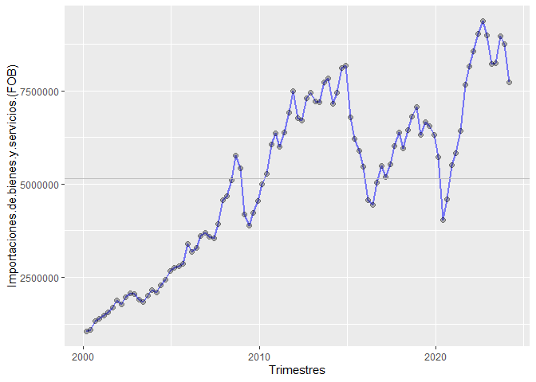
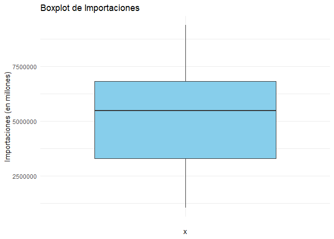
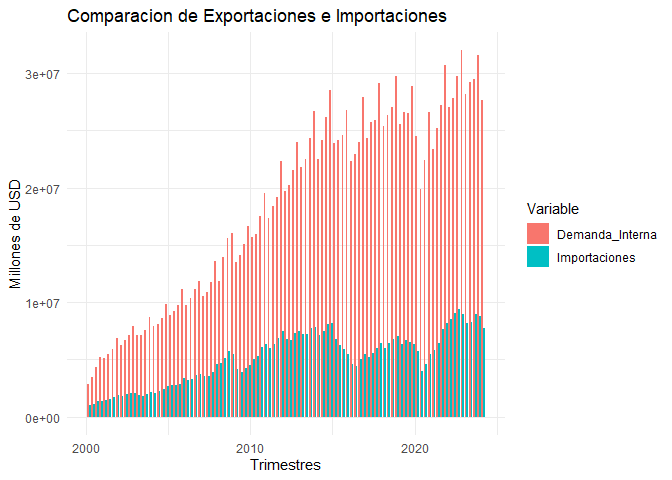
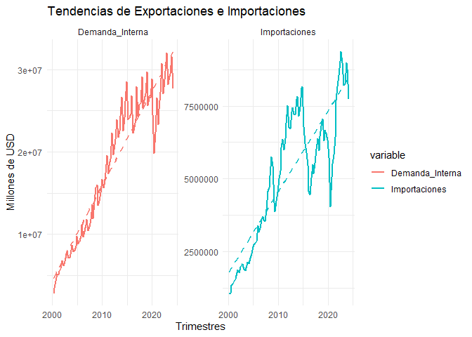

MODULO II
================
Ronald Llerena
2024-08-14

``` r
datos<- read.xlsx("D://Betametrica/Modulo II/Data.xlsx", sheet = "Hoja1", detectDates = T )
datos$Trimestres <- seq(as.Date("2000/03/01"),
                        as.Date("2024/03/01"), 
                        by="quarter")
```

Gráficos con ggplot

``` r
ggplot(data=datos)+
        aes(x=Trimestres)+
        aes(y=`Importaciones.de.bienes.y.servicios.(FOB)`)+
        geom_line(color="blue", alpha=0.5, linewidth=1)+
         geom_point(color="black",alpha=0.3, size=2)+
         geom_hline(yintercept = mean(datos$`Importaciones.de.bienes.y.servicios.(FOB)`,na.rm = TRUE),
                    col="grey")
```

<!-- -->

boxplot usando ggplot2

``` r
ggplot(data = datos) +
  aes(x = "", y = `Importaciones.de.bienes.y.servicios.(FOB)`) +  # Ajusta el nombre de la columna según tus datos
  geom_boxplot(fill = "skyblue") +
  labs(title = "Boxplot de Importaciones", y = "Importaciones (en millones)") +
  theme_minimal()
```

<!-- -->

GRÁFICO DE BARRAS NO APILADAS PARA 2 VARIABLES

Crear un dataframe con las dos variables

``` r
datos_barras <- datos %>%
  select(Trimestres, Demanda_Interna = Demanda.interna, Importaciones = `Importaciones.de.bienes.y.servicios.(FOB)`)

datos_barras_long <- melt(datos_barras, id.vars = "Trimestres")
```

# Crear el gráfico de barras

``` r
ggplot(data = datos_barras_long) +
  aes(x = Trimestres, y = value, fill = variable) +
  geom_bar(stat = "identity", position = "dodge") +
  labs(title = "Comparacion de Exportaciones e Importaciones",
       x = "Trimestres",
       y = "Millones de USD",
       fill = "Variable") +
  theme_minimal()
```

<!-- -->

GRAFICO DE LINEAS CON FACET

SE Escoge dos variables: Importaciones y Demanda interna

``` r
ggplot(data = datos_barras_long) +
  aes(x = Trimestres, y = value, color = variable) +
  geom_line(linewidth = 1) +
  geom_smooth(method = "lm", se = FALSE, linetype = "dashed") +  # Añadir línea de tendencia
  facet_wrap(~ variable, scales = "free_y") +
  labs(title = "Tendencias de Exportaciones e Importaciones",
       x = "Trimestres",
       y = "Millones de USD") +
  theme_minimal()
```

    ## `geom_smooth()` using formula = 'y ~ x'

<!-- -->
