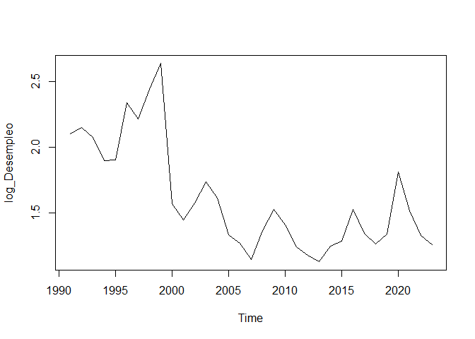

MODULO3: Ciencia de Datos: Modelos Predictivos
================
Ronald Llerena
2024-08-15

SECCION A

``` r
base3<- read.xlsx("D:\\Betametrica\\MODULO III\\DATOS-M3.xlsx")

tsbase <- ts(base3, start = c(2001,1), frequency = 12)
 tsbase
```

    ##          FECHA Oferta_Monetaria Exportaciones
    ## Jan 2001 40544         10442.46       1554522
    ## Feb 2001 40575         10539.79       1520493
    ## Mar 2001 40603         10877.90       1899417
    ## Apr 2001 40634         10768.36       1863609
    ## May 2001 40664         10892.41       1950197
    ## Jun 2001 40695         11074.81       1993007
    ## Jul 2001 40725         11280.38       1819009
    ## Aug 2001 40756         11331.80       2023622
    ## Sep 2001 40787         11233.55       2088516
    ## Oct 2001 40817         11294.03       2053626
    ## Nov 2001 40848         11247.79       2150828
    ## Dec 2001 40878         12092.97       2113138
    ## Jan 2002 40909         11915.69       2022369
    ## Feb 2002 40940         11895.74       1801091
    ## Mar 2002 40969         12443.83       1950793
    ## Apr 2002 41000         12298.02       1847018
    ## May 2002 41030         12537.27       2197999
    ## Jun 2002 41061         12423.70       2043454
    ## Jul 2002 41091         12405.68       2068793
    ## Aug 2002 41122         12512.03       2229932
    ## Sep 2002 41153         12542.09       2027998
    ## Oct 2002 41183         12853.09       1870358
    ## Nov 2002 41214         13336.64       2121648
    ## Dec 2002 41244         14511.62       1983650
    ## Jan 2003 41275         14003.54       2131639
    ## Feb 2003 41306         13992.34       2016811
    ## Mar 2003 41334         14111.17       2103033
    ## Apr 2003 41365         14072.45       2137369
    ## May 2003 41395         14500.44       2378247
    ## Jun 2003 41426         14184.46       2112476
    ## Jul 2003 41456         14281.93       2164968
    ## Aug 2003 41487         14460.12       2322895
    ## Sep 2003 41518         14598.49       2088796
    ## Oct 2003 41548         14764.85       2340841
    ## Nov 2003 41579         15001.81       2047663
    ## Dec 2003 41609         16272.43       1922567
    ## Jan 2004 41640         15549.41       2227396
    ## Feb 2004 41671         15624.84       1868416
    ## Mar 2004 41699         15839.39       2061298

LA TASA DE CRECIMIENTO RELATIVA COMPUESTA PARA EXPORTACIONES ES:

``` r
 tasa <- tslm(log10(tsbase[,"Exportaciones"]) ~ trend, data=tsbase)
 summary(tasa)
```

    ## 
    ## Call:
    ## tslm(formula = log10(tsbase[, "Exportaciones"]) ~ trend, data = tsbase)
    ## 
    ## Residuals:
    ##       Min        1Q    Median        3Q       Max 
    ## -0.089011 -0.018177  0.008754  0.022256  0.053598 
    ## 
    ## Coefficients:
    ##              Estimate Std. Error t value Pr(>|t|)    
    ## (Intercept) 6.2671685  0.0112854 555.336  < 2e-16 ***
    ## trend       0.0019135  0.0004918   3.891 0.000401 ***
    ## ---
    ## Signif. codes:  0 '***' 0.001 '**' 0.01 '*' 0.05 '.' 0.1 ' ' 1
    ## 
    ## Residual standard error: 0.03456 on 37 degrees of freedom
    ## Multiple R-squared:  0.2904, Adjusted R-squared:  0.2712 
    ## F-statistic: 15.14 on 1 and 37 DF,  p-value: 0.0004012

``` r
 plot(tsbase[,"Exportaciones"], main="Exportaciones", ylab="Millones de USD", xlab="Tiempo")
 abline(tasa, col="red", lwd=2)
```

<!-- -->

``` r
 (exp(0.0019135)-1)*100
```

    ## [1] 0.1915332

LA TASA DE CRECIMIENTO RELATIVA COMPUESTA PARA OFERTA MONETARIA ESO:

``` r
 plot(tsbase[,"Oferta_Monetaria"], main="Oferta Monetaria", ylab="Millones de USD", xlab="Tiempo")
 abline(tasa, col="red", lwd=2)
```

<!-- -->

``` r
 tasa <- tslm(log10(tsbase[,"Oferta_Monetaria"]) ~ trend, data=tsbase)
 summary(tasa)
```

    ## 
    ## Call:
    ## tslm(formula = log10(tsbase[, "Oferta_Monetaria"]) ~ trend, data = tsbase)
    ## 
    ## Residuals:
    ##       Min        1Q    Median        3Q       Max 
    ## -0.016040 -0.006665 -0.000090  0.004276  0.032832 
    ## 
    ## Coefficients:
    ##              Estimate Std. Error t value Pr(>|t|)    
    ## (Intercept) 4.0130907  0.0032726 1226.27   <2e-16 ***
    ## trend       0.0048247  0.0001426   33.83   <2e-16 ***
    ## ---
    ## Signif. codes:  0 '***' 0.001 '**' 0.01 '*' 0.05 '.' 0.1 ' ' 1
    ## 
    ## Residual standard error: 0.01002 on 37 degrees of freedom
    ## Multiple R-squared:  0.9687, Adjusted R-squared:  0.9678 
    ## F-statistic:  1145 on 1 and 37 DF,  p-value: < 2.2e-16

``` r
 (exp(0.0048247)-1)*100
```

    ## [1] 0.4836358

SECCION B

REGRESIÓN LINEAL MULTIPLE

``` r
base<- read.xlsx("D:\\Betametrica\\MODULO III\\BASE_MIGRACION.xlsx")
 View(base)
 
 attach(base)

 Emigraciont =ts(base[,2], start =c(1991),end=c(2023), freq=1)
 
 Remesass =ts(base[,4], start =c(1991),end=c(2023), freq=1)
 Desempleo =ts(base[,5], start =c(1991),end=c(2023), freq=1)
```

\#————————-Graficos de las variables————————

Primer grafico

``` r
 plot(Emigraciont, type = "l", col = "blue", main = "Migracion", xlab = "Tiempo", ylab = "Migracion")
```

<!-- -->

Segundo grafico

``` r
 plot(Remesass, type = "l", col = "green", main = "Remesas", xlab = "Tiempo", ylab = "Remesas")
```

<!-- -->

Tercer grafico

``` r
 plot(Desempleo, type = "l", col = "purple", main = "Desempleo", xlab = "Tiempo", ylab = "Desempleo")
```

<!-- -->

``` r
 #------------------------ CONVERTIR UNA SERIE LOG------------------------
 
 log_Emigracion <- log(Emigraciont)  

 log_Remesas <- log(Remesass)  
 log_Desempleo <- log(Desempleo)  

 

 
 #-------------------------Graficos de las variables LOG------------------------
 

 plot(log_Emigracion)
```

<!-- -->

``` r
 plot(log_Remesas)
```

<!-- -->

``` r
 plot(log_Desempleo)
```

<!-- -->

``` r
 #------------------------ REGRESION LINEAL MULTIPLE------------------------
 
 
 modelo1 <- lm(log_Emigracion ~ log_Remesas + log_Desempleo, data = base)
 summary(modelo1)
```

    ## 
    ## Call:
    ## lm(formula = log_Emigracion ~ log_Remesas + log_Desempleo, data = base)
    ## 
    ## Residuals:
    ##      Min       1Q   Median       3Q      Max 
    ## -0.81497 -0.33842 -0.00249  0.41188  0.83177 
    ## 
    ## Coefficients:
    ##               Estimate Std. Error t value Pr(>|t|)    
    ## (Intercept)    15.7997     0.4678  33.773  < 2e-16 ***
    ## log_Remesas     0.4129     0.1360   3.037  0.00491 ** 
    ## log_Desempleo  -1.4014     0.2343  -5.980 1.47e-06 ***
    ## ---
    ## Signif. codes:  0 '***' 0.001 '**' 0.01 '*' 0.05 '.' 0.1 ' ' 1
    ## 
    ## Residual standard error: 0.4962 on 30 degrees of freedom
    ## Multiple R-squared:  0.7096, Adjusted R-squared:  0.6902 
    ## F-statistic: 36.65 on 2 and 30 DF,  p-value: 8.815e-09

``` r
 stargazer(modelo1,type="text")
```

    ## 
    ## ===============================================
    ##                         Dependent variable:    
    ##                     ---------------------------
    ##                           log_Emigracion       
    ## -----------------------------------------------
    ## log_Remesas                  0.413***          
    ##                               (0.136)          
    ##                                                
    ## log_Desempleo                -1.401***         
    ##                               (0.234)          
    ##                                                
    ## Constant                     15.800***         
    ##                               (0.468)          
    ##                                                
    ## -----------------------------------------------
    ## Observations                    33             
    ## R2                             0.710           
    ## Adjusted R2                    0.690           
    ## Residual Std. Error       0.496 (df = 30)      
    ## F Statistic           36.651*** (df = 2; 30)   
    ## ===============================================
    ## Note:               *p<0.1; **p<0.05; ***p<0.01

``` r
 #----------------------- ERRORES DENTRO DE LA REGRESION------------------------
 
 #RESIDUALES
 #HOMOCEDASTICO
 
 residuos <- resid(modelo1)
 residuos
```

    ##           1           2           3           4           5           6 
    ## -0.19775784 -0.14282978 -0.55384446 -0.71348644 -0.81496805 -0.27101397 
    ##           7           8           9          10          11          12 
    ##  0.45260545  0.53318434  0.77254915 -0.63760110 -0.65554408 -0.33842402 
    ##          13          14          15          16          17          18 
    ## -0.09721118 -0.17490515 -0.54308810 -0.55258737 -0.62587720 -0.16608102 
    ##          19          20          21          22          23          24 
    ##  0.10176325  0.08890648 -0.00249074  0.04005602  0.09664119  0.41188290 
    ##          25          26          27          28          29          30 
    ##  0.50653550  0.83176689  0.60514904  0.67628126  0.68623000  0.09688380 
    ##          31          32          33 
    ## -0.05996497  0.24055494  0.40668524

``` r
 # Crear el Q-Q plot de los residuos
 # se puede concluir que los datos tiene normalidad
 
 x11()
 plot(residuos, type = "l", main = "residuos", xlab = "C
ndice", ylab = "residuos")
 
 bptest(modelo1)
```

    ## 
    ##  studentized Breusch-Pagan test
    ## 
    ## data:  modelo1
    ## BP = 1.1868, df = 2, p-value = 0.5524

``` r
 #NORMALES
 shapiro.test(modelo1$residuals)
```

    ## 
    ##  Shapiro-Wilk normality test
    ## 
    ## data:  modelo1$residuals
    ## W = 0.9559, p-value = 0.1973

``` r
 ad.test(modelo1$residuals)
```

    ## 
    ##  Anderson-Darling normality test
    ## 
    ## data:  modelo1$residuals
    ## A = 0.41269, p-value = 0.3202

``` r
 jarque.bera.test(as.vector(modelo1$residuals))
```

    ## 
    ##  Jarque Bera Test
    ## 
    ## data:  as.vector(modelo1$residuals)
    ## X-squared = 1.662, df = 2, p-value = 0.4356

``` r
 #NO AUTOCORRELACION
 dwtest(modelo1)
```

    ## 
    ##  Durbin-Watson test
    ## 
    ## data:  modelo1
    ## DW = 0.60141, p-value = 1.36e-07
    ## alternative hypothesis: true autocorrelation is greater than 0

``` r
 bgtest(modelo1)
```

    ## 
    ##  Breusch-Godfrey test for serial correlation of order up to 1
    ## 
    ## data:  modelo1
    ## LM test = 15.973, df = 1, p-value = 6.424e-05

``` r
 #SISTEMICO
 #MULTICOLINEALIDAD
 vif_valores <- vif(modelo1)
 print(vif_valores)
```

    ##   log_Remesas log_Desempleo 
    ##      1.215806      1.215806

``` r
 #CORRECTA ESPECIFICACION
 resettest(modelo1)
```

    ## 
    ##  RESET test
    ## 
    ## data:  modelo1
    ## RESET = 1.9017, df1 = 2, df2 = 28, p-value = 0.1681
