Modulo VII
================
Ronald Llerena
2024-08-21

``` r
data <- read_xlsx("D:\\Betametrica\\MODULO VII\\Data.xlsx")
View(data)
```

CONVERTIR UNA SERIE TEMPORAL

``` r
ex <- ts(data[,2], start = c(2000, 1), end = c(2024, 1), freq = 4)
ex
```

    ##         Qtr1    Qtr2    Qtr3    Qtr4
    ## 2000 1670809 1633022 1670331 1608796
    ## 2001 1664911 1543295 1582505 1594006
    ## 2002 1592666 1699992 1782781 1881390
    ## 2003 2012166 1944536 2114403 2240506
    ## 2004 2246586 2506136 2643580 2845318
    ## 2005 2968426 3105199 3432391 3635824
    ## 2006 3962502 4006485 4074262 4269123
    ## 2007 4038305 4357788 4716080 5572342
    ## 2008 6572235 6501836 6204701 5345932
    ## 2009 4178039 4191543 4341503 4902530
    ## 2010 5006393 5423076 5449955 6260009
    ## 2011 6520296 6983862 7401629 7618953
    ## 2012 7659503 7537769 7679872 7682211
    ## 2013 7495089 7519253 7941294 8309267
    ## 2014 8563482 8310005 7915722 7417993
    ## 2015 6027218 5932752 5275793 4883772
    ## 2016 4419256 5023177 5101892 5516695
    ## 2017 5524608 5459552 5471475 5989818
    ## 2018 6083442 6408240 6502149 6310877
    ## 2019 6034681 6592066 6612610 6635971
    ## 2020 6418864 4349522 5447565 6104946
    ## 2021 6271020 7198975 7494971 8047571
    ## 2022 8712109 9531874 8884456 8764447
    ## 2023 8317838 8518269 9120179 8586401
    ## 2024 8983490

CONVERSIÓN DE SERIES DE TIEMPO EN LOGARITMOS - TASAS DE CRECIMIENTO

Generar los logaritmos de las series

``` r
lex <- log(ex)
lex
```

    ##          Qtr1     Qtr2     Qtr3     Qtr4
    ## 2000 14.32882 14.30594 14.32853 14.29100
    ## 2001 14.32528 14.24943 14.27452 14.28176
    ## 2002 14.28092 14.34613 14.39368 14.44752
    ## 2003 14.51472 14.48053 14.56428 14.62221
    ## 2004 14.62492 14.73425 14.78764 14.86119
    ## 2005 14.90354 14.94859 15.04877 15.10635
    ## 2006 15.19239 15.20342 15.22020 15.26692
    ## 2007 15.21134 15.28748 15.36649 15.53333
    ## 2008 15.69836 15.68760 15.64082 15.49185
    ## 2009 15.24535 15.24858 15.28373 15.40526
    ## 2010 15.42623 15.50617 15.51112 15.64969
    ## 2011 15.69043 15.75911 15.81721 15.84615
    ## 2012 15.85146 15.83544 15.85411 15.85442
    ## 2013 15.82976 15.83298 15.88759 15.93288
    ## 2014 15.96302 15.93297 15.88436 15.81942
    ## 2015 15.61180 15.59600 15.47864 15.40143
    ## 2016 15.30148 15.42957 15.44512 15.52329
    ## 2017 15.52472 15.51288 15.51506 15.60557
    ## 2018 15.62108 15.67310 15.68764 15.65779
    ## 2019 15.61303 15.70138 15.70449 15.70802
    ## 2020 15.67475 15.28558 15.51068 15.62461
    ## 2021 15.65145 15.78945 15.82974 15.90088
    ## 2022 15.98022 16.07015 15.99981 15.98621
    ## 2023 15.93391 15.95772 16.02600 15.96569
    ## 2024 16.01090

``` r
# Grafico de la serie original
plot(ex, main="Exportaciones Originales", ylab="Exportaciones", xlab="Periodo")
```

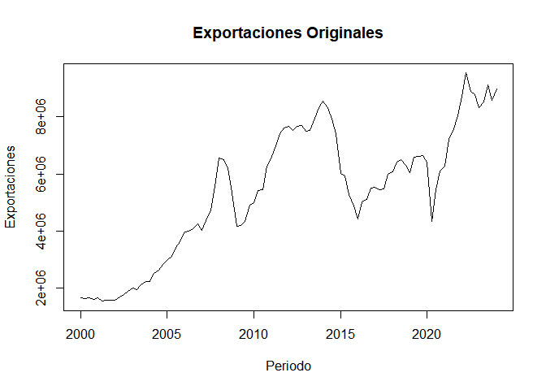<!-- -->

``` r
# Grafico de la serie en logaritmos
plot(lex, main="Logaritmo de las Exportaciones", ylab="Log(Exportaciones)", xlab="Periodo")
```

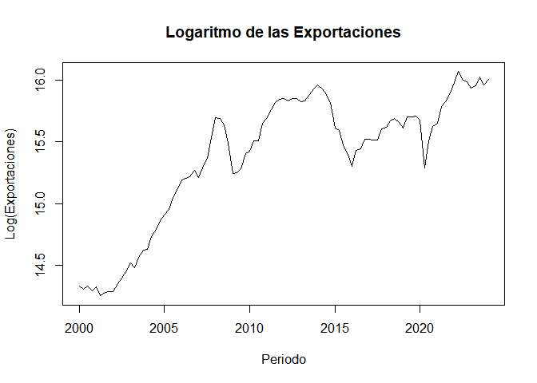<!-- -->

La serie presenta varios picos y valles que indican fluctuaciones en las
exportaciones . El año 2008, por ejemplo, muestra un pico alto seguido
de una caída abrupta, lo que podría estar asociado con la crisis
financiera global de ese año. Otro aspecto notable es el fuerte descenso
en 2020, probablemente reflejando el impacto de la pandemia de COVID-19
en el comercio global. Después del descenso en 2020, la serie muestra
una recuperación significativa, con las exportaciones alcanzando nuevos
máximos en 2022 y 2023. Este repunte podría estar relacionado con la
recuperación económica global y el aumento en la demanda de
exportaciones.

Generar los rezagos interanuales

``` r
lexlag4 = stats::lag(lex, -4)
lexlag4
```

    ##          Qtr1     Qtr2     Qtr3     Qtr4
    ## 2001 14.32882 14.30594 14.32853 14.29100
    ## 2002 14.32528 14.24943 14.27452 14.28176
    ## 2003 14.28092 14.34613 14.39368 14.44752
    ## 2004 14.51472 14.48053 14.56428 14.62221
    ## 2005 14.62492 14.73425 14.78764 14.86119
    ## 2006 14.90354 14.94859 15.04877 15.10635
    ## 2007 15.19239 15.20342 15.22020 15.26692
    ## 2008 15.21134 15.28748 15.36649 15.53333
    ## 2009 15.69836 15.68760 15.64082 15.49185
    ## 2010 15.24535 15.24858 15.28373 15.40526
    ## 2011 15.42623 15.50617 15.51112 15.64969
    ## 2012 15.69043 15.75911 15.81721 15.84615
    ## 2013 15.85146 15.83544 15.85411 15.85442
    ## 2014 15.82976 15.83298 15.88759 15.93288
    ## 2015 15.96302 15.93297 15.88436 15.81942
    ## 2016 15.61180 15.59600 15.47864 15.40143
    ## 2017 15.30148 15.42957 15.44512 15.52329
    ## 2018 15.52472 15.51288 15.51506 15.60557
    ## 2019 15.62108 15.67310 15.68764 15.65779
    ## 2020 15.61303 15.70138 15.70449 15.70802
    ## 2021 15.67475 15.28558 15.51068 15.62461
    ## 2022 15.65145 15.78945 15.82974 15.90088
    ## 2023 15.98022 16.07015 15.99981 15.98621
    ## 2024 15.93391 15.95772 16.02600 15.96569
    ## 2025 16.01090

``` r
exlag4 = stats::lag(ex, -4)
exlag4
```

    ##         Qtr1    Qtr2    Qtr3    Qtr4
    ## 2001 1670809 1633022 1670331 1608796
    ## 2002 1664911 1543295 1582505 1594006
    ## 2003 1592666 1699992 1782781 1881390
    ## 2004 2012166 1944536 2114403 2240506
    ## 2005 2246586 2506136 2643580 2845318
    ## 2006 2968426 3105199 3432391 3635824
    ## 2007 3962502 4006485 4074262 4269123
    ## 2008 4038305 4357788 4716080 5572342
    ## 2009 6572235 6501836 6204701 5345932
    ## 2010 4178039 4191543 4341503 4902530
    ## 2011 5006393 5423076 5449955 6260009
    ## 2012 6520296 6983862 7401629 7618953
    ## 2013 7659503 7537769 7679872 7682211
    ## 2014 7495089 7519253 7941294 8309267
    ## 2015 8563482 8310005 7915722 7417993
    ## 2016 6027218 5932752 5275793 4883772
    ## 2017 4419256 5023177 5101892 5516695
    ## 2018 5524608 5459552 5471475 5989818
    ## 2019 6083442 6408240 6502149 6310877
    ## 2020 6034681 6592066 6612610 6635971
    ## 2021 6418864 4349522 5447565 6104946
    ## 2022 6271020 7198975 7494971 8047571
    ## 2023 8712109 9531874 8884456 8764447
    ## 2024 8317838 8518269 9120179 8586401
    ## 2025 8983490

Generar las tasas de crecimiento interanual

``` r
tclex4 <- (lex - lexlag4) * 100
tclex4
```

    ##             Qtr1        Qtr2        Qtr3        Qtr4
    ## 2001  -0.3535842  -5.6512199  -5.4012699  -0.9236159
    ## 2002  -4.4362285   9.6703575  11.9165321  16.5761068
    ## 2003  23.3802370  13.4400082  17.0597930  17.4690762
    ## 2004  11.0199615  25.3718522  22.3361871  23.8973072
    ## 2005  27.8620155  21.4335640  26.1123069  24.5160805
    ## 2006  28.8843973  25.4836622  17.1432441  16.0572610
    ## 2007   1.8949434   8.4050384  14.6288214  26.6407065
    ## 2008  48.7028790  40.0119990  27.4329320  -4.1479588
    ## 2009 -45.3011867 -43.9015814 -35.7086735  -8.6584543
    ## 2010  18.0873626  25.7594393  22.7386951  24.4430352
    ## 2011  26.4204101  25.2938796  30.6092636  19.6457251
    ## 2012  16.1027274   7.6324159   3.6902758   0.8268508
    ## 2013  -2.1699111  -0.2459378   3.3473400   7.8463948
    ## 2014  13.3258902   9.9993353  -0.3225344 -11.3462867
    ## 2015 -35.1221257 -33.6972053 -40.5721905 -41.7990696
    ## 2016 -31.0314243 -16.6425500  -3.3517569  12.1861211
    ## 2017  22.3240848   8.3304198   6.9936845   8.2281935
    ## 2018   9.6358460  16.0217769  17.2584406   5.2213668
    ## 2019  -0.8047675   2.8282281   1.6845737   5.0230340
    ## 2020   6.1718148 -41.5801008 -19.3809644  -8.3405664
    ## 2021  -2.3302099  50.3872858  31.9063502  27.6271055
    ## 2022  32.8774884  28.0702576  17.0070957   8.5333098
    ## 2023  -4.6311617 -11.2428164   2.6186247  -2.0523774
    ## 2024   7.6986161

``` r
tcex4 <- (ex / exlag4 - 1) * 100
tcex4
```

    ##             Qtr1        Qtr2        Qtr3        Qtr4
    ## 2001  -0.3529598  -5.4945044  -5.2579924  -0.9193637
    ## 2002  -4.3392670  10.1533803  12.6556146  18.0291059
    ## 2003  26.3394783  14.3850362  18.6013793  19.0877895
    ## 2004  11.6500918  28.8808982  25.0272929  26.9944339
    ## 2005  32.1305358  23.9038456  29.8387446  27.7826778
    ## 2006  33.4883434  29.0250806  18.7003947  17.4183028
    ## 2007   1.9130114   8.7683694  15.7529757  30.5266279
    ## 2008  62.7473464  49.2003712  31.5648000  -4.0631082
    ## 2009 -36.4289410 -35.5329416 -30.0288194  -8.2941985
    ## 2010  19.8263740  29.3813932  25.5315520  27.6893726
    ## 2011  30.2393989  28.7804456  35.8108110  21.7083291
    ## 2012  17.4717007   7.9312387   3.7592118   0.8302786
    ## 2013  -2.1465379  -0.2456356   3.4039937   8.1624360
    ## 2014  14.2545767  10.5163572  -0.3220149 -10.7262654
    ## 2015 -29.6171990 -28.6071208 -33.3504509 -34.1631646
    ## 2016 -26.6783488 -15.3314107  -3.2962078  12.9597316
    ## 2017  25.0121627   8.6872383   7.2440449   8.5761881
    ## 2018  10.1153713  17.3766454  18.8372122   5.3600839
    ## 2019  -0.8015379   2.8686022   1.6988427   5.1513274
    ## 2020   6.3662507 -34.0188445 -17.6185292  -8.0022130
    ## 2021  -2.3032702  65.5118915  37.5838691  31.8205122
    ## 2022  38.9265075  32.4059738  18.5388960   8.9079776
    ## 2023  -4.5255599 -10.6338458   2.6532119  -2.0314594
    ## 2024   8.0027130

EXPORTAR LA DATA-

``` r
datafinal <- cbind(ex, exlag4, tcex4, lex, tclex4)
datafinal
```

    ##              ex  exlag4       tcex4      lex      tclex4
    ## 2000 Q1 1670809      NA          NA 14.32882          NA
    ## 2000 Q2 1633022      NA          NA 14.30594          NA
    ## 2000 Q3 1670331      NA          NA 14.32853          NA
    ## 2000 Q4 1608796      NA          NA 14.29100          NA
    ## 2001 Q1 1664911 1670809  -0.3529598 14.32528  -0.3535842
    ## 2001 Q2 1543295 1633022  -5.4945044 14.24943  -5.6512199
    ## 2001 Q3 1582505 1670331  -5.2579924 14.27452  -5.4012699
    ## 2001 Q4 1594006 1608796  -0.9193637 14.28176  -0.9236159
    ## 2002 Q1 1592666 1664911  -4.3392670 14.28092  -4.4362285
    ## 2002 Q2 1699992 1543295  10.1533803 14.34613   9.6703575
    ## 2002 Q3 1782781 1582505  12.6556146 14.39368  11.9165321
    ## 2002 Q4 1881390 1594006  18.0291059 14.44752  16.5761068
    ## 2003 Q1 2012166 1592666  26.3394783 14.51472  23.3802370
    ## 2003 Q2 1944536 1699992  14.3850362 14.48053  13.4400082
    ## 2003 Q3 2114403 1782781  18.6013793 14.56428  17.0597930
    ## 2003 Q4 2240506 1881390  19.0877895 14.62221  17.4690762
    ## 2004 Q1 2246586 2012166  11.6500918 14.62492  11.0199615
    ## 2004 Q2 2506136 1944536  28.8808982 14.73425  25.3718522
    ## 2004 Q3 2643580 2114403  25.0272929 14.78764  22.3361871
    ## 2004 Q4 2845318 2240506  26.9944339 14.86119  23.8973072
    ## 2005 Q1 2968426 2246586  32.1305358 14.90354  27.8620155
    ## 2005 Q2 3105199 2506136  23.9038456 14.94859  21.4335640
    ## 2005 Q3 3432391 2643580  29.8387446 15.04877  26.1123069
    ## 2005 Q4 3635824 2845318  27.7826778 15.10635  24.5160805
    ## 2006 Q1 3962502 2968426  33.4883434 15.19239  28.8843973
    ## 2006 Q2 4006485 3105199  29.0250806 15.20342  25.4836622
    ## 2006 Q3 4074262 3432391  18.7003947 15.22020  17.1432441
    ## 2006 Q4 4269123 3635824  17.4183028 15.26692  16.0572610
    ## 2007 Q1 4038305 3962502   1.9130114 15.21134   1.8949434
    ## 2007 Q2 4357788 4006485   8.7683694 15.28748   8.4050384
    ## 2007 Q3 4716080 4074262  15.7529757 15.36649  14.6288214
    ## 2007 Q4 5572342 4269123  30.5266279 15.53333  26.6407065
    ## 2008 Q1 6572235 4038305  62.7473464 15.69836  48.7028790
    ## 2008 Q2 6501836 4357788  49.2003712 15.68760  40.0119990
    ## 2008 Q3 6204701 4716080  31.5648000 15.64082  27.4329320
    ## 2008 Q4 5345932 5572342  -4.0631082 15.49185  -4.1479588
    ## 2009 Q1 4178039 6572235 -36.4289410 15.24535 -45.3011867
    ## 2009 Q2 4191543 6501836 -35.5329416 15.24858 -43.9015814
    ## 2009 Q3 4341503 6204701 -30.0288194 15.28373 -35.7086735
    ## 2009 Q4 4902530 5345932  -8.2941985 15.40526  -8.6584543
    ## 2010 Q1 5006393 4178039  19.8263740 15.42623  18.0873626
    ## 2010 Q2 5423076 4191543  29.3813932 15.50617  25.7594393
    ## 2010 Q3 5449955 4341503  25.5315520 15.51112  22.7386951
    ## 2010 Q4 6260009 4902530  27.6893726 15.64969  24.4430352
    ## 2011 Q1 6520296 5006393  30.2393989 15.69043  26.4204101
    ## 2011 Q2 6983862 5423076  28.7804456 15.75911  25.2938796
    ## 2011 Q3 7401629 5449955  35.8108110 15.81721  30.6092636
    ## 2011 Q4 7618953 6260009  21.7083291 15.84615  19.6457251
    ## 2012 Q1 7659503 6520296  17.4717007 15.85146  16.1027274
    ## 2012 Q2 7537769 6983862   7.9312387 15.83544   7.6324159
    ## 2012 Q3 7679872 7401629   3.7592118 15.85411   3.6902758
    ## 2012 Q4 7682211 7618953   0.8302786 15.85442   0.8268508
    ## 2013 Q1 7495089 7659503  -2.1465379 15.82976  -2.1699111
    ## 2013 Q2 7519253 7537769  -0.2456356 15.83298  -0.2459378
    ## 2013 Q3 7941294 7679872   3.4039937 15.88759   3.3473400
    ## 2013 Q4 8309267 7682211   8.1624360 15.93288   7.8463948
    ## 2014 Q1 8563482 7495089  14.2545767 15.96302  13.3258902
    ## 2014 Q2 8310005 7519253  10.5163572 15.93297   9.9993353
    ## 2014 Q3 7915722 7941294  -0.3220149 15.88436  -0.3225344
    ## 2014 Q4 7417993 8309267 -10.7262654 15.81942 -11.3462867
    ## 2015 Q1 6027218 8563482 -29.6171990 15.61180 -35.1221257
    ## 2015 Q2 5932752 8310005 -28.6071208 15.59600 -33.6972053
    ## 2015 Q3 5275793 7915722 -33.3504509 15.47864 -40.5721905
    ## 2015 Q4 4883772 7417993 -34.1631646 15.40143 -41.7990696
    ## 2016 Q1 4419256 6027218 -26.6783488 15.30148 -31.0314243
    ## 2016 Q2 5023177 5932752 -15.3314107 15.42957 -16.6425500
    ## 2016 Q3 5101892 5275793  -3.2962078 15.44512  -3.3517569
    ## 2016 Q4 5516695 4883772  12.9597316 15.52329  12.1861211
    ## 2017 Q1 5524608 4419256  25.0121627 15.52472  22.3240848
    ## 2017 Q2 5459552 5023177   8.6872383 15.51288   8.3304198
    ## 2017 Q3 5471475 5101892   7.2440449 15.51506   6.9936845
    ## 2017 Q4 5989818 5516695   8.5761881 15.60557   8.2281935
    ## 2018 Q1 6083442 5524608  10.1153713 15.62108   9.6358460
    ## 2018 Q2 6408240 5459552  17.3766454 15.67310  16.0217769
    ## 2018 Q3 6502149 5471475  18.8372122 15.68764  17.2584406
    ## 2018 Q4 6310877 5989818   5.3600839 15.65779   5.2213668
    ## 2019 Q1 6034681 6083442  -0.8015379 15.61303  -0.8047675
    ## 2019 Q2 6592066 6408240   2.8686022 15.70138   2.8282281
    ## 2019 Q3 6612610 6502149   1.6988427 15.70449   1.6845737
    ## 2019 Q4 6635971 6310877   5.1513274 15.70802   5.0230340
    ## 2020 Q1 6418864 6034681   6.3662507 15.67475   6.1718148
    ## 2020 Q2 4349522 6592066 -34.0188445 15.28558 -41.5801008
    ## 2020 Q3 5447565 6612610 -17.6185292 15.51068 -19.3809644
    ## 2020 Q4 6104946 6635971  -8.0022130 15.62461  -8.3405664
    ## 2021 Q1 6271020 6418864  -2.3032702 15.65145  -2.3302099
    ## 2021 Q2 7198975 4349522  65.5118915 15.78945  50.3872858
    ## 2021 Q3 7494971 5447565  37.5838691 15.82974  31.9063502
    ## 2021 Q4 8047571 6104946  31.8205122 15.90088  27.6271055
    ## 2022 Q1 8712109 6271020  38.9265075 15.98022  32.8774884
    ## 2022 Q2 9531874 7198975  32.4059738 16.07015  28.0702576
    ## 2022 Q3 8884456 7494971  18.5388960 15.99981  17.0070957
    ## 2022 Q4 8764447 8047571   8.9079776 15.98621   8.5333098
    ## 2023 Q1 8317838 8712109  -4.5255599 15.93391  -4.6311617
    ## 2023 Q2 8518269 9531874 -10.6338458 15.95772 -11.2428164
    ## 2023 Q3 9120179 8884456   2.6532119 16.02600   2.6186247
    ## 2023 Q4 8586401 8764447  -2.0314594 15.96569  -2.0523774
    ## 2024 Q1 8983490 8317838   8.0027130 16.01090   7.6986161
    ## 2024 Q2      NA 8518269          NA       NA          NA
    ## 2024 Q3      NA 9120179          NA       NA          NA
    ## 2024 Q4      NA 8586401          NA       NA          NA
    ## 2025 Q1      NA 8983490          NA       NA          NA

``` r
muestra1<-window(datafinal, start=c(2000,1), end=c(2024,1))
muestra1
```

    ##              ex  exlag4       tcex4      lex      tclex4
    ## 2000 Q1 1670809      NA          NA 14.32882          NA
    ## 2000 Q2 1633022      NA          NA 14.30594          NA
    ## 2000 Q3 1670331      NA          NA 14.32853          NA
    ## 2000 Q4 1608796      NA          NA 14.29100          NA
    ## 2001 Q1 1664911 1670809  -0.3529598 14.32528  -0.3535842
    ## 2001 Q2 1543295 1633022  -5.4945044 14.24943  -5.6512199
    ## 2001 Q3 1582505 1670331  -5.2579924 14.27452  -5.4012699
    ## 2001 Q4 1594006 1608796  -0.9193637 14.28176  -0.9236159
    ## 2002 Q1 1592666 1664911  -4.3392670 14.28092  -4.4362285
    ## 2002 Q2 1699992 1543295  10.1533803 14.34613   9.6703575
    ## 2002 Q3 1782781 1582505  12.6556146 14.39368  11.9165321
    ## 2002 Q4 1881390 1594006  18.0291059 14.44752  16.5761068
    ## 2003 Q1 2012166 1592666  26.3394783 14.51472  23.3802370
    ## 2003 Q2 1944536 1699992  14.3850362 14.48053  13.4400082
    ## 2003 Q3 2114403 1782781  18.6013793 14.56428  17.0597930
    ## 2003 Q4 2240506 1881390  19.0877895 14.62221  17.4690762
    ## 2004 Q1 2246586 2012166  11.6500918 14.62492  11.0199615
    ## 2004 Q2 2506136 1944536  28.8808982 14.73425  25.3718522
    ## 2004 Q3 2643580 2114403  25.0272929 14.78764  22.3361871
    ## 2004 Q4 2845318 2240506  26.9944339 14.86119  23.8973072
    ## 2005 Q1 2968426 2246586  32.1305358 14.90354  27.8620155
    ## 2005 Q2 3105199 2506136  23.9038456 14.94859  21.4335640
    ## 2005 Q3 3432391 2643580  29.8387446 15.04877  26.1123069
    ## 2005 Q4 3635824 2845318  27.7826778 15.10635  24.5160805
    ## 2006 Q1 3962502 2968426  33.4883434 15.19239  28.8843973
    ## 2006 Q2 4006485 3105199  29.0250806 15.20342  25.4836622
    ## 2006 Q3 4074262 3432391  18.7003947 15.22020  17.1432441
    ## 2006 Q4 4269123 3635824  17.4183028 15.26692  16.0572610
    ## 2007 Q1 4038305 3962502   1.9130114 15.21134   1.8949434
    ## 2007 Q2 4357788 4006485   8.7683694 15.28748   8.4050384
    ## 2007 Q3 4716080 4074262  15.7529757 15.36649  14.6288214
    ## 2007 Q4 5572342 4269123  30.5266279 15.53333  26.6407065
    ## 2008 Q1 6572235 4038305  62.7473464 15.69836  48.7028790
    ## 2008 Q2 6501836 4357788  49.2003712 15.68760  40.0119990
    ## 2008 Q3 6204701 4716080  31.5648000 15.64082  27.4329320
    ## 2008 Q4 5345932 5572342  -4.0631082 15.49185  -4.1479588
    ## 2009 Q1 4178039 6572235 -36.4289410 15.24535 -45.3011867
    ## 2009 Q2 4191543 6501836 -35.5329416 15.24858 -43.9015814
    ## 2009 Q3 4341503 6204701 -30.0288194 15.28373 -35.7086735
    ## 2009 Q4 4902530 5345932  -8.2941985 15.40526  -8.6584543
    ## 2010 Q1 5006393 4178039  19.8263740 15.42623  18.0873626
    ## 2010 Q2 5423076 4191543  29.3813932 15.50617  25.7594393
    ## 2010 Q3 5449955 4341503  25.5315520 15.51112  22.7386951
    ## 2010 Q4 6260009 4902530  27.6893726 15.64969  24.4430352
    ## 2011 Q1 6520296 5006393  30.2393989 15.69043  26.4204101
    ## 2011 Q2 6983862 5423076  28.7804456 15.75911  25.2938796
    ## 2011 Q3 7401629 5449955  35.8108110 15.81721  30.6092636
    ## 2011 Q4 7618953 6260009  21.7083291 15.84615  19.6457251
    ## 2012 Q1 7659503 6520296  17.4717007 15.85146  16.1027274
    ## 2012 Q2 7537769 6983862   7.9312387 15.83544   7.6324159
    ## 2012 Q3 7679872 7401629   3.7592118 15.85411   3.6902758
    ## 2012 Q4 7682211 7618953   0.8302786 15.85442   0.8268508
    ## 2013 Q1 7495089 7659503  -2.1465379 15.82976  -2.1699111
    ## 2013 Q2 7519253 7537769  -0.2456356 15.83298  -0.2459378
    ## 2013 Q3 7941294 7679872   3.4039937 15.88759   3.3473400
    ## 2013 Q4 8309267 7682211   8.1624360 15.93288   7.8463948
    ## 2014 Q1 8563482 7495089  14.2545767 15.96302  13.3258902
    ## 2014 Q2 8310005 7519253  10.5163572 15.93297   9.9993353
    ## 2014 Q3 7915722 7941294  -0.3220149 15.88436  -0.3225344
    ## 2014 Q4 7417993 8309267 -10.7262654 15.81942 -11.3462867
    ## 2015 Q1 6027218 8563482 -29.6171990 15.61180 -35.1221257
    ## 2015 Q2 5932752 8310005 -28.6071208 15.59600 -33.6972053
    ## 2015 Q3 5275793 7915722 -33.3504509 15.47864 -40.5721905
    ## 2015 Q4 4883772 7417993 -34.1631646 15.40143 -41.7990696
    ## 2016 Q1 4419256 6027218 -26.6783488 15.30148 -31.0314243
    ## 2016 Q2 5023177 5932752 -15.3314107 15.42957 -16.6425500
    ## 2016 Q3 5101892 5275793  -3.2962078 15.44512  -3.3517569
    ## 2016 Q4 5516695 4883772  12.9597316 15.52329  12.1861211
    ## 2017 Q1 5524608 4419256  25.0121627 15.52472  22.3240848
    ## 2017 Q2 5459552 5023177   8.6872383 15.51288   8.3304198
    ## 2017 Q3 5471475 5101892   7.2440449 15.51506   6.9936845
    ## 2017 Q4 5989818 5516695   8.5761881 15.60557   8.2281935
    ## 2018 Q1 6083442 5524608  10.1153713 15.62108   9.6358460
    ## 2018 Q2 6408240 5459552  17.3766454 15.67310  16.0217769
    ## 2018 Q3 6502149 5471475  18.8372122 15.68764  17.2584406
    ## 2018 Q4 6310877 5989818   5.3600839 15.65779   5.2213668
    ## 2019 Q1 6034681 6083442  -0.8015379 15.61303  -0.8047675
    ## 2019 Q2 6592066 6408240   2.8686022 15.70138   2.8282281
    ## 2019 Q3 6612610 6502149   1.6988427 15.70449   1.6845737
    ## 2019 Q4 6635971 6310877   5.1513274 15.70802   5.0230340
    ## 2020 Q1 6418864 6034681   6.3662507 15.67475   6.1718148
    ## 2020 Q2 4349522 6592066 -34.0188445 15.28558 -41.5801008
    ## 2020 Q3 5447565 6612610 -17.6185292 15.51068 -19.3809644
    ## 2020 Q4 6104946 6635971  -8.0022130 15.62461  -8.3405664
    ## 2021 Q1 6271020 6418864  -2.3032702 15.65145  -2.3302099
    ## 2021 Q2 7198975 4349522  65.5118915 15.78945  50.3872858
    ## 2021 Q3 7494971 5447565  37.5838691 15.82974  31.9063502
    ## 2021 Q4 8047571 6104946  31.8205122 15.90088  27.6271055
    ## 2022 Q1 8712109 6271020  38.9265075 15.98022  32.8774884
    ## 2022 Q2 9531874 7198975  32.4059738 16.07015  28.0702576
    ## 2022 Q3 8884456 7494971  18.5388960 15.99981  17.0070957
    ## 2022 Q4 8764447 8047571   8.9079776 15.98621   8.5333098
    ## 2023 Q1 8317838 8712109  -4.5255599 15.93391  -4.6311617
    ## 2023 Q2 8518269 9531874 -10.6338458 15.95772 -11.2428164
    ## 2023 Q3 9120179 8884456   2.6532119 16.02600   2.6186247
    ## 2023 Q4 8586401 8764447  -2.0314594 15.96569  -2.0523774
    ## 2024 Q1 8983490 8317838   8.0027130 16.01090   7.6986161

DIFERENCIAS———————————————————–

``` r
#.........Primera diferencia----------------------------------

dtcltcb <- diff(tclex4)
dex <- diff(ex)
dlex <- diff(lex)
dtclex4 <- diff(tclex4)

#--------Segunda diferencia---------------------------------

dtclx2 <- diff(tclex4, differences = 2)
dex2 <- diff(ex, differences = 2)
dlex2 <- diff(lex, differences = 2)
```

GRAFICOS————————————————————–

``` r
grafico1<-plot(dlex2)
```

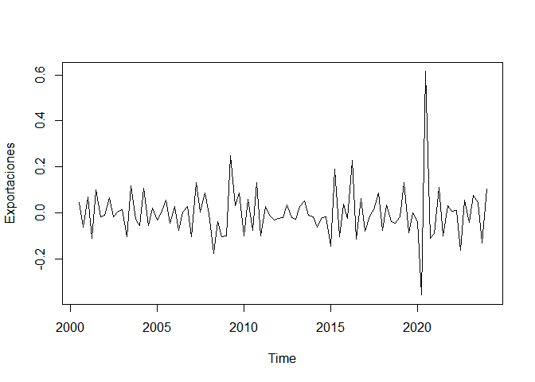<!-- -->

``` r
grafico2<-plot(dex2)
```

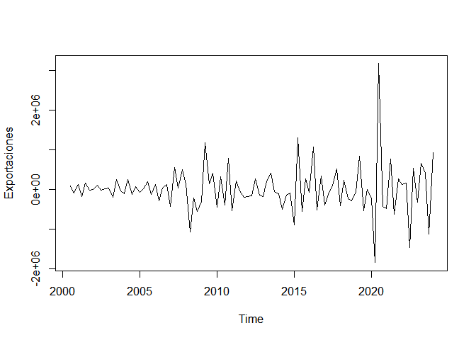<!-- -->

``` r
# La gráfica en logarítmo en segunda diferencia se observa más estacional.
# Nota importante: Se puede correr las diferencias necesarias, pero estadísticamente es mejor hasta segunda diferencia porque se piede datos 
# A su vez la data cuenta con 97 observaciones
```

DESCOMPOSICIÓN DE LA SERIE———————-

``` r
  ts_decompose(dlex2)
```

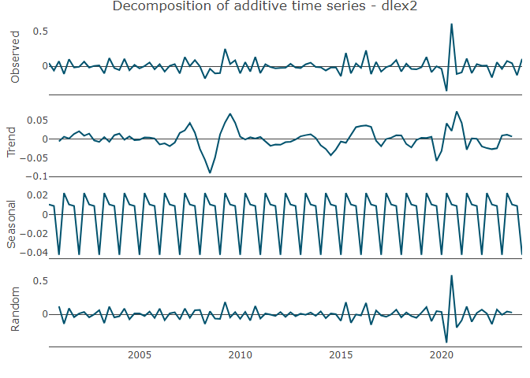<!-- -->

``` r
  # Una vez convertida la variable en segunda diferencia logarítmica, comprobada su estacionalidad con ADF
  # se observa que las gráficas tienen tendencia y estacionalidad
```

ESTACIONARIEDAD DE LAS SERIES—–

``` r
#---------Test Augmented Dickey-Fuller---------
## sin constante ni tendencia

adf1_ltp<-summary(ur.df(dlex2, lags=4))
adf1_ltp
```

    ## 
    ## ############################################### 
    ## # Augmented Dickey-Fuller Test Unit Root Test # 
    ## ############################################### 
    ## 
    ## Test regression none 
    ## 
    ## 
    ## Call:
    ## lm(formula = z.diff ~ z.lag.1 - 1 + z.diff.lag)
    ## 
    ## Residuals:
    ##      Min       1Q   Median       3Q      Max 
    ## -0.35236 -0.04343  0.00055  0.05078  0.36004 
    ## 
    ## Coefficients:
    ##             Estimate Std. Error t value Pr(>|t|)    
    ## z.lag.1      -2.9103     0.4036  -7.210 2.14e-10 ***
    ## z.diff.lag1   1.2436     0.3478   3.575  0.00058 ***
    ## z.diff.lag2   0.8940     0.2792   3.203  0.00192 ** 
    ## z.diff.lag3   0.6308     0.1991   3.168  0.00213 ** 
    ## z.diff.lag4   0.2269     0.1060   2.140  0.03523 *  
    ## ---
    ## Signif. codes:  0 '***' 0.001 '**' 0.01 '*' 0.05 '.' 0.1 ' ' 1
    ## 
    ## Residual standard error: 0.09054 on 85 degrees of freedom
    ## Multiple R-squared:  0.7824, Adjusted R-squared:  0.7696 
    ## F-statistic: 61.12 on 5 and 85 DF,  p-value: < 2.2e-16
    ## 
    ## 
    ## Value of test-statistic is: -7.2099 
    ## 
    ## Critical values for test statistics: 
    ##      1pct  5pct 10pct
    ## tau1 -2.6 -1.95 -1.61

``` r
#constante
adf2_ltp<-summary(ur.df(dlex2, type="drift", lags=3))
adf2_ltp
```

    ## 
    ## ############################################### 
    ## # Augmented Dickey-Fuller Test Unit Root Test # 
    ## ############################################### 
    ## 
    ## Test regression drift 
    ## 
    ## 
    ## Call:
    ## lm(formula = z.diff ~ z.lag.1 + 1 + z.diff.lag)
    ## 
    ## Residuals:
    ##      Min       1Q   Median       3Q      Max 
    ## -0.36110 -0.04186 -0.00044  0.04653  0.36165 
    ## 
    ## Coefficients:
    ##               Estimate Std. Error t value Pr(>|t|)    
    ## (Intercept)  0.0009643  0.0097079   0.099  0.92110    
    ## z.lag.1     -2.3789918  0.3229319  -7.367 9.91e-11 ***
    ## z.diff.lag1  0.7662640  0.2726298   2.811  0.00612 ** 
    ## z.diff.lag2  0.4621998  0.1969711   2.347  0.02125 *  
    ## z.diff.lag3  0.2637442  0.1046127   2.521  0.01354 *  
    ## ---
    ## Signif. codes:  0 '***' 0.001 '**' 0.01 '*' 0.05 '.' 0.1 ' ' 1
    ## 
    ## Residual standard error: 0.0926 on 86 degrees of freedom
    ## Multiple R-squared:  0.7728, Adjusted R-squared:  0.7623 
    ## F-statistic: 73.14 on 4 and 86 DF,  p-value: < 2.2e-16
    ## 
    ## 
    ## Value of test-statistic is: -7.3669 27.1383 
    ## 
    ## Critical values for test statistics: 
    ##       1pct  5pct 10pct
    ## tau2 -3.51 -2.89 -2.58
    ## phi1  6.70  4.71  3.86

``` r
##constante y tendencia
adf3_ltp<-summary(ur.df(dlex2, type="trend", lags=3))
adf3_ltp
```

    ## 
    ## ############################################### 
    ## # Augmented Dickey-Fuller Test Unit Root Test # 
    ## ############################################### 
    ## 
    ## Test regression trend 
    ## 
    ## 
    ## Call:
    ## lm(formula = z.diff ~ z.lag.1 + 1 + tt + z.diff.lag)
    ## 
    ## Residuals:
    ##      Min       1Q   Median       3Q      Max 
    ## -0.35811 -0.03996 -0.00087  0.04891  0.36450 
    ## 
    ## Coefficients:
    ##               Estimate Std. Error t value Pr(>|t|)    
    ## (Intercept)  0.0057907  0.0206625   0.280  0.77997    
    ## z.lag.1     -2.3807832  0.3247622  -7.331 1.23e-10 ***
    ## tt          -0.0000985  0.0003717  -0.265  0.79164    
    ## z.diff.lag1  0.7676642  0.2741665   2.800  0.00632 ** 
    ## z.diff.lag2  0.4632361  0.1980832   2.339  0.02170 *  
    ## z.diff.lag3  0.2643694  0.1052093   2.513  0.01387 *  
    ## ---
    ## Signif. codes:  0 '***' 0.001 '**' 0.01 '*' 0.05 '.' 0.1 ' ' 1
    ## 
    ## Residual standard error: 0.0931 on 85 degrees of freedom
    ## Multiple R-squared:  0.773,  Adjusted R-squared:  0.7597 
    ## F-statistic:  57.9 on 5 and 85 DF,  p-value: < 2.2e-16
    ## 
    ## 
    ## Value of test-statistic is: -7.3309 17.92 26.877 
    ## 
    ## Critical values for test statistics: 
    ##       1pct  5pct 10pct
    ## tau3 -4.04 -3.45 -3.15
    ## phi2  6.50  4.88  4.16
    ## phi3  8.73  6.49  5.47

``` r
# A nivel no sale estacional en ninguno de las medidas ya sea en valores originales, logarítimicas y tasas de crecimiento
# Se procede a calcular primera diferencia en tasa de crecimiento logaritmica, sale estacional pero no pasa las otras pruebas


# Por primera diferencia en logaritmos la serie es estacional al aplicarse la prueva ADF, pero las siguientes pruebas de ajuste no logra superarlas
# Se considera por segunda diferencia logarítmica de la variable exportaciones
```

DISEÑO DE LA MUESTRA

``` r
estacionaria<-cbind (dlex2)
estacionaria
```

    ##               Qtr1          Qtr2          Qtr3          Qtr4
    ## 2000                              0.0454654024 -0.0601252504
    ## 2001  0.0718212321 -0.1101377409  0.1009412592 -0.0178482110
    ## 2002 -0.0080814331  0.0660542447 -0.0176628548  0.0062857907
    ## 2003  0.0133641212 -0.1013893455  0.1179372822 -0.0258192259
    ## 2004 -0.0552198581  0.1066207094 -0.0559382768  0.0201486266
    ## 2005 -0.0311839756  0.0026891111  0.0551336663 -0.0426010654
    ## 2006  0.0284614557 -0.0750014068  0.0057368349  0.0299432859
    ## 2007 -0.1023018904  0.1317227193  0.0028737157  0.0878243063
    ## 2008 -0.0017990166 -0.1758078061 -0.0360081535 -0.1021939312
    ## 2009 -0.0975223886  0.2497205260  0.0319248735  0.0863791811
    ## 2010 -0.1005664122  0.0589831243 -0.0750033348  0.1336300234
    ## 2011 -0.0978360635  0.0279440698 -0.0105841903 -0.0291592003
    ## 2012 -0.0236306568 -0.0213290669  0.0346975226 -0.0183720491
    ## 2013 -0.0249640255  0.0278782853  0.0513905665 -0.0093142778
    ## 2014 -0.0151596202 -0.0601822172 -0.0185625823 -0.0163331032
    ## 2015 -0.1426804868  0.1918253757 -0.1015616375  0.0401479574
    ## 2016 -0.0227352428  0.2280376665 -0.1125424503  0.0626188067
    ## 2017 -0.0767343860 -0.0132786204  0.0140268465  0.0883312494
    ## 2018 -0.0750029501  0.0365041636 -0.0374658263 -0.0444061249
    ## 2019 -0.0148935553  0.1330954622 -0.0852323254  0.0004150207
    ## 2020 -0.0367903490 -0.3559115023  0.6142781947 -0.1111723632
    ## 2021 -0.0870907648  0.1111598911 -0.0977061195  0.0308445462
    ## 2022  0.0082055114  0.0105837536 -0.1602654303  0.0567383056
    ## 2023 -0.0387013434  0.0761119213  0.0444655273 -0.1285861260
    ## 2024  0.1055186123

``` r
muestra_end<-window(estacionaria, start=c(2000,3), end=c(2024,1))
muestra_end
```

    ##               Qtr1          Qtr2          Qtr3          Qtr4
    ## 2000                              0.0454654024 -0.0601252504
    ## 2001  0.0718212321 -0.1101377409  0.1009412592 -0.0178482110
    ## 2002 -0.0080814331  0.0660542447 -0.0176628548  0.0062857907
    ## 2003  0.0133641212 -0.1013893455  0.1179372822 -0.0258192259
    ## 2004 -0.0552198581  0.1066207094 -0.0559382768  0.0201486266
    ## 2005 -0.0311839756  0.0026891111  0.0551336663 -0.0426010654
    ## 2006  0.0284614557 -0.0750014068  0.0057368349  0.0299432859
    ## 2007 -0.1023018904  0.1317227193  0.0028737157  0.0878243063
    ## 2008 -0.0017990166 -0.1758078061 -0.0360081535 -0.1021939312
    ## 2009 -0.0975223886  0.2497205260  0.0319248735  0.0863791811
    ## 2010 -0.1005664122  0.0589831243 -0.0750033348  0.1336300234
    ## 2011 -0.0978360635  0.0279440698 -0.0105841903 -0.0291592003
    ## 2012 -0.0236306568 -0.0213290669  0.0346975226 -0.0183720491
    ## 2013 -0.0249640255  0.0278782853  0.0513905665 -0.0093142778
    ## 2014 -0.0151596202 -0.0601822172 -0.0185625823 -0.0163331032
    ## 2015 -0.1426804868  0.1918253757 -0.1015616375  0.0401479574
    ## 2016 -0.0227352428  0.2280376665 -0.1125424503  0.0626188067
    ## 2017 -0.0767343860 -0.0132786204  0.0140268465  0.0883312494
    ## 2018 -0.0750029501  0.0365041636 -0.0374658263 -0.0444061249
    ## 2019 -0.0148935553  0.1330954622 -0.0852323254  0.0004150207
    ## 2020 -0.0367903490 -0.3559115023  0.6142781947 -0.1111723632
    ## 2021 -0.0870907648  0.1111598911 -0.0977061195  0.0308445462
    ## 2022  0.0082055114  0.0105837536 -0.1602654303  0.0567383056
    ## 2023 -0.0387013434  0.0761119213  0.0444655273 -0.1285861260
    ## 2024  0.1055186123

IDENTIFICACÓN p, q

``` r
ts_cor(muestra_end)
```

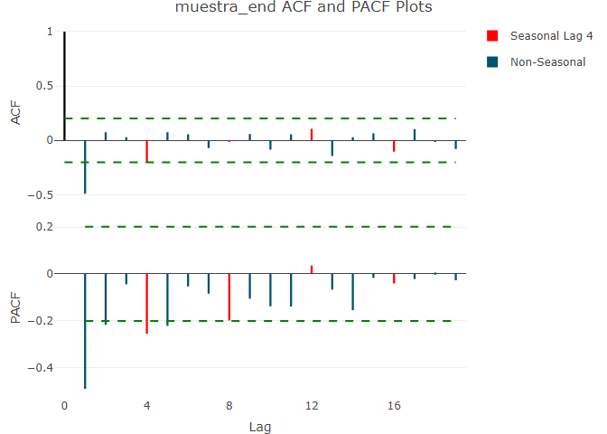<!-- -->

``` r
ts_cor(muestra_end, lag=28)
```

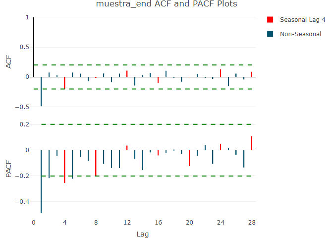<!-- -->

MODELO ARIMA(p,d,q)—

ESTIMACIÓN ARIMA-

``` r
arima1<- arima(muestra_end,order=c(2,2,1), method = "ML")
summary( arima1)
```

    ## 
    ## Call:
    ## arima(x = muestra_end, order = c(2, 2, 1), method = "ML")
    ## 
    ## Coefficients:
    ##           ar1      ar2      ma1
    ##       -1.0359  -0.5051  -1.0000
    ## s.e.   0.0886   0.0885   0.0272
    ## 
    ## sigma^2 estimated as 0.01367:  log likelihood = 63.82,  aic = -119.63
    ## 
    ## Training set error measures:
    ##                       ME      RMSE        MAE       MPE     MAPE      MASE
    ## Training set 0.001419714 0.1156991 0.07274907 -27.94577 337.4221 0.5677935
    ##                   ACF1
    ## Training set -0.113397

``` r
#------Mostrar la significancia del pvalue del ARIMA(p,d,q)--------------

coeftest(arima1)
```

    ## 
    ## z test of coefficients:
    ## 
    ##      Estimate Std. Error  z value  Pr(>|z|)    
    ## ar1 -1.035928   0.088627 -11.6886 < 2.2e-16 ***
    ## ar2 -0.505059   0.088502  -5.7068 1.151e-08 ***
    ## ma1 -0.999995   0.027217 -36.7417 < 2.2e-16 ***
    ## ---
    ## Signif. codes:  0 '***' 0.001 '**' 0.01 '*' 0.05 '.' 0.1 ' ' 1

``` r
# De acuerdo al modelo seleccionado 2 autorregresivos y 1 media móvil todas las variables salen significativas 
# con un p value menor al 5% y los errores estándares adecuados
```

``` r
#EVALUACIÓN DEL ARIMA------------------------------

#------Residuos son ruido blanco---------------------------------
residuals=resid(arima1)

adf.test(residuals)
```

    ## Warning in adf.test(residuals): p-value smaller than printed p-value

    ## 
    ##  Augmented Dickey-Fuller Test
    ## 
    ## data:  residuals
    ## Dickey-Fuller = -7.5756, Lag order = 4, p-value = 0.01
    ## alternative hypothesis: stationary

``` r
# El valor negativo del ADF -7,57 indica que los residuos son estacionarios 

# la prueba arroja un p value de 0.01, lo que significa que es bueno ya que han estacionariedad de los residuos
# De esta forma se rechaza la H0 (que hay problemas de raiz y no estacionaridad) y aceptar la Ha el cual expresa que es estacionaria
# Estos resultados indican que los datos se ajustan adecuadamente en el modelo ARIMA


plot(residuals)
```

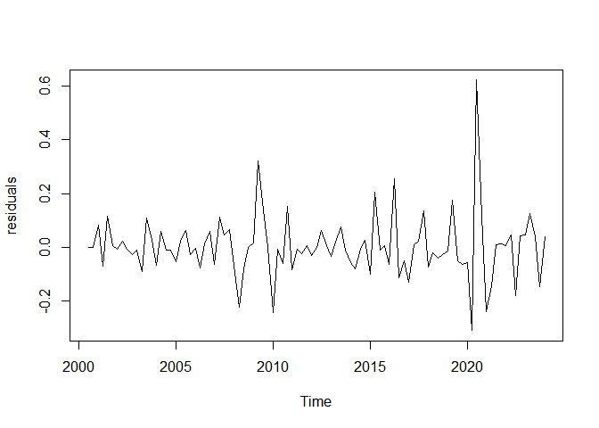<!-- -->

``` r
## sin constante ni tendencia

adf1_ltp<-summary(ur.df(residuals, lags=3))
adf1_ltp
```

    ## 
    ## ############################################### 
    ## # Augmented Dickey-Fuller Test Unit Root Test # 
    ## ############################################### 
    ## 
    ## Test regression none 
    ## 
    ## 
    ## Call:
    ## lm(formula = z.diff ~ z.lag.1 - 1 + z.diff.lag)
    ## 
    ## Residuals:
    ##      Min       1Q   Median       3Q      Max 
    ## -0.32374 -0.05851 -0.01039  0.04605  0.47261 
    ## 
    ## Coefficients:
    ##             Estimate Std. Error t value Pr(>|t|)    
    ## z.lag.1      -2.2773     0.2706  -8.415 7.05e-13 ***
    ## z.diff.lag1   0.9831     0.2123   4.631 1.27e-05 ***
    ## z.diff.lag2   0.6447     0.1602   4.026 0.000121 ***
    ## z.diff.lag3   0.2625     0.1046   2.509 0.013973 *  
    ## ---
    ## Signif. codes:  0 '***' 0.001 '**' 0.01 '*' 0.05 '.' 0.1 ' ' 1
    ## 
    ## Residual standard error: 0.1064 on 87 degrees of freedom
    ## Multiple R-squared:  0.6485, Adjusted R-squared:  0.6323 
    ## F-statistic: 40.13 on 4 and 87 DF,  p-value: < 2.2e-16
    ## 
    ## 
    ## Value of test-statistic is: -8.4153 
    ## 
    ## Critical values for test statistics: 
    ##      1pct  5pct 10pct
    ## tau1 -2.6 -1.95 -1.61

``` r
#constante
adf2_ltp<-summary(ur.df(residuals, type="drift", lags=3))
adf2_ltp
```

    ## 
    ## ############################################### 
    ## # Augmented Dickey-Fuller Test Unit Root Test # 
    ## ############################################### 
    ## 
    ## Test regression drift 
    ## 
    ## 
    ## Call:
    ## lm(formula = z.diff ~ z.lag.1 + 1 + z.diff.lag)
    ## 
    ## Residuals:
    ##      Min       1Q   Median       3Q      Max 
    ## -0.32718 -0.06188 -0.01368  0.04269  0.46891 
    ## 
    ## Coefficients:
    ##              Estimate Std. Error t value Pr(>|t|)    
    ## (Intercept)  0.003414   0.011218   0.304 0.761577    
    ## z.lag.1     -2.280153   0.272197  -8.377 9.12e-13 ***
    ## z.diff.lag1  0.985458   0.213544   4.615 1.36e-05 ***
    ## z.diff.lag2  0.646162   0.161064   4.012 0.000128 ***
    ## z.diff.lag3  0.263148   0.105216   2.501 0.014279 *  
    ## ---
    ## Signif. codes:  0 '***' 0.001 '**' 0.01 '*' 0.05 '.' 0.1 ' ' 1
    ## 
    ## Residual standard error: 0.1069 on 86 degrees of freedom
    ## Multiple R-squared:  0.6489, Adjusted R-squared:  0.6325 
    ## F-statistic: 39.73 on 4 and 86 DF,  p-value: < 2.2e-16
    ## 
    ## 
    ## Value of test-statistic is: -8.3768 35.0858 
    ## 
    ## Critical values for test statistics: 
    ##       1pct  5pct 10pct
    ## tau2 -3.51 -2.89 -2.58
    ## phi1  6.70  4.71  3.86

``` r
##constante y tendencia
adf3_ltp<-summary(ur.df(residuals, type="trend", lags=3))
adf3_ltp
```

    ## 
    ## ############################################### 
    ## # Augmented Dickey-Fuller Test Unit Root Test # 
    ## ############################################### 
    ## 
    ## Test regression trend 
    ## 
    ## 
    ## Call:
    ## lm(formula = z.diff ~ z.lag.1 + 1 + tt + z.diff.lag)
    ## 
    ## Residuals:
    ##      Min       1Q   Median       3Q      Max 
    ## -0.32338 -0.06279 -0.01394  0.03853  0.47244 
    ## 
    ## Coefficients:
    ##               Estimate Std. Error t value Pr(>|t|)    
    ## (Intercept)  0.0094806  0.0238760   0.397 0.692305    
    ## z.lag.1     -2.2825448  0.2737857  -8.337 1.19e-12 ***
    ## tt          -0.0001237  0.0004293  -0.288 0.773850    
    ## z.diff.lag1  0.9871752  0.2147739   4.596 1.48e-05 ***
    ## z.diff.lag2  0.6475733  0.1620035   3.997 0.000136 ***
    ## z.diff.lag3  0.2641344  0.1058367   2.496 0.014504 *  
    ## ---
    ## Signif. codes:  0 '***' 0.001 '**' 0.01 '*' 0.05 '.' 0.1 ' ' 1
    ## 
    ## Residual standard error: 0.1075 on 85 degrees of freedom
    ## Multiple R-squared:  0.6492, Adjusted R-squared:  0.6286 
    ## F-statistic: 31.46 on 5 and 85 DF,  p-value: < 2.2e-16
    ## 
    ## 
    ## Value of test-statistic is: -8.337 23.1689 34.7532 
    ## 
    ## Critical values for test statistics: 
    ##       1pct  5pct 10pct
    ## tau3 -4.04 -3.45 -3.15
    ## phi2  6.50  4.88  4.16
    ## phi3  8.73  6.49  5.47

``` r
# En cada caso, se supera la prueba ADF
```

``` r
#------Normalidad de los resiudos--------------------------------


jarque.bera.test(residuals(arima1))
```

    ## 
    ##  Jarque Bera Test
    ## 
    ## data:  residuals(arima1)
    ## X-squared = 301.58, df = 2, p-value < 2.2e-16

``` r
# Los resultados indican que el modelo no siguen una distribución normal, sin embargo ello no desmerece el modelo

#Estabilidad ARIMA--------


autoplot(arima1)
```

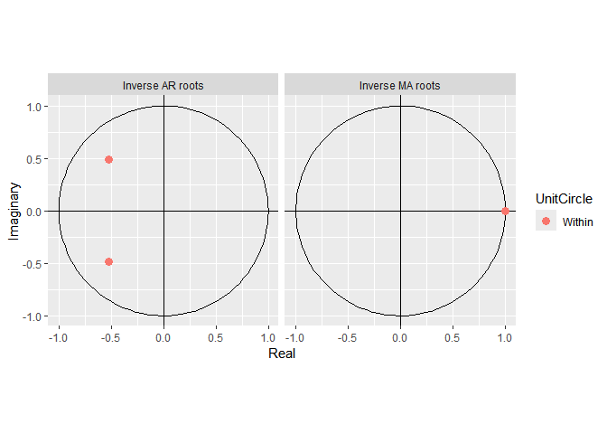<!-- -->

``` r
# el resultado indica que el modelo es estable ya que se encuentran los puntos dentro del círculo en su inversa tanto para el componente ar y ma


#####--Ljung-Box test----

checkresiduals(arima1)
```

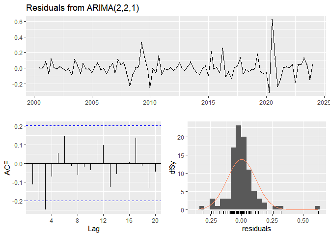<!-- -->

    ## 
    ##  Ljung-Box test
    ## 
    ## data:  Residuals from ARIMA(2,2,1)
    ## Q* = 15.242, df = 5, p-value = 0.009376
    ## 
    ## Model df: 3.   Total lags used: 8

``` r
# La prueba expresa que un p value menor al 5% expres problemas de autocorrelación residual
# Puede ser necesario realizar ajustes adicionales como otra transformación de datos para mejorar el nivel de predicción
# como p value es menor a 0.05 no se rechaza la Ho 


##9.3.Proyección ARIMA-------------------------------

prediccion1 <- forecast(arima1, h=4)
summary(prediccion1)
```

    ## 
    ## Forecast method: ARIMA(2,2,1)
    ## 
    ## Model Information:
    ## 
    ## Call:
    ## arima(x = muestra_end, order = c(2, 2, 1), method = "ML")
    ## 
    ## Coefficients:
    ##           ar1      ar2      ma1
    ##       -1.0359  -0.5051  -1.0000
    ## s.e.   0.0886   0.0885   0.0272
    ## 
    ## sigma^2 estimated as 0.01367:  log likelihood = 63.82,  aic = -119.63
    ## 
    ## Error measures:
    ##                       ME      RMSE        MAE       MPE     MAPE      MASE
    ## Training set 0.001419714 0.1156991 0.07274907 -27.94577 337.4221 0.6601102
    ##                   ACF1
    ## Training set -0.113397
    ## 
    ## Forecasts:
    ##         Point Forecast      Lo 80     Hi 80      Lo 95     Hi 95
    ## 2024 Q2   -0.049862866 -0.2005315 0.1008058 -0.2802906 0.1805649
    ## 2024 Q3   -0.007402749 -0.1581106 0.1433052 -0.2378906 0.2230851
    ## 2024 Q4    0.026821283 -0.1446170 0.1982596 -0.2353709 0.2890135
    ## 2025 Q1   -0.030344376 -0.2165666 0.1558778 -0.3151466 0.2544579

``` r
#--9.4.Graficar la proyecci?n---------------------------


hchart(prediccion1)
```

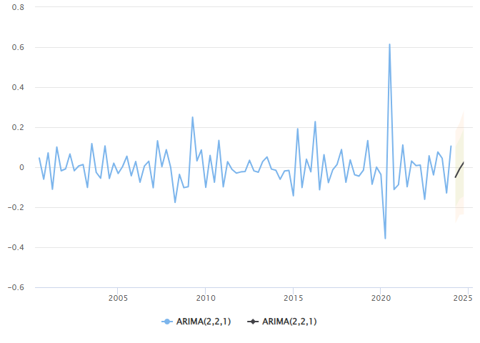<!-- -->

``` r
# La gráfica permite visualizar el modelo con los cuatro periodos de predicción

#---ETAPA 10. RESUMEN DEL ARIMA----------------------------------


stargazer(arima1, type="text")
```

    ## 
    ## =============================================
    ##                       Dependent variable:    
    ##                   ---------------------------
    ##                           muestra_end        
    ## ---------------------------------------------
    ## ar1                        -1.036***         
    ##                             (0.089)          
    ##                                              
    ## ar2                        -0.505***         
    ##                             (0.089)          
    ##                                              
    ## ma1                        -1.000***         
    ##                             (0.027)          
    ##                                              
    ## ---------------------------------------------
    ## Observations                  93             
    ## Log Likelihood              63.817           
    ## sigma2                       0.014           
    ## Akaike Inf. Crit.          -119.635          
    ## =============================================
    ## Note:             *p<0.1; **p<0.05; ***p<0.01

``` r
# Del resultado final tenemos un MAPE demasiado elevado.  El MAE indica que la predicción del modelo esta equivocada en 0.072 unidades
# El MAE es aceptable, pero el MAPE hace generar dudas sobre la capacidad predicitiva del modelo. 
# Tal vez para el tipo de datos, el modelo ARIMA hay que incorporar variables de control en el denominado ARIMAX
```
