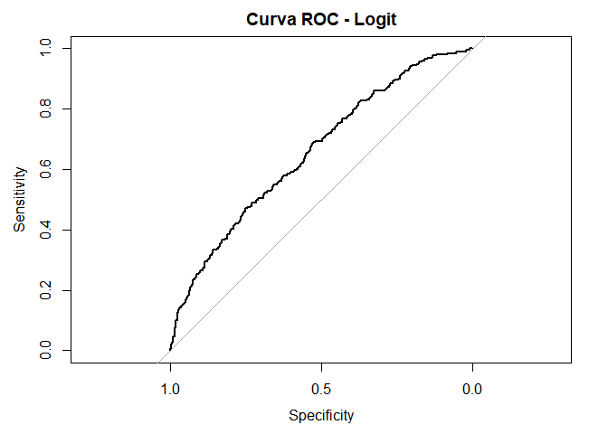

Modulo IV: Ciencia de Datos: Modelos Predictivos II
================
Ronald Llerena
2024-08-10

``` r
db<-read.xlsx("D:\\Betametrica\\M4\\germancredit.xlsx")

attach(db)
```

    ## The following object is masked from package:MASS:
    ## 
    ##     housing

``` r
names(db)
```

    ##  [1] "Default"         "checkingstatus1" "duration"        "history"        
    ##  [5] "purpose"         "amount"          "savings"         "employ"         
    ##  [9] "installment"     "status"          "others"          "residence"      
    ## [13] "property"        "age"             "otherplans"      "housing"        
    ## [17] "cards"           "job"             "liable"          "tele"           
    ## [21] "foreign"

``` r
str(db)
```

    ## 'data.frame':    1000 obs. of  21 variables:
    ##  $ Default        : num  0 1 0 0 1 0 0 0 0 1 ...
    ##  $ checkingstatus1: chr  "A11" "A12" "A14" "A11" ...
    ##  $ duration       : num  6 48 12 42 24 36 24 36 12 30 ...
    ##  $ history        : chr  "A34" "A32" "A34" "A32" ...
    ##  $ purpose        : chr  "A43" "A43" "A46" "A42" ...
    ##  $ amount         : num  1169 5951 2096 7882 4870 ...
    ##  $ savings        : chr  "A65" "A61" "A61" "A61" ...
    ##  $ employ         : chr  "A75" "A73" "A74" "A74" ...
    ##  $ installment    : num  4 2 2 2 3 2 3 2 2 4 ...
    ##  $ status         : chr  "A93" "A92" "A93" "A93" ...
    ##  $ others         : chr  "A101" "A101" "A101" "A103" ...
    ##  $ residence      : num  4 2 3 4 4 4 4 2 4 2 ...
    ##  $ property       : chr  "A121" "A121" "A121" "A122" ...
    ##  $ age            : num  67 22 49 45 53 35 53 35 61 28 ...
    ##  $ otherplans     : chr  "A143" "A143" "A143" "A143" ...
    ##  $ housing        : chr  "A152" "A152" "A152" "A153" ...
    ##  $ cards          : num  2 1 1 1 2 1 1 1 1 2 ...
    ##  $ job            : chr  "A173" "A173" "A172" "A173" ...
    ##  $ liable         : num  1 1 2 2 2 2 1 1 1 1 ...
    ##  $ tele           : chr  "A192" "A191" "A191" "A191" ...
    ##  $ foreign        : chr  "A201" "A201" "A201" "A201" ...

``` r
logit_model <- glm(Default ~ duration + amount + installment + age + I(age^2) + cards,
                   data = db, family = binomial(link = "logit"))


probit_model <- glm(Default ~duration   + amount + installment + age + I(age^2) + cards,
                    data = db, family = binomial(link = "probit"))

summary(probit_model)
```

    ## 
    ## Call:
    ## glm(formula = Default ~ duration + amount + installment + age + 
    ##     I(age^2) + cards, family = binomial(link = "probit"), data = db)
    ## 
    ## Coefficients:
    ##               Estimate Std. Error z value Pr(>|z|)    
    ## (Intercept)  1.942e-01  4.445e-01   0.437 0.662136    
    ## duration     1.656e-02  4.688e-03   3.533 0.000411 ***
    ## amount       4.386e-05  2.073e-05   2.116 0.034379 *  
    ## installment  1.271e-01  4.310e-02   2.949 0.003189 ** 
    ## age         -7.078e-02  2.252e-02  -3.143 0.001674 ** 
    ## I(age^2)     7.200e-04  2.682e-04   2.684 0.007269 ** 
    ## cards       -7.333e-02  7.674e-02  -0.956 0.339257    
    ## ---
    ## Signif. codes:  0 '***' 0.001 '**' 0.01 '*' 0.05 '.' 0.1 ' ' 1
    ## 
    ## (Dispersion parameter for binomial family taken to be 1)
    ## 
    ##     Null deviance: 1221.7  on 999  degrees of freedom
    ## Residual deviance: 1151.9  on 993  degrees of freedom
    ## AIC: 1165.9
    ## 
    ## Number of Fisher Scoring iterations: 4

# Predicciones para el modelo logit y probit

``` r
logit_preds <- predict(logit_model, type = "response")
probit_preds <- predict(probit_model, type = "response")
```

# Curva ROC para el modelo logit

``` r
roc_logit <- roc(db$Default, logit_preds)
```

    ## Setting levels: control = 0, case = 1

    ## Setting direction: controls < cases

``` r
plot(roc_logit, main = "Curva ROC - Logit")
```

<!-- -->

``` r
auc(roc_logit)
```

    ## Area under the curve: 0.6559

# Curva ROC para el modelo probit

``` r
roc_probit <- roc(db$Default, probit_preds)
```

    ## Setting levels: control = 0, case = 1

    ## Setting direction: controls < cases

``` r
plot(roc_probit, main = "Curva ROC - Probit")
```

<!-- -->

``` r
auc(roc_probit)
```

    ## Area under the curve: 0.6558

# Umbral óptimo para el modelo logit

``` r
optimal_cut_logit <- coords(roc_logit, "best", ret = "threshold")
optimal_cut_logit <- as.numeric(optimal_cut_logit[1])
```

# Matriz de confusión para el modelo logit

``` r
table(db$Default, logit_preds > optimal_cut_logit)
```

    ##    
    ##     FALSE TRUE
    ##   0   525  175
    ##   1   159  141

# Umbral óptimo para el modelo probit

``` r
optimal_cut_probit <- coords(roc_probit, "best", ret = "threshold")
optimal_cut_probit <- as.numeric(optimal_cut_probit[1])
optimal_cut_probit
```

    ## [1] 0.3436555

# Matriz de confusión para el modelo probit

``` r
table(db$Default, probit_preds > optimal_cut_probit)
```

    ##    
    ##     FALSE TRUE
    ##   0   522  178
    ##   1   158  142

# Test de Hosmer-Lemeshow para logit

``` r
hoslem.test(db$Default, fitted(logit_model), g = 10)
```

    ## 
    ##  Hosmer and Lemeshow goodness of fit (GOF) test
    ## 
    ## data:  db$Default, fitted(logit_model)
    ## X-squared = 7.6569, df = 8, p-value = 0.4677

# Test de Hosmer-Lemeshow para probit

``` r
hoslem.test(db$Default, fitted(probit_model), g = 10)
```

    ## 
    ##  Hosmer and Lemeshow goodness of fit (GOF) test
    ## 
    ## data:  db$Default, fitted(probit_model)
    ## X-squared = 8.0644, df = 8, p-value = 0.4272

# Crear un nuevo dataframe con valores hipotéticos

``` r
hypothetical <- data.frame(duration = c(24, 36), amount = c(5000, 10000), installment = c(2,3), 
                           age = c(35, 50), age2 = c(35^2, 50^2), cards = c(2, 3))

hypothetical
```

    ##   duration amount installment age age2 cards
    ## 1       24   5000           2  35 1225     2
    ## 2       36  10000           3  50 2500     3

# Predecir con el modelo logit

``` r
hypothetical$logit_pred <- predict(logit_model, newdata = hypothetical, type = "response")
```

# Predecir con el modelo probit

``` r
hypothetical$probit_pred <- predict(probit_model, newdata = hypothetical, type = "response")
```

# Mostrar los valores y proyecciones

``` r
print(hypothetical)
```

    ##   duration amount installment age age2 cards logit_pred probit_pred
    ## 1       24   5000           2  35 1225     2  0.2456485   0.2492486
    ## 2       36  10000           3  50 2500     3  0.3598599   0.3636268

Los valores predichos son muy similares para ambos modelos (logit_pred y
probit_pred), lo que sugiere que no hay una gran diferencia en su
rendimiento en términos de predicción.
