MODULO V: Modelos para segmentación y clasificación
================
Ronald Llerena
2024-08-11

``` r
data<- read.xlsx("D://Betametrica/MODULO V/bancos.xlsx")
nombres<-data$BANCOS
base<- as.data.frame(scale(data[,-1]))
row.names(base) <- nombres
```

# Método de distancia: Euclidean y Manhattan

``` r
cluster <- hclust(dist(base, method = "euclidean"),
                  method = "ward.D")
plot(cluster, hang=-0.01, cex=0.8)
```

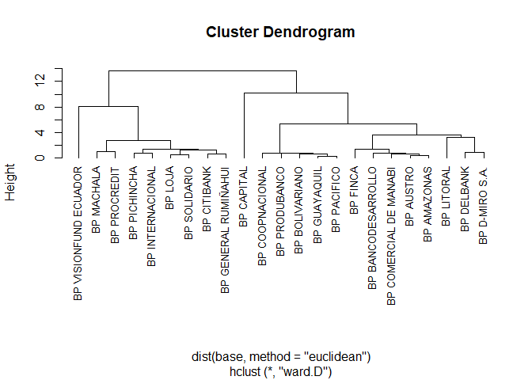<!-- -->

La figura anterior es un Dendrogram, es un cluster jerarquico, que
enbloba todos los elementos de la tabla de la base de datos, una dentro
de otros subgrupos y unos que quedan solitos por ejemplo BP CAPITAL y es
superior a los demás cluster. Hay otro bloque que cluster por ejemplo el
que va desde BP MACHALA hasta BP GENERAL RUMIÑAHUI. A continuación se
mostrará otros cluster utilizando otros métodos.

``` r
cluster2 <-  hclust(dist(base, method = "euclidean"),
                    method = "average")
plot(cluster2, hang=-0.01, cex=0.8)
```

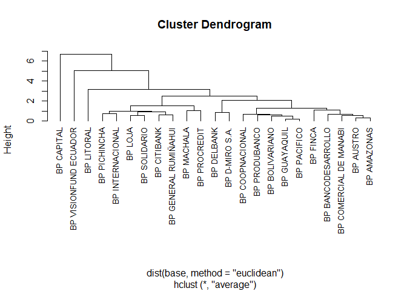<!-- -->

``` r
cluster3 <-  hclust(dist(base, method = "manhattan"),
                    method = "ward.D")
plot(cluster3, hang=-0.01, cex=0.8)
```

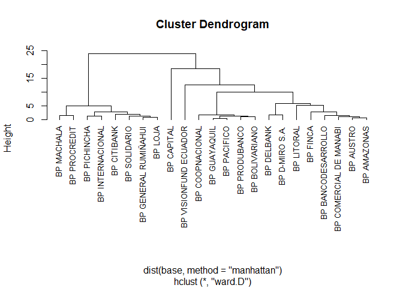<!-- -->

``` r
cluster4 <-  hclust(dist(base, method = "manhattan"),
                    method = "average")
plot(cluster4, hang=-0.01, cex=0.8)
```

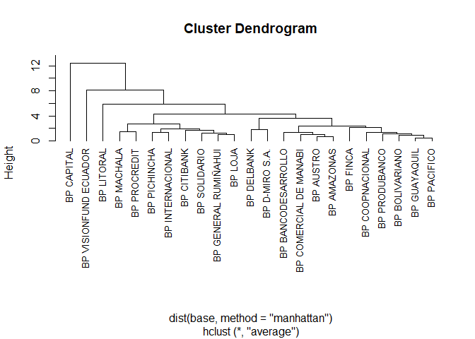<!-- -->

Se presenta a continuación la distancia se encuentra los elementos entre
sí

``` r
distancia <- dist(base, method = "euclidean")
distancia
```

    ##                        BP GUAYAQUIL BP PACIFICO BP PICHINCHA BP PRODUBANCO
    ## BP PACIFICO               0.2150178                                       
    ## BP PICHINCHA              1.7819174   1.6456452                           
    ## BP PRODUBANCO             0.6559963   0.5421784    1.6541791              
    ## BP AUSTRO                 1.0542735   0.9190477    1.8306538     0.7225974
    ## BP BOLIVARIANO            0.4369233   0.5307674    1.8216480     0.5989588
    ## BP CITIBANK               2.3071521   2.2845537    1.3621242     2.4783226
    ## BP GENERAL RUMIÑAHUI      2.1528133   2.0977226    0.9561189     2.2555075
    ## BP INTERNACIONAL          1.9944115   1.9205291    0.7140531     1.9740318
    ## BP LOJA                   2.1678986   2.1099156    1.1585885     2.3561786
    ## BP MACHALA                2.3123686   2.2043836    0.9435659     2.1583368
    ## BP SOLIDARIO              1.9869037   1.8893959    0.8022493     2.0585704
    ## BP PROCREDIT              2.6864192   2.5477548    1.4542120     2.3948699
    ## BP AMAZONAS               1.2686732   1.1156547    1.9735152     0.9239865
    ## BP COMERCIAL DE MANABI    1.5026388   1.3403347    1.8104701     1.2186060
    ## BP LITORAL                3.3496800   3.2240884    3.4821430     2.9349451
    ## BP COOPNACIONAL           0.6513771   0.7374864    2.1454610     0.7251971
    ## BP CAPITAL                7.0559648   6.9091092    6.8696101     6.7677099
    ## BP FINCA                  1.1981924   1.0555151    2.0208246     0.8742596
    ## BP DELBANK                1.9305900   1.9030687    2.6879154     2.1829046
    ## BP D-MIRO S.A.            2.4012826   2.3252175    3.0582157     2.4805104
    ## BP BANCODESARROLLO        1.4816895   1.3732119    2.2631750     1.2436238
    ## BP VISIONFUND ECUADOR     4.5419516   4.6737247    5.2746352     5.1057463
    ##                        BP AUSTRO BP BOLIVARIANO BP CITIBANK
    ## BP PACIFICO                                                
    ## BP PICHINCHA                                               
    ## BP PRODUBANCO                                              
    ## BP AUSTRO                                                  
    ## BP BOLIVARIANO         1.0281736                           
    ## BP CITIBANK            2.8430590      2.3544123            
    ## BP GENERAL RUMIÑAHUI   2.4935325      2.1767368   0.5957524
    ## BP INTERNACIONAL       2.2738227      1.9971081   0.8970691
    ## BP LOJA                2.4638014      2.2556473   1.0129557
    ## BP MACHALA             2.1449602      2.2217230   1.7079169
    ## BP SOLIDARIO           2.0869303      2.0508198   1.2949141
    ## BP PROCREDIT           2.2923010      2.5726548   2.3847737
    ## BP AMAZONAS            0.3262292      1.3014759   3.0532346
    ## BP COMERCIAL DE MANABI 0.6014519      1.5445425   2.9590978
    ## BP LITORAL             2.3074595      3.2299624   4.7174859
    ## BP COOPNACIONAL        1.3149532      0.6621668   2.6441784
    ## BP CAPITAL             6.1567365      7.0540811   8.0130418
    ## BP FINCA               0.9702631      1.2938956   2.9530080
    ## BP DELBANK             1.7182146      2.0553353   3.3292196
    ## BP D-MIRO S.A.         1.8778143      2.5252173   3.9240195
    ## BP BANCODESARROLLO     0.6306596      1.4529257   3.2817685
    ## BP VISIONFUND ECUADOR  5.1442634      4.5990269   4.7233971
    ##                        BP GENERAL RUMIÑAHUI BP INTERNACIONAL   BP LOJA
    ## BP PACIFICO                                                           
    ## BP PICHINCHA                                                          
    ## BP PRODUBANCO                                                         
    ## BP AUSTRO                                                             
    ## BP BOLIVARIANO                                                        
    ## BP CITIBANK                                                           
    ## BP GENERAL RUMIÑAHUI                                                  
    ## BP INTERNACIONAL                  0.6328020                           
    ## BP LOJA                           0.5974806        1.0338665          
    ## BP MACHALA                        1.1483788        1.1252260 1.2774334
    ## BP SOLIDARIO                      0.7472232        0.9845820 0.5267609
    ## BP PROCREDIT                      1.8931940        1.9003246 2.0530359
    ## BP AMAZONAS                       2.6978466        2.4768373 2.6506132
    ## BP COMERCIAL DE MANABI            2.5354111        2.3180401 2.4217858
    ## BP LITORAL                        4.2107912        4.0091678 4.1257159
    ## BP COOPNACIONAL                   2.5643778        2.2959819 2.6797740
    ## BP CAPITAL                        7.4952519        7.5277635 7.3034783
    ## BP FINCA                          2.7258245        2.5215769 2.7897888
    ## BP DELBANK                        2.9584545        3.0747069 2.6198879
    ## BP D-MIRO S.A.                    3.5121644        3.5651062 3.1959230
    ## BP BANCODESARROLLO                2.9040701        2.7722164 2.8282745
    ## BP VISIONFUND ECUADOR             4.7642944        5.2133756 4.5178426
    ##                        BP MACHALA BP SOLIDARIO BP PROCREDIT BP AMAZONAS
    ## BP PACIFICO                                                            
    ## BP PICHINCHA                                                           
    ## BP PRODUBANCO                                                          
    ## BP AUSTRO                                                              
    ## BP BOLIVARIANO                                                         
    ## BP CITIBANK                                                            
    ## BP GENERAL RUMIÑAHUI                                                   
    ## BP INTERNACIONAL                                                       
    ## BP LOJA                                                                
    ## BP MACHALA                                                             
    ## BP SOLIDARIO            0.8987555                                      
    ## BP PROCREDIT            1.0067442    1.6072482                         
    ## BP AMAZONAS             2.3207452    2.2519558    2.3778719            
    ## BP COMERCIAL DE MANABI  2.0480829    2.0001621    2.1931474   0.5447422
    ## BP LITORAL              3.3041631    3.6419360    3.0003649   2.1719143
    ## BP COOPNACIONAL         2.7087537    2.5026032    3.0381089   1.4961793
    ## BP CAPITAL              6.6516798    6.8473910    5.9604387   5.9375724
    ## BP FINCA                2.5852838    2.4389622    2.5308063   0.8839100
    ## BP DELBANK              2.7858181    2.3929284    2.9894429   1.7502356
    ## BP D-MIRO S.A.          3.1628499    2.8774460    3.1669811   1.7686990
    ## BP BANCODESARROLLO      2.4715012    2.4281248    2.4279971   0.5369322
    ## BP VISIONFUND ECUADOR   5.2955455    4.7491986    5.6673954   5.3204654
    ##                        BP COMERCIAL DE MANABI BP LITORAL BP COOPNACIONAL
    ## BP PACIFICO                                                             
    ## BP PICHINCHA                                                            
    ## BP PRODUBANCO                                                           
    ## BP AUSTRO                                                               
    ## BP BOLIVARIANO                                                          
    ## BP CITIBANK                                                             
    ## BP GENERAL RUMIÑAHUI                                                    
    ## BP INTERNACIONAL                                                        
    ## BP LOJA                                                                 
    ## BP MACHALA                                                              
    ## BP SOLIDARIO                                                            
    ## BP PROCREDIT                                                            
    ## BP AMAZONAS                                                             
    ## BP COMERCIAL DE MANABI                                                  
    ## BP LITORAL                          2.0421557                           
    ## BP COOPNACIONAL                     1.8304833  3.5143273                
    ## BP CAPITAL                          5.8387076  4.4392836       7.3617388
    ## BP FINCA                            1.3468904  2.8254030       1.2687580
    ## BP DELBANK                          1.6837784  2.8778966       2.4727673
    ## BP D-MIRO S.A.                      1.7111758  2.4232781       2.8568582
    ## BP BANCODESARROLLO                  0.8364898  2.0012799       1.7536862
    ## BP VISIONFUND ECUADOR               5.3875001  6.6507341       4.9419371
    ##                        BP CAPITAL  BP FINCA BP DELBANK BP D-MIRO S.A.
    ## BP PACIFICO                                                          
    ## BP PICHINCHA                                                         
    ## BP PRODUBANCO                                                        
    ## BP AUSTRO                                                            
    ## BP BOLIVARIANO                                                       
    ## BP CITIBANK                                                          
    ## BP GENERAL RUMIÑAHUI                                                 
    ## BP INTERNACIONAL                                                     
    ## BP LOJA                                                              
    ## BP MACHALA                                                           
    ## BP SOLIDARIO                                                         
    ## BP PROCREDIT                                                         
    ## BP AMAZONAS                                                          
    ## BP COMERCIAL DE MANABI                                               
    ## BP LITORAL                                                           
    ## BP COOPNACIONAL                                                      
    ## BP CAPITAL                                                           
    ## BP FINCA                6.2615031                                    
    ## BP DELBANK              5.8813130 2.2041235                          
    ## BP D-MIRO S.A.          5.1568051 2.2689932  0.8451436               
    ## BP BANCODESARROLLO      5.6566892 1.1029602  1.5046606      1.4672896
    ## BP VISIONFUND ECUADOR   8.9788119 5.3055740  4.0255730      4.7042577
    ##                        BP BANCODESARROLLO
    ## BP PACIFICO                              
    ## BP PICHINCHA                             
    ## BP PRODUBANCO                            
    ## BP AUSTRO                                
    ## BP BOLIVARIANO                           
    ## BP CITIBANK                              
    ## BP GENERAL RUMIÑAHUI                     
    ## BP INTERNACIONAL                         
    ## BP LOJA                                  
    ## BP MACHALA                               
    ## BP SOLIDARIO                             
    ## BP PROCREDIT                             
    ## BP AMAZONAS                              
    ## BP COMERCIAL DE MANABI                   
    ## BP LITORAL                               
    ## BP COOPNACIONAL                          
    ## BP CAPITAL                               
    ## BP FINCA                                 
    ## BP DELBANK                               
    ## BP D-MIRO S.A.                           
    ## BP BANCODESARROLLO                       
    ## BP VISIONFUND ECUADOR           5.0989800

``` r
cluster$merge
```

    ##       [,1] [,2]
    ##  [1,]   -1   -2
    ##  [2,]   -5  -14
    ##  [3,]  -10  -12
    ##  [4,]   -6    1
    ##  [5,]   -7   -8
    ##  [6,]  -15    2
    ##  [7,]   -4    4
    ##  [8,]   -3   -9
    ##  [9,]  -22    6
    ## [10,]  -17    7
    ## [11,]  -20  -21
    ## [12,]  -11  -13
    ## [13,]    3    5
    ## [14,]    8   13
    ## [15,]  -19    9
    ## [16,]   12   14
    ## [17,]  -16   11
    ## [18,]   15   17
    ## [19,]   10   18
    ## [20,]  -23   16
    ## [21,]  -18   19
    ## [22,]   20   21

Realizando cortes

``` r
cutree(cluster, k=4)
```

    ##           BP GUAYAQUIL            BP PACIFICO           BP PICHINCHA 
    ##                      1                      1                      2 
    ##          BP PRODUBANCO              BP AUSTRO         BP BOLIVARIANO 
    ##                      1                      1                      1 
    ##            BP CITIBANK   BP GENERAL RUMIÑAHUI       BP INTERNACIONAL 
    ##                      2                      2                      2 
    ##                BP LOJA             BP MACHALA           BP SOLIDARIO 
    ##                      2                      2                      2 
    ##           BP PROCREDIT            BP AMAZONAS BP COMERCIAL DE MANABI 
    ##                      2                      1                      1 
    ##             BP LITORAL        BP COOPNACIONAL             BP CAPITAL 
    ##                      1                      1                      3 
    ##               BP FINCA             BP DELBANK         BP D-MIRO S.A. 
    ##                      1                      1                      1 
    ##     BP BANCODESARROLLO  BP VISIONFUND ECUADOR 
    ##                      1                      4

``` r
plot(cluster, hang= -0.01, cex=0.8)
rect.hclust(cluster, k=4, border="red")
```

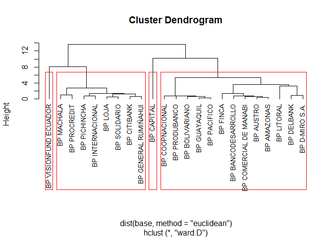<!-- -->

``` r
grupos<- as.data.frame(cutree(cluster, k=4))


ncluster <- diana(base, metric = "euclidean")

par(mfrow=c(1,2))
plot(ncluster)
```

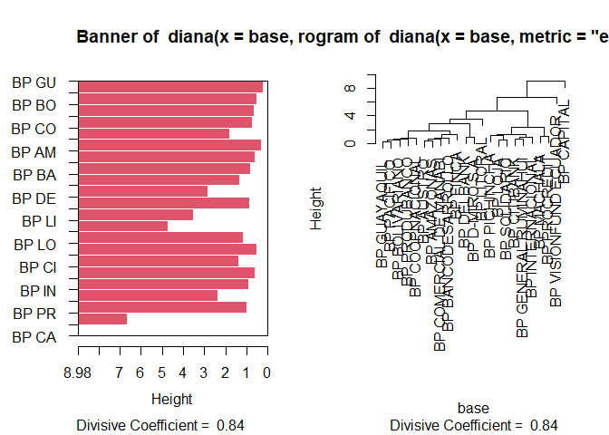<!-- -->

Las figuras anteriores tenemos un cluster jerárquico con una distancia
eucladiana. La otra figura es equivalente sino que la gráfica esta en
barras. Lo importante de estas gráficas es el divisive Coefficiente =
0.84 Este coeficiente esta comprendido entre -1 a 1 Mientras mas cercano
al valor de 1 mejor clasificados estan los elementos.

# CLUSTER NO JERARQUITO

``` r
cnj<- kmeans(base,4)
cnj
```

    ## K-means clustering with 4 clusters of sizes 6, 1, 8, 8
    ## 
    ## Cluster means:
    ##   ACT_PRODUCTIVOS MOROSIDAD._CARTERA_TOTAL GASTOS.DE.OPERACION
    ## 1       0.6582891               -0.6154215          -0.4689663
    ## 2       0.4549623                3.5968639           4.1344555
    ## 3      -1.3130214               -0.4484966          -0.3379057
    ## 4       0.7624343                0.4604547           0.1728235
    ##   RESULTADOS_EJERCICIO FONDOS_DISPONIBLES
    ## 1            0.5900068          0.5245302
    ## 2           -2.8225866         -0.3471037
    ## 3            0.3908076         -0.2117304
    ## 4           -0.4804894         -0.1382793
    ## 
    ## Clustering vector:
    ##           BP GUAYAQUIL            BP PACIFICO           BP PICHINCHA 
    ##                      1                      1                      3 
    ##          BP PRODUBANCO              BP AUSTRO         BP BOLIVARIANO 
    ##                      1                      4                      1 
    ##            BP CITIBANK   BP GENERAL RUMIÑAHUI       BP INTERNACIONAL 
    ##                      3                      3                      3 
    ##                BP LOJA             BP MACHALA           BP SOLIDARIO 
    ##                      3                      3                      3 
    ##           BP PROCREDIT            BP AMAZONAS BP COMERCIAL DE MANABI 
    ##                      3                      4                      4 
    ##             BP LITORAL        BP COOPNACIONAL             BP CAPITAL 
    ##                      4                      1                      2 
    ##               BP FINCA             BP DELBANK         BP D-MIRO S.A. 
    ##                      4                      4                      4 
    ##     BP BANCODESARROLLO  BP VISIONFUND ECUADOR 
    ##                      4                      1 
    ## 
    ## Within cluster sum of squares by cluster:
    ## [1] 19.60832  0.00000  5.55003 10.10370
    ##  (between_SS / total_SS =  67.9 %)
    ## 
    ## Available components:
    ## 
    ## [1] "cluster"      "centers"      "totss"        "withinss"     "tot.withinss"
    ## [6] "betweenss"    "size"         "iter"         "ifault"

``` r
cnj$centers
```

    ##   ACT_PRODUCTIVOS MOROSIDAD._CARTERA_TOTAL GASTOS.DE.OPERACION
    ## 1       0.6582891               -0.6154215          -0.4689663
    ## 2       0.4549623                3.5968639           4.1344555
    ## 3      -1.3130214               -0.4484966          -0.3379057
    ## 4       0.7624343                0.4604547           0.1728235
    ##   RESULTADOS_EJERCICIO FONDOS_DISPONIBLES
    ## 1            0.5900068          0.5245302
    ## 2           -2.8225866         -0.3471037
    ## 3            0.3908076         -0.2117304
    ## 4           -0.4804894         -0.1382793

``` r
aggregate(base, by=list(cnj$cluster), FUN=mean)
```

    ##   Group.1 ACT_PRODUCTIVOS MOROSIDAD._CARTERA_TOTAL GASTOS.DE.OPERACION
    ## 1       1       0.6582891               -0.6154215          -0.4689663
    ## 2       2       0.4549623                3.5968639           4.1344555
    ## 3       3      -1.3130214               -0.4484966          -0.3379057
    ## 4       4       0.7624343                0.4604547           0.1728235
    ##   RESULTADOS_EJERCICIO FONDOS_DISPONIBLES
    ## 1            0.5900068          0.5245302
    ## 2           -2.8225866         -0.3471037
    ## 3            0.3908076         -0.2117304
    ## 4           -0.4804894         -0.1382793

A continuación se mostrara como se ven los grupos en un cluster no
jerárquico

``` r
fviz_cluster(cnj, data=base)
```

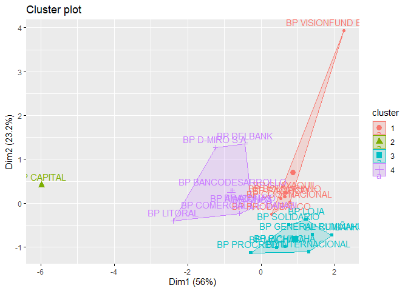<!-- -->

``` r
require(cluster)
clusplot(base, 
         cnj$cluster,
         color=T,
         shade=T,
         label=1,
         line=2)
```

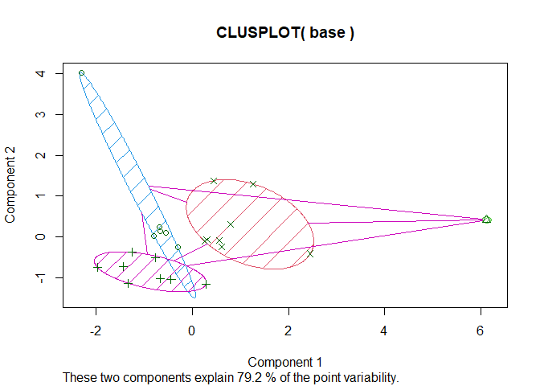<!-- -->

Procedimien para cuantos cluster son los óptimos

``` r
clusteroptimo <- NbClust(base,
                        distance = "euclidean",
                        min.nc=2,
                        max.nc=6,
                        method = "ward.D",
                        index="all")
```

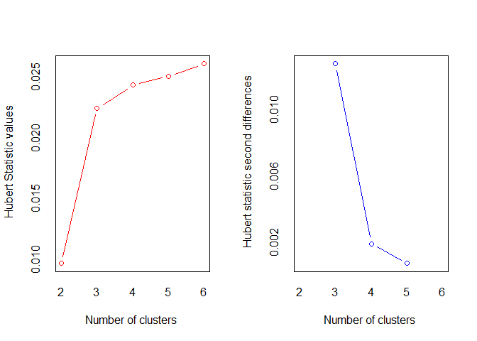<!-- -->

    ## *** : The Hubert index is a graphical method of determining the number of clusters.
    ##                 In the plot of Hubert index, we seek a significant knee that corresponds to a 
    ##                 significant increase of the value of the measure i.e the significant peak in Hubert
    ##                 index second differences plot. 
    ## 

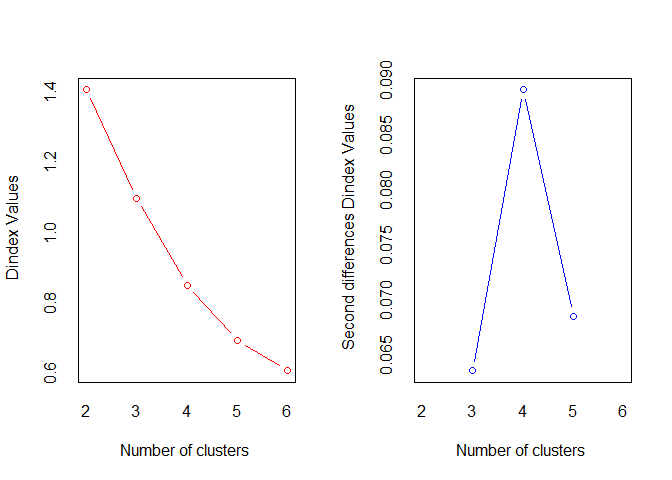<!-- -->

    ## *** : The D index is a graphical method of determining the number of clusters. 
    ##                 In the plot of D index, we seek a significant knee (the significant peak in Dindex
    ##                 second differences plot) that corresponds to a significant increase of the value of
    ##                 the measure. 
    ##  
    ## ******************************************************************* 
    ## * Among all indices:                                                
    ## * 3 proposed 2 as the best number of clusters 
    ## * 4 proposed 3 as the best number of clusters 
    ## * 13 proposed 4 as the best number of clusters 
    ## * 1 proposed 5 as the best number of clusters 
    ## * 2 proposed 6 as the best number of clusters 
    ## 
    ##                    ***** Conclusion *****                            
    ##  
    ## * According to the majority rule, the best number of clusters is  4 
    ##  
    ##  
    ## *******************************************************************

``` r
best_nc <- clusteroptimo$Best.nc
print(best_nc)
```

    ##                     KL      CH Hartigan    CCC   Scott Marriot  TrCovW  TraceW
    ## Number_clusters 4.0000  6.0000   4.0000 6.0000  4.0000     3.0   3.000  4.0000
    ## Value_Index     3.0344 26.2967  10.4029 3.2132 65.0823 10296.6 506.904 14.8197
    ##                 Friedman   Rubin Cindex     DB Silhouette   Duda PseudoT2 Beale
    ## Number_clusters   4.0000  4.0000 3.0000 4.0000     4.0000 2.0000   2.0000 2.000
    ## Value_Index      38.9631 -0.2199 0.2709 0.5619     0.5076 0.9695   0.3778 0.091
    ##                 Ratkowsky    Ball PtBiserial Frey McClain   Dunn Hubert SDindex
    ## Number_clusters    4.0000  3.0000     4.0000    1  4.0000 4.0000      0  4.0000
    ## Value_Index        0.4419 25.0277     0.6013   NA  0.5651 0.4683      0  1.3002
    ##                 Dindex   SDbw
    ## Number_clusters      0 5.0000
    ## Value_Index          0 0.1055

``` r
optimal_clusters <- as.numeric(names(which.max(table(best_nc[1, ]))))


# Mostrar el número óptimo de clusters

cat("El número óptimo de clusters es:", optimal_clusters, "\n")
```

    ## El número óptimo de clusters es: 4

``` r
cnj2<-kmeans(base,4)

silueta<- silhouette(cnj2$cluster,
                     dist(base, method="euclidean"))

fviz_silhouette(silueta)
```

    ##   cluster size ave.sil.width
    ## 1       1    1          0.00
    ## 2       2    1          0.00
    ## 3       3   13          0.41
    ## 4       4    8          0.55

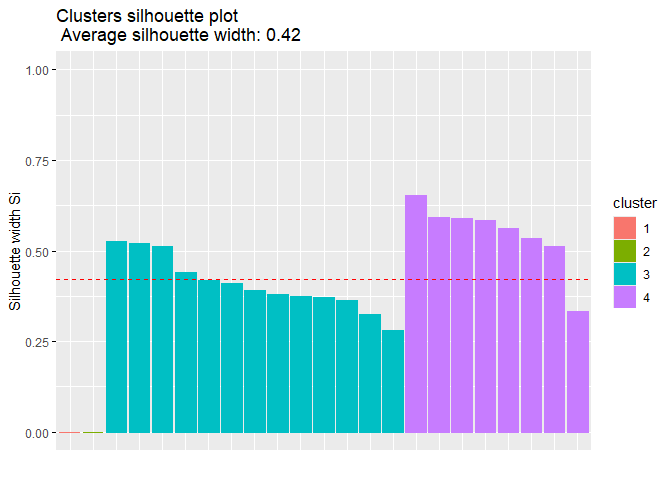<!-- -->

Un Average Silhouette Width de 0.41 indica que:

Los clusters están razonablemente bien definidos, aunque no de manera
perfecta. Algunos objetos pueden estar cerca de los bordes de sus
clusters, lo que sugiere que los clusters no son completamente distintos
entre sí. Podría haber solapamientos entre los clusters, o algunos datos
podrían estar mal asignados.
